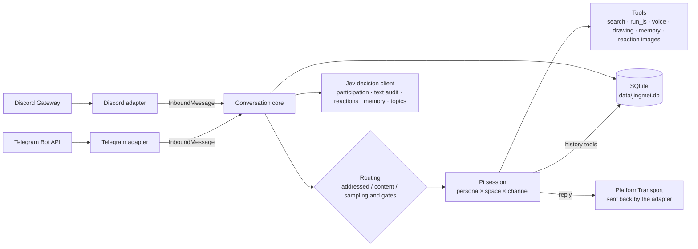

<div align="center">


# Jingmei (精魅)

**An AI group pet for Discord and Telegram groups · built on [Pi](https://www.npmjs.com/package/@earendil-works/pi-coding-agent)**

[](https://github.com/beiwater/jingmei/actions/workflows/ci.yml)
[](LICENSE)
[](https://bun.sh/)
[](tsconfig.json)
[](https://www.npmjs.com/package/@earendil-works/pi-coding-agent)
[](#discord-setup)

[中文](README.md) · **English**

[Quick start](#quick-start) · [Optional features](#optional-features) · [Commands](#commands) · [Operator commands](#operator-commands) · [Configuration](#configuration-reference) · [Architecture](docs/architecture.md) · [Deployment](docs/deploy.md) · [Contributing](CONTRIBUTING.md)

</div>

> The ancients believed that anything, given enough years, can become a spirit — hence *jing* (精); and because such spirits can bewitch the human heart — *mei* (魅).

Jingmei is an AI group pet that lives in Discord and Telegram groups. One configuration can keep several characters with different personalities: they chime in by probability, always answer when addressed, understand images and videos, send voice messages, look things up on the web, do math, and remember members' birthdays. Both platforms share one conversation core, and every character uses its Pi session in every channel as a "conversation segment": only a triggered character writes to its own session, a running conversation continues the same segment, a long gap or a large backlog starts a new one, and anything older is found by search.

## What it does

- **Content-aware participation, always routes when addressed**: explicit mentions, replies and names/aliases retain their routing priority. With a decision client and participation enabled, other human messages identify a directed character; otherwise a deterministic `routingP` candidate must pass cooldown, speaking-share and, when enabled, content-score gates. Bot messages never trigger a character. Final text is checked before sending to withhold internal markers or unnatural replies.
- **Failures do not stall the channel**: model/tool turns have a 180-second deadline, then abort and release the channel. Failures are logged without sending an error notice to the group. Successful Telegram text/image/voice replies are also stored in history so replies to the bot can inherit the original topic; Discord remains echo-driven.
- **Crash recovery without stale chime-ins**: history and pending work are stored in one transaction. On restart, unfinished messages up to 3 minutes old are processed. Failed turns are not retried. A message already over 3 minutes old when it arrives or reaches its channel queue (including a backlog delivered after a long outage) is only stored and indexed for search: it never gets a reply (even when mentioned, replied to or named), a participation decision, a quick reaction, member-memory or topic processing, and Telegram skips downloading its photos and videos, keeping `[图片]` / `[视频]` markers. Such messages still enter the conversation as accumulated history when a character is next triggered. Recovery preserves text and replaces images with an honest unavailable-image note.
- **"Typing…" stays visible**: while a routed character generates its reply, the typing indicator is refreshed every 4 seconds on Telegram and every 8 seconds on Discord; it stops when the reply is sent, withheld or fails, and never shows for more than 60 seconds.
- **"Why didn't it reply?" is answerable**: every human message gets one `route` log line without its text, giving the final route, the HMAC candidate, whether cooldown/speaking-share blocked it, and the participation decision and score; paused messages log `paused`. Fields: [docs/architecture.md](docs/architecture.md#路由srccorerouterts) (Chinese).
- **Jev quick reactions** (optional): a Jev decision API (or an in-process LLM wrapper) puts an emoji on messages. Addressed messages get the selected emoji unless the decision is `none`; ordinary messages only when strongly emotional or genuinely funny, rate-limited per channel. It does not use the main model and never delays the real reply. See [Jev](#jev).
- **Concurrent topics** (optional): `events` assigns channel messages to topics. `§E` IDs, titles, descriptions and leading participants tell the character which event it is answering, keeping simultaneous discussions separate and recalling older topics when they resume.
- **Conversation segments, continued on demand**: every group message is stored and indexed, but only the character the router triggers writes to its own session; messages that trigger nobody enter no session. When a character is triggered, its previous session continues if its last successful reply was at most 5 minutes ago, at most 30 messages have accumulated since, and the session is at most 40,000 tokens: the accumulated messages are appended as one context message, then the trigger. Otherwise a new segment starts, seeded with the 30 most recent messages before the trigger. Each line looks like `[time] #messageId ↪ replyId §E<topic> author: text （相关 N 条）`, where N is the number of related messages in earlier history (shown as `20+` above 20). It is fixed when the line is written and never recomputed, so the prefix stays stable and cache hits survive. After a turn timeout, send failure or final error, the next trigger always starts a new segment, also across restarts.
- **History search**: when a line shows "（相关 N 条）", a character can call `related_messages` to see the earlier related chat for a message, or `search_history` to search by keyword and meaning (optionally limited by ISO time or `YYYY-MM-DD` date). The two share at most 3 lookups per turn, each returns at most 20 lines, hits come with 2 lines of context on each side, only the current group/channel is searched, and members who used `/forget` never appear. Keywords use SQLite FTS5 trigram; meaning uses sqlite-vec vectors (requires `events`, which supplies the embedding model). Messages stored before the upgrade become searchable only after running the [backfill script](#operator-commands).
- **Images and video frames**: up to 4 images per message, scaled to fit 1024×1024 and 200 KB, reach the model; videos are sampled into 1–3 frames with ffmpeg. When the main model has no image input, Pi replaces each image with an omission note; alternatively set `visionModel` to describe images in a sentence or two first. Voice, files and stickers become text placeholders such as `[语音]`, `[文件]`, `[贴纸 😀]`.
- **Voice** (optional): with Fish Audio, characters can send MP3s with a transcript in Chinese, Japanese or English. When a member explicitly asks for a voice reply, the final answer is also turned into audio.
- **Drawing** (optional): once the Antigravity provider is signed in, characters can put an `image` part in `send_reply` to draw one picture from a member's description and send it (Nano Banana 2 / `gemini-3.1-flash-image` by default, about 15 seconds). See [Drawing](#drawing) for sign-in. **Warning**: Google's Antigravity terms explicitly forbid third-party tools using Antigravity OAuth and accounts have been banned for it; use a secondary account.
- **Long text as an image** (optional): with `textImage` enabled, a text reply over 300 characters (configurable) is not sent; the character is told to use a `text_image` part of `send_reply` instead, which renders its full Markdown to one image: headings, lists, tables, code blocks, LaTeX math (`$…$`, `$$…$$`), public images, graphs (functions, implicit curves, parametric curves, scatter points, 3D surfaces) and, when drawing is enabled, pictures newly drawn by AI. Pure libraries, no browser. See [Long text as an image](#long-text-as-an-image).
- **Candlestick charts** (optional): with `kline` enabled, a character can put a `kline_image` part in `send_reply` to send a live candlestick chart with volume for a Binance spot pair (for example BTCUSDT). The bot fetches the prices from Binance's public API; the model only picks the pair and interval and never writes numbers. Pure libraries (hand-written SVG + resvg), no browser. See [Candlestick charts](#candlestick-charts).
- **Web search**: with `DEEPSEEK_API_KEY` set, DeepSeek server-side web search is enabled. Messages that explicitly say “查一下” / “搜索” / “look up” are searched first and answered with source links; the model can also search on its own when a question depends on external facts.
- **Calculation**: `run_js` runs small pure-computation JavaScript in a node:vm realm inside a short-lived child process for exact arithmetic, date math and unit conversions. It requires Linux with a working bubblewrap (filesystem, network and PID isolation); startup runs it once and exits with an error when it is unusable, with no fallback. No new configuration is needed. See [docs/deploy.md](docs/deploy.md#run_js-操作系统沙箱) for Ubuntu setup, and [docs/architecture.md](docs/architecture.md) for residual risks.
- **Member memory and soul**: per group, profiles hold names, birthdays, stable self-stated facts, and relationships formed by mentions and replies. Member memory is not attached to the input automatically; the replying character calls `recall_member_memory` with a chat display name when it needs it (bots and members who used `/forget` are excluded), keeping history shorter and the cache stable. Characters save explicit self-stated interests, roles, projects, timezones, languages, goals, and preferences, never reciting full profiles or birthdays publicly. Each character keeps a private soul per channel; stable lessons about its own formatting, tone, or response length are staged and become formal when a new conversation segment starts or after successful compaction. Members can `/forget` at any time.
  The system prompt spells out when to save and when to recall: save before replying when the author states lasting facts about themselves (never jokes, passing states, other people's details or sensitive data); recall before answering about a member; if nothing is found, say so instead of inventing memories.
- **Holiday and birthday greetings** (optional): sent to a chosen channel after 09:00 local time, covering birthdays and Chinese/Australian holidays; deliveries are recorded in the database, so restarts never resend.
- **Reaction images**: characters can send one of 4 bundled PNGs (hello, laugh, think, hug) or an image from their own local PNG/JPEG catalog (a `reaction_image` part of `send_reply`), using its default caption; can be turned off per character.
- **Several messages in one reply**: with `send_reply` a character sends up to 4 messages in order in one turn: text, voice, a newly drawn picture, a reaction image, a text image (at most one of each non-text kind), for example a picture followed by a text or voice explanation, or an answer in a few separate paragraphs. The tool only offers the kinds that character can send. Slow parts (drawing, rendering, speech) are prepared in parallel and sent strictly in order once all are ready; only the first message replies to the trigger. If any part cannot be prepared nothing is sent and the character falls back to text; if a send fails midway, what was sent stays, nothing is resent and the rest is dropped. Text and voice transcripts pass the same internal-marker check, naturalness audit and length gate as an ordinary text reply. A one-message answer is still written as plain text.
- **No thinking by default, fewer tokens**: `reasoningEffort` defaults to `off`; even when enabled, thinking from completed turns is not sent back to the model. The system prompt and tool definitions stay stable for provider prefix caching.
- **Fixed identity and summary boundaries**: characters know their names, aliases, and verified platform accounts and accept turns selected by the router. Media instructions distinguish direct image input, optional auxiliary descriptions, and placeholders without inventing processing. History compaction instructions preserve fixed identity, retain confirmed facts, attribute member claims, and exclude assistant guesses or past refusals as permanent rules; style lessons require an explicit member request.

## Architecture at a glance

One process, one conversation core, two thin platform adapters. Platform differences (formatting, length limits, emoji sets) stay in the adapters; the core only knows `InboundMessage` (in) and `PlatformTransport` (out).



| Principle | In practice |
|---|---|
| Pi-native first | Sessions, near-limit compaction, model catalog and auth, image degradation all come from Pi |
| Deterministic before LLM | Replay-safe HMAC selects probability candidates; history determines cooldown and speaking share. Content decisions use bounded requests; deduplication is a database primary key |
| Bounded cost | Stable system prompt and tool definitions hit prefix caches; dynamic content goes into messages only; segments rotate at fixed limits, seeds hold only the latest 30 messages and older history is searched; reasoning off by default |
| Private by default | Secrets live only in `.env`; logs are redacted and never contain message text; members can `/forget` at any time |

Full data flow, schema and the run_js threat model: [docs/architecture.md](docs/architecture.md) (Chinese).

## Quick start

You need Linux, [Bun](https://bun.sh/) 1.3 or newer, a working bubblewrap (the `run_js` sandbox; startup fails without it, see [docs/deploy.md](docs/deploy.md#run_js-操作系统沙箱)), at least one Discord or Telegram bot, and credentials for a model provider. Video frames additionally need `ffmpeg` (including `ffprobe`) on the host; without it everything else works and videos become a `[视频]` placeholder.

macOS development also needs `brew install sqlite` so Bun can load sqlite-vec. The first startup downloads the default Chinese embedding model (about 96 MB) into `data/models` (under your custom `dataDir` if set), requiring network access; later starts reuse that cache; neither is needed with `features.history` set to `false`. The vector part of message search (related counts, semantic search) always uses this model; topics share it when `events` is enabled.

```bash
git clone https://github.com/beiwater/jingmei.git
cd jingmei
bun install
bun run jingmei init
```

`init` is the recommended way to configure: an interactive wizard that creates `jingmei.config.json`, `.env` and `personas/<id>.md`, so you never hand-edit JSON. It first asks Recommended / Minimal / Custom (Recommended = every core feature on, no add-ons; Minimal = every core feature off, no embedding model download; Custom = pick core features and add-ons one by one, asking for parameters only for the add-ons you pick). Then it asks for the platform(s), each bot token (masked, and verified live with the same call the bot makes, showing the bot's name), the server / channel ids (the group ids on Telegram), the persona id and name, and the model (DeepSeek with `DEEPSEEK_API_KEY`, or sign in later with `bun run jingmei login`). `ROUTING_SECRET` is generated randomly; secrets go only into `.env` (mode 0600), never into the JSON. `init` refuses to run when `jingmei.config.json` or `.env` already exists, never overwrites anything, and needs an interactive terminal. It ends by printing the next steps (including the Discord invite link).

After it finishes:

1. Edit `personas/<id>.md`: the character's identity, voice and boundaries.
2. `bun run jingmei doctor`: a read-only self-check of the config, the `run_js` sandbox, model credentials, bot tokens and permissions (Message Content Intent, privacy mode, group ids), and ffmpeg / fonts / sqlite-vec / the embedding cache for the features you enabled. One OK / WARN / FAIL line each, with a fix hint.
3. Start:

   ```bash
   bun run start
   ```

To configure by hand instead (or to script deployments), the wizard does the equivalent of:

```bash
cp jingmei.config.example.json jingmei.config.json
cp .env.example .env
cp personas/template.en.md personas/luna.md
```

1. Edit `personas/luna.md`: the character's identity, voice and boundaries.
2. Edit `jingmei.config.json`: fill in your Discord server ID and channel ID. The example has a single Discord character; Telegram, voice, Jev and the rest are in [Optional features](#optional-features), and fields are in [Configuration reference](#configuration-reference).
3. Edit `.env`: bot tokens, `ROUTING_SECRET` (any long random string) and API keys. The format is `key: value`, not `KEY=value`.
4. Provide model credentials, either way:
   - The example persona uses DeepSeek `deepseek-flash`; just set `DEEPSEEK_API_KEY` in `.env`. On startup a catalog entry for this model (without the key) is written to `data/pi-agent/models.json`.
   - Other providers: for subscription accounts (Claude Pro/Max, ChatGPT Plus/Pro, GitHub Copilot, ...) run `bun run jingmei login` and pick a provider to sign in with OAuth. Credentials go to `<dataDir>/pi-agent/auth.json`; the bot uses them on startup and refreshes tokens automatically. `bun run jingmei logout` removes them. On a server without a browser, open the printed link on your own machine, then paste the final redirect URL or code back into the terminal. `bun run jingmei model` lists every model that has credentials. Alternatively put that provider's API key variable (for example `OPENAI_API_KEY`) in the process environment. `.env` is read only by this project and, apart from `DEEPSEEK_API_KEY`, is not passed to Pi.
5. Run `bun run jingmei doctor` to self-check, then `bun run start`.

Startup validates the configuration, verifies every bot token, and checks that every persona's model exists and is authenticated. Configuration errors are listed all at once; an invalid token or unavailable model also stops startup. Then @-mention or reply to a character in the group.

When started in the foreground on a terminal, a [fox-girl-loader](https://github.com/beiwater/fox-girl-loader) animation plays while the bot gets ready and shows **✓ Ready** when done; startup logs are held and printed once it finishes. Under systemd or any other non-terminal output nothing is drawn and logs stream as usual.

<div align="center">

</div>

## Discord setup

Each character is one Discord application.

1. In the [Discord Developer Portal](https://discord.com/developers/applications) create an application, copy the token on the **Bot** page and put it in `.env` (e.g. `DISCORD_LUNA_TOKEN: …`).
2. Under **Bot → Privileged Gateway Intents** enable **Message Content Intent**, otherwise the bot cannot read ordinary messages.
3. Under **OAuth2 → URL Generator** select `bot` and `applications.commands`, with the permissions View Channels, Send Messages, Read Message History, Send Messages in Threads, Attach Files, Add Reactions. Administrator is not needed.
4. Invite the bot with the generated link and put the server and channel IDs in `discord.guilds` (right-click → Copy ID in developer mode).

On startup each character registers its slash commands in its servers. Replies use Discord Markdown, are split above 2000 characters, and never trigger @ notifications.

## Telegram setup

The example config has no Telegram; first add the `telegram` section and the persona's `telegram` account from [Optional features](#optional-features).

1. Create one bot per character with `/newbot` at [@BotFather](https://t.me/BotFather) and put the token in `.env` (e.g. `TELEGRAM_LUNA_TOKEN: …`).
2. Use `/setprivacy` to set privacy mode to **Disable**, or make the bot a group admin; otherwise it only sees commands and messages addressed to it. After changing it, remove the bot from the group and add it again. The `privacy_mode_enabled` warning in the startup log points at this.
3. Add the bot to the group and put the group ID (supergroups look like `-100…`) in `telegram.chatIds`. If you don't know it, start with any placeholder, send a message in the group, and read `chat_id` from the `chat_ignored` log event.

Telegram limitation: **bots cannot see other bots' messages**. With several characters in one group they do not see each other's replies; each one knows only what members said and what it said itself. Discord has no such limit.

Telegram replies convert Markdown into message entities and are split above 4096 characters. Characters put long explanations and lists in a ```` ```fold ```` block, shown as a quote that stays collapsed until tapped (inside it only bold/italic/strikethrough survive, code shows as plain text and links are written as "label (url)"). Reactions are limited to the emoji set allowed by the Bot API (which has no 😂).

## Optional features

The example config has one Discord character. Everything below is added to `jingmei.config.json` as needed; each snippet says which environment variable it needs (put it in `.env`, `key: value` format). Field meanings are in the [Configuration reference](#configuration-reference).

**Telegram**: needs `TELEGRAM_LUNA_TOKEN` in `.env` (the BotFather token). Add a top-level `telegram` section and a `telegram` account on the persona; setup steps are in [Telegram setup](#telegram-setup).

```json
"telegram": { "chatIds": ["-1001234567890"] }
```

```json
"telegram": { "tokenEnv": "TELEGRAM_LUNA_TOKEN" }
```

The second snippet goes in the persona object under `personas[]`, next to `discord`.

**Voice** (Fish Audio): needs `FISH_AUDIO_API_KEY`. `referenceId` is a 32-hex voice ID; a persona uses voice by default and can opt out with `voiceEnabled: false`.

```json
"voice": {
	"apiKeyEnv": "FISH_AUDIO_API_KEY",
	"referenceId": "00000000000000000000000000000000",
	"model": "s2.1-pro-free"
}
```

**Drawing**: needs no environment variable, but an Antigravity OAuth login; steps in [Drawing](#drawing). The model defaults to `gemini-3.1-flash-image`, so write this only to change it:

```json
"imageGeneration": { "model": "gemini-3.1-flash-image" }
```

**Vision model**: describes images with another model when a persona's main model cannot see images. Needs credentials for that provider (`bun run jingmei login <provider>` or its API key variable).

```json
"visionModel": "openrouter/google/gemini-2.5-flash"
```

**Candlestick charts** and **long text as an image**: no environment variable; both are off by default. See [Candlestick charts](#candlestick-charts) and [Long text as an image](#long-text-as-an-image).

```json
"kline": { "enabled": true },
"textImage": { "enabled": true, "thresholdChars": 300 }
```

**Feature switches** (`features`): everything is on by default. Each of these can be turned off alone, which removes the tools and prompt lines and stops loading dependencies nothing uses.

```json
"features": { "history": false, "memory": false, "soul": false, "search": false, "audit": false }
```

| Switch | When `false` |
|---|---|
| `history` | No message index, no `related_messages` / `search_history`, no "（相关 N 条）" on context lines; the ~96 MB embedding model is not downloaded and fastembed and sqlite-vec are not loaded. Combining it with `events` is a configuration error |
| `memory` | No `remember_member_fact` / `recall_member_memory`, and no passive collection of member profiles, preferences, relationships or birthdays stated in chat. Kept: `/memory` and `/forget` still show and delete existing data, and `/birthday` still records a birthday by hand (which `celebrations` birthday greetings rely on) |
| `soul` | No `update_soul`, and stored private soul notes are no longer injected into the system prompt; stored data stays in the database |
| `search` | No `search_web` and no prefetched search results; `DEEPSEEK_API_KEY` remains the default model's credential |
| `audit` | No natural-tone audit of final text (the leak-marker check still runs); reply decisions are controlled separately by `jev.replyDecision` |

`run_js` is always on. Switches are read once at startup; restart after changing them.

**Jev** (quick reactions, memory ranking; participation decisions use it too): remote Jev needs `TYPESAFE_API_KEY`; omit `apiKeyEnv` to use only the in-process wrapper, which then requires `DEEPSEEK_API_KEY` (or a `localJev` section), otherwise startup fails with a configuration error. See [Jev](#jev).

```json
"jev": {
	"apiKeyEnv": "TYPESAFE_API_KEY",
	"quickReactions": true,
	"memoryScoring": true
}
```

**Topics** (`events`): needs a resolvable decision client, that is the Jev section above or `DEEPSEEK_API_KEY`; the `summaryModel` provider needs credentials. The first start downloads an embedding model.

```json
"events": { "summaryModel": "deepseek/deepseek-flash" }
```

**Holiday and birthday greetings**: no environment variable. `space` and `channelId` must be a server/channel you configured above; `personaId` is the character that posts.

```json
"celebrations": [
	{
		"space": "discord:000000000000000000",
		"channelId": "000000000000000001",
		"personaId": "luna",
		"timeZone": "Australia/Sydney",
		"calendar": "both"
	}
]
```

## Commands

| Action | Discord (slash commands) | Telegram (text commands in the group) |
|---|---|---|
| List commands and how to talk to a character | `/help` | `/help` |
| Online characters (says so when paused) | `/status` | `/status` |
| Ask directly | `/ask prompt:<question>` | `/ask <question>` |
| Show memory / re-enable | `/memory`, `/memory action:enable` | `/memory`, `/memory enable` |
| Birthday: show / set / clear | `/birthday`, `/birthday date:09-25`, `/birthday date:clear` | `/birthday`, `/birthday 09-25`, `/birthday clear` |
| Delete my memory here and stop collecting | `/forget` | `/forget` |
| Context usage and segment limits (admin) | `/context` | `/context` |
| Compact context now (admin) | `/compact` | `/compact` |

- Discord command responses are visible only to the caller; the answer to `/ask` is posted in the channel as usual. Command replies are in Chinese on both platforms (the project is Chinese-first); command names are unchanged.
- You don't need a command to talk to a character: @mention it, reply to its message, or call it by name (`/help` says so).
- While an operator has paused the bot, `/ask` says it is paused; when `/ask` gets no answer (error, withheld, timeout) both platforms reply that no answer came and to try again.
- Admin commands are open only to the character's `adminUserIds` and registered only for characters that have admins.
- Telegram commands can target a character with `@botusername`; without it the first character to receive the command handles it. With several characters in a group, `/context` and `/compact` must name one.
- Telegram has no caller-only replies, so command responses go to the group and `/memory` shows counts rather than the remembered details.
- `/forget` deletes the structured member profile and relationships plus the member's message-search index rows (their messages are not indexed afterwards), but not the platform's messages or existing session history.

## Operator commands

Run them in the project directory as the same user that runs the bot. Apart from `init` and `doctor`, they read only `dataDir` and each persona's `provider`/`model` from `jingmei.config.json` and need no bot tokens; `bun run jingmei --help` lists every command.

| Command | What it does |
|---|---|
| `bun run jingmei` | Interactive menu (before a config exists it offers only "Set up", i.e. `init`): status, check install, switch model, pause / resume, sign in, sign out; each action returns to the menu until you pick Exit |
| `bun run jingmei init` | First-run wizard: creates `jingmei.config.json`, `.env` (mode 0600) and a persona file, verifying bot tokens live; refuses to run when a config exists and needs an interactive terminal |
| `bun run jingmei start` | Run the bot in the foreground, same as `bun run start` |
| `bun run jingmei doctor` | Read-only self-check: config, the `run_js` sandbox, models and credentials, Discord / Telegram tokens and permissions (Message Content Intent, privacy mode, group ids), and ffmpeg, fonts, sqlite-vec and the embedding cache for the features you enabled. One OK / WARN / FAIL line each with a one-line fix hint; exits non-zero on any FAIL. Never prints a token |
| `bun run jingmei login [provider]` / `logout [provider]` | Sign in with OAuth / remove a stored credential; signing in refreshes that provider's model list |
| `bun run jingmei model [provider/model\|default] [--persona <id>]` | Show and switch a persona's chat model; without a model it refreshes the model lists and opens a picker |
| `bun run jingmei pause` / `resume` | Pause / resume |
| `bun run jingmei stats` | Status and current uptime, total runtime and number of starts, replies, and message / group / member / topic / celebration totals |
| `nice -n 10 bun scripts/backfill-message-index.ts [delayMs]` | Index messages stored before the upgrade (keywords + vectors), newest first, 100 ms between messages by default; safe to interrupt and rerun, indexed rows are skipped. Run it once after deploying the new version; new messages are indexed automatically. See [docs/deploy.md](docs/deploy.md#升级后回填历史消息索引) (Chinese) |

- **Pause**: the bot stays online and keeps storing messages, but does not reply, react, update member memory or topics, or send celebrations, and makes no reply-model calls; administrator manual compaction can still call a model. It applies to a running bot immediately without a restart, and survives restarts until `resume`. Messages received while paused are only stored and written to no session (after resuming, when a character is triggered they may enter its new session with the recent window like any other untriggered message); greetings due that day go out after resuming. To actually stop the process, use `systemctl --user stop pi-discord-agent` or Ctrl+C.
- **Status**: the bot writes a heartbeat every minute; with no heartbeat for two minutes it counts as stopped (including crashes). Replies are counted from the release that introduced this command; message and other totals cover all history.
- **Switch model**: only the CLI on the server can switch models; there is no chat command for it. The choice is stored in the database, the running bot moves each channel over before its next reply without a restart, and it survives restarts. `default` restores `provider`/`model` from `jingmei.config.json`. `reasoningEffort` is kept and Pi clamps it when the new model does not support it. To use another provider, `login` first or put its API key in the service environment. If the bot cannot find the chosen model (for example its provider was removed), it logs `model_override_unavailable` and keeps using the configured model. A switch invalidates the provider's prefix cache once.
- **Context and conversation segments**: each character's channel session uses the model's own `contextWindow` (for example Gemini's 1M), without a shared cap. In normal operation a segment is replaced at the next trigger once 5 minutes pass without a reply, more than 30 messages accumulate, or the session exceeds 40,000 tokens, so reply input stays small and does not depend on compaction. Pi still provides near-limit auto-compaction (window minus 16,384 tokens) and provider overflow recovery; administrators can still use `/compact`; `/context` shows current usage, the window size in messages and the segment limits. Compaction retains about 15–20k real recent tokens (Pi's character estimate undercounts Chinese about fivefold, so the kept tail remains 3,000 estimated tokens); within a segment history grows only at the end, helping prefix caches.

## Configuration reference

There are exactly two sources: `jingmei.config.json` for settings and `.env` for secrets. The config file only names environment variables (`tokenEnv`, `apiKeyEnv`, `routingSecretEnv`), never the secrets themselves; process environment variables override `.env`. Write every ID as a JSON string.

### Top level

| Field | Meaning |
|---|---|
| `dataDir` | Data directory, default `data`; relative to the project root, `~/` allowed |
| `routingSecretEnv` | Env var holding the routing HMAC secret, default `ROUTING_SECRET`; must be set |
| `visionModel` | Optional `"provider/model"` (split at the first `/`). Describes images as text only for personas whose main model cannot see images; must accept image input |
| `discord.guilds[]` | `{ guildId, channelIds }`: server ID and allowed channel IDs (17–20 digits); threads under those channels work too |
| `telegram.chatIds` | Allowed group IDs, e.g. `"-1001234567890"` |
| `voice` | Optional Fish Audio: `apiKeyEnv`, `referenceId` (32-hex voice ID), `model` (`s2.1-pro-free` default, or `s2.1-pro`) |
| `imageGeneration` | Optional `{ model }`: the Antigravity model ID used for drawing, default `gemini-3.1-flash-image`. The drawing tool is enabled only when the `antigravity` provider is signed in, see [Drawing](#drawing) |
| `kline` | Optional `{ enabled }`: `enabled` defaults to `false`, see [Candlestick charts](#candlestick-charts) |
| `textImage` | Optional `{ enabled, thresholdChars }`: `enabled` defaults to `false`; `thresholdChars` is the length limit of a text reply (integer 50–8000, default `300`), see [Long text as an image](#long-text-as-an-image) |
| `features` | Optional; boolean switches `history`, `memory`, `soul`, `search`, `audit`, all `true` by default; see [Optional features](#optional-features) |
| `jev` | Optional, see [Jev](#jev) |
| `localJev` | Optional in-process LLM→Jev wrapper: required `baseUrl` (http(s)) and `model`, optional `apiKeyEnv` (omit for unauthenticated local services). Requires an OpenAI-compatible endpoint with logprobs. If the section is absent and `DEEPSEEK_API_KEY` resolves, defaults to DeepSeek / `deepseek-flash` |
| `events` | Optional; presence enables topics. Required `summaryModel`: `"provider/model"` (first slash splits; model and authentication checked at startup). `embeddingModel` defaults to `fast-bge-small-zh-v1.5` (512 dimensions), and must be supported by fastembed; it also supplies the message-search vectors (without topics, message search uses the default model). Requires a remote Jev or local LLM decision client |
| `celebrations[]` | Optional greeting targets, see below |
| `personas[]` | Characters, at least one |

Web search has no section of its own: it is on whenever `DEEPSEEK_API_KEY` is present, and `features.search: false` turns it off.

### `personas[]`

| Field | Meaning |
|---|---|
| `id` | Unique, `a-z 0-9 _ -` only |
| `name` | Display name; a message containing it addresses the character |
| `personaPath` | Persona file, must be readable |
| `reactionImages` | Optional local catalog directory containing `catalog.json`; resolved from the project root like `personaPath`, also accepting absolute paths and `~/` |
| `provider` / `model` | Pi provider and model ID |
| `reasoningEffort` | `off` (default), `minimal`, `low`, `medium`, `high`, `xhigh`, `max`; a level the model doesn't support fails at startup |
| `routingP` | 0–1, deterministic candidate probability for ordinary messages, still subject to gates and enabled content scoring; the sum over characters in one group/server must not exceed 1. At 0, the character never chimes in randomly but can still be addressed explicitly or identified as the content's addressee |
| `aliases` | Optional extra names that address the character (≤ 64 characters each) |
| `spaces` | Optional restriction to some groups/servers, e.g. `["discord:<guildId>", "telegram:<chatId>"]`; omit for all |
| `sendReactionImages` | Whether bundled and local catalog reaction images may be sent, default `true` |
| `voiceEnabled` | Whether to use `voice` when configured, default `true` |
| `imageGenerationEnabled` | Whether to draw when Antigravity is signed in, default `true` |
| `discord` / `telegram` | The character's account on that platform: `{ tokenEnv, adminUserIds? }`. At least one is required, and each platform used needs its top-level section. `adminUserIds` may use `/context` and `/compact` |

Keep local catalogs private: place the whole directory at `personas/feiba/`, add `"reactionImages": "personas/feiba"` to that character's object, and keep `"sendReactionImages": true`. Example layout:

```text
personas/
  idk.local.md
  feiba/
    catalog.json
    001_innocent.png
    ...
```

`catalog.json` maps ids to metadata, e.g. `{"innocent":{"file":"feiba/001_innocent.png","name":"Innocent","caption":"Who, me?"}}`. Files are relative to the catalog directory; if the first segment exactly matches the directory name (`feiba/` here), it is stripped first. Thus the old `assets/reactions/feiba/` directory can be copied wholesale to `personas/feiba/` without editing its 120 catalog paths; keep the directory name `feiba`.

Startup validation collects errors: ids use only `a-z 0-9 _` and cannot collide with hello/laugh/think/hug; `name` and `caption` must be strings; files must be readable, with `.png`, `.jpg`, or `.jpeg` extensions (case-insensitive). Absolute paths, `..`, backslashes, and symlinks escaping the directory are rejected. Extra metadata is ignored. Available ids enter the character's tool schema in stable order; selection guidance belongs in its persona file, not a repeated full list in the system prompt. Restart after changing the directory or catalog to reload it.

### `celebrations[]`

| Field | Meaning |
|---|---|
| `space` | `"discord:<guildId>"` or `"telegram:<chatId>"`, a configured space |
| `channelId` | Discord: one of that server's allowed channels; Telegram: optional, must equal the group ID if set |
| `personaId` | The character who sends greetings; must be able to speak in that space |
| `timeZone` | IANA time zone, e.g. `Australia/Sydney` |
| `calendar` | `china` (New Year's Day, Spring Festival, Labour Day, Dragon Boat, Mid-Autumn, National Day), `australia` (New Year's Day, Australia Day, Good Friday, Easter Sunday, ANZAC Day, Christmas, Boxing Day) or `both` |

Lunar holidays are calculated from the Gregorian date in the target time zone, independently of the operating system; leap months do not repeat greetings.

Birthdays are greeted only in groups/servers with a greeting target; February 29 birthdays are greeted on February 28 in common years.

## Drawing

Drawing reuses the Antigravity sign-in of the Pi extension [`pi-provider-antigravity`](https://github.com/iamxeph/pi-provider-antigravity); Jingmei keeps no second credential:

1. Put `{ "packages": ["npm:pi-provider-antigravity@0.13.0"] }` in `<dataDir>/pi-agent/settings.json`; Pi installs the extension the next time `bun run jingmei` runs.
2. Sign in with Google via `bun run jingmei login antigravity`.
3. Restart the bot. `image_generation_enabled: true` in the startup `ready` log means it is on; a character can opt out with `imageGenerationEnabled: false`.

Each drawing is one request (about 15 seconds with `gemini-3.1-flash-image`). On failure (rate limit, safety block, timeout) that `send_reply` sends nothing, the character explains in text, and the log records `reply_part_failed` (`part_type: image`) with an error category. At most one picture is drawn per turn. **Google's Antigravity terms explicitly forbid third-party tools using Antigravity OAuth and accounts have been banned; use at your own risk, preferably with a secondary account.**

## Candlestick charts

Turn it on with `"kline": { "enabled": true }`; no browser and no API key are needed. `send_reply` then gains a `kline_image` part with `symbol` (such as `BTCUSDT`; `BTC/USDT` is accepted too), `interval` (`15m`, `1h`, `4h`, `1d`, `1w`) and an optional `limit` (number of candles, 10–120, default 60).

- **Data**: the bot fetches candles from Binance's public market-data mirror `data-api.binance.vision`, not through the model, so prices cannot be invented. Only Binance spot pairs work; for an unknown pair or a network failure the whole `send_reply` sends nothing, the character explains in text, and the log records `reply_part_failed` (`part_type: kline_image`) with an error category.
- **Rendering**: The SVG is written directly by code (candles, volume bars, axes) and `@resvg/resvg-js` turns it into a 1600×1000 PNG: candlesticks over volume bars, red for up and green for down, times in UTC. Text uses system fonts; on Debian/Ubuntu make sure DejaVu Sans (`fonts-dejavu-core`, usually preinstalled) is present. Startup does one trial render of two synthetic candles; if it fails the bot only logs `kline_unavailable` and the feature stays off. `kline_enabled: true` in the startup `ready` log means it is active.
- **Stored content**: the message caption is generated from the data, for example `📈 BTCUSDT 日线 · 最新 67123.45 · 近 60 根 +5.20%`; that is what later turns see for this message. A character that wants to comment adds a `text` part after the chart.

## Long text as an image

Turn it on with `"textImage": { "enabled": true }`; no browser is needed. Rendering uses the Typst compiler (`@myriaddreamin/typst-ts-node-compiler`) to lay the page out as SVG and `@resvg/resvg-js` to rasterise it to PNG. The server needs a system CJK font (Debian/Ubuntu: `sudo apt install fonts-noto-cjk`), and the first render downloads and caches version-pinned packages (cmarker, mitex; plus cetz, cetz-plot and plotsy-3d once a graph is drawn) from the official Typst registry. Startup does one trial render; if it fails the bot only logs `text_image_unavailable` and the feature stays off.

- **Length gate**: a character's final text longer than `thresholdChars` (default 300) is not sent. In the same turn the model is told the reply exceeded the limit and was not sent, and must resend it as a `text_image` part of `send_reply`; that costs one extra model call and is retried only once. If it still answers over the limit (or rendering fails), that text is sent as ordinary split messages, never dropped.
- **`text_image` part**: one kind of `send_reply` part, taking Markdown (≤ 8000 characters) and an optional short caption; it can go out in order with text, voice and pictures. A character may also use it without waiting for the gate when the content has formulas, tables or pictures. Each `text` part of `send_reply` is held to `thresholdChars` too: an over-long one rejects the whole reply before anything is sent, and the character moves it into a `text_image`. The system prompt states the limit so the model usually gets it right the first time.
- **Supported**: headings, bold, lists, quotes, tables, code blocks; LaTeX math as `$…$` (inline) and `$$…$$` (display); `` public images (PNG/JPEG/GIF/WebP, ≤ 4 MiB each, at most 4).
- **Graphs**: a fenced block with language `plot` holds JSON. 2D example: `{"x":[-3,3],"y":[-2,2],"plots":[{"y":"sin(x)","label":"sin x"},{"implicit":"x^2+y^2=1"},{"x":"cos(t)","y":"sin(2t)","t":[0,6.28]},{"points":[[1,2],[2,3]]}]}`. Each item is a function of x, an implicit equation in x and y, a parametric curve in t, or points. Ranges are optional (chosen automatically; implicit curves are located automatically, and plots without a function of x use equal axis scales); poles such as `tan` or `1/x` break the curve. 3D surface: `{"z":"sin(x)*cos(y)","x":[-3,3],"y":[-3,3]}` with whole-number ranges. Expressions accept only numbers, x/y/t, `+ - * / ^`, implicit multiplication such as `2x`, `pi`, `e` and common functions (sin cos tan asin acos atan sinh cosh tanh exp ln log sqrt cbrt abs floor ceil). Sampling happens in JS, so only numbers and escaped legend labels reach Typst; model-written expressions never run as code. Drawing uses the Typst packages cetz-plot (2D) and plotsy-3d (3D), downloaded on first use. At most 3 graphs per image; a broken spec shows its reason in place and the rest still renders.
- **AI pictures**: when the character has drawing enabled (see [Drawing](#drawing)), a fenced block with language `image` holding an English description is drawn by the same image model and embedded (at most 2 per image, about 15 s each); on failure, or without drawing, "图片无法生成" is shown in its place.
- **Limits**: images are fetched only from public http(s) URLs, redirects are refused, and private/loopback hosts and local paths show "图片无法显示" in place of the picture; raw Typst, `<svg>`, `<a>` and similar inside the Markdown are never executed. The image is 720 px wide (dropping to 1x, 360 px, when a page is very tall); more than 8000 px tall or over 9 MB makes rendering fail and that turn falls back to text.
- **Stored content**: on both Discord and Telegram the stored message is the caption (the Markdown's first heading when none is given), not the full text, so a long answer does not fill every later turn's context; the character's own session keeps the full Markdown of the call.

## Jev

[Jev](https://docs.typesafe.ai/models) is TypeSafe's “System One” decision model: instead of text it returns calibrated probabilities for structured questions. Jingmei shares one decision client across participation decisions, final-text audits, reactions, memory ranking, and optional event assignment and participation scoring.

**Participation decisions** (`replyDecision`, default `true`). Explicit mentions, replies and name/alias matches route directly without a participation request. Every other human message gets one request when enabled and a client exists: given the speaker, choose among all scoped characters and `none`. Without explicit addressing, only an obvious response to what the character just said counts (the character having just spoken does not), and uncertain cases choose `none`. A selected character with winning probability ≥ 0.5 routes directly, bypassing sampling and gates, and counts as addressed for quick reactions.

- Ordinary candidates still come from cumulative `routingP` HMAC sampling. Any message from the character's current-platform account in the last 30 seconds puts it on cooldown. It also stays silent when, among at most 30 latest messages in the last 10 minutes, its account has at least 3 messages, there are more than 1 distinct other authors, and its share is ≥ 25%.
- Only a sampled, ungated candidate adds the `chat_in` noul scoring question to that same request; it needs a score ≥ `replyThreshold` (default `0.7`). Directed-content detection still runs when there is no candidate or a gate blocks it. Failure logs `participation_failed` with an error category and routes nobody. Disabled or without a client, routing uses only HMAC sampling and gates.

**Final-text audit**. Before sending final text (or converting it to explicitly requested voice), a deterministic check withholds `§E` followed by a digit or `[当前事件`; no audit request is made for these internal-marker leaks. With a client, a noul naturalness score < 0.5 also withholds the reply. Audit failures withhold content-directed and probability replies, but allow explicit mention/reply/name routes. Without a client, only the marker check runs. Withholding sends no error notice, records no platform message and adds no reply count: it logs text-free `reply_withheld` and persists a hidden `jingmei_withheld_v1` marker. Subsequent provider projections omit that marker and the withheld turn's assistant messages so unsent text cannot become chat history. `send_reply` runs the same audit before preparing any part: all its text parts and voice transcripts are scored together, and captions and text-image Markdown also get the marker check; a withheld reply sends none of its parts and ends the turn (also logging `reply_withheld`; the tool result stays in the session so the character knows nothing was sent). Media-only replies (pictures, reaction images) skip the naturalness score.

**Quick reactions** (`quickReactions`). Every human message with text gets one Jev request asking three things at once: pick an emoji from the table (or `none`), is the message strongly emotional, is it funny.

- Addressed messages (mention, reply, name, or a content-directed character): the corresponding character adds the chosen emoji, nothing if Jev chose `none`.
- Ordinary messages: an emoji is added only if max(strong emotion, funny) ≥ `threshold` and the channel's previous such reaction was at least `minIntervalMs` ago, by the first character configured for that group. Messages inside the rate-limit window don't call Jev at all.
- Runs alongside the main reply; failures are only logged and never affect the reply. While enabled, the main model's `react_to_message` tool is not registered — reactions belong to Jev.

**Memory ranking** (`memoryScoring`). When a character explicitly calls `recall_member_memory`, candidate facts and relationships (per member: the 20 newest facts and 16 strongest relationships) are scored against the current message in a single Jev request, keeping the 5 most relevant facts and 4 relationships per member. If Jev is unavailable it falls back to recency and interaction count.

**Local wrapper and fallback**. When `jev.apiKeyEnv` resolves, requests go to `jev.endpoint` first. If a local LLM is configured, any remote error retries once through the in-process `notjev` wrapper. Without a remote key, the wrapper is used directly; no extra HTTP server is started. “Local” describes the wrapper, not necessarily its LLM: absent `localJev` plus a resolved `DEEPSEEK_API_KEY` defaults to `https://api.deepseek.com` / `deepseek-flash`. An explicit `localJev` replaces that default completely; omitting its `apiKeyEnv` sends no authentication.

The wrapper has a 30-second default timeout and disables DeepSeek thinking (`thinking.type=disabled`). Its LLM must return logprobs; missing logprobs become an `invalid_response` call failure. When the model abstains, the wrapper takes the highest-probability option (argmax).

Quick reactions and memory ranking still require an explicit `jev` section; `events` alone or a DeepSeek key alone does not enable them. Participation decisions default to enabled whenever a shared decision client exists; final-text audits also run with a client regardless of `replyDecision`. You may omit `jev.apiKeyEnv` to use only the wrapper, but then a local LLM must exist (a `localJev` section or `DEEPSEEK_API_KEY`); otherwise it is a configuration error. Without any `jev` section, routing falls back to deterministic sampling/gates and marker checks. An explicitly named `apiKeyEnv` missing from `.env` / the process environment is still a configuration error, not a silent fallback. Wrapper calls are billed by the chosen LLM provider.

**Cost**. Remote Jev bills input tokens only; output is free (`jev-1.13` was $0.042 per million tokens at the time of writing — see the [official pricing](https://docs.typesafe.ai/models)). A reaction request carries just the message, up to 5 recent chat lines (each cut to 200 characters) and three questions — typically a few hundred tokens — and the remote request times out after 3 seconds. It uses none of the main model's tokens; the local wrapper consumes tokens from its configured LLM.

With participation enabled and a client available, each human message without an explicit addressee adds **+1 decision request** (directed detection plus optional participation score combined), and each final-text reply adds **+1 naturalness audit**. Explicit addressing skips participation; marker leaks skip the audit. These calls do not use the main reply model, but the local wrapper incurs its LLM's cost; remote fallback can add one local LLM call.

**Configuration**. Put `TYPESAFE_API_KEY: …` in `.env` and add to `jingmei.config.json`:

```json
"jev": {
	"endpoint": "https://api.typesafe.ai/v1/systemone",
	"apiKeyEnv": "TYPESAFE_API_KEY",
	"model": "jev-latest",
	"quickReactions": true,
	"memoryScoring": true,
	"replyDecision": true,
	"replyThreshold": 0.7,
	"threshold": 0.8,
	"minIntervalMs": 60000
}
```

| Field | Default | Meaning |
|---|---|---|
| `endpoint` | `https://api.typesafe.ai/v1/systemone` | Remote Jev http(s) URL |
| `apiKeyEnv` | none | Env var for the remote key; omit to use only the local wrapper |
| `model` | `jev-latest` | Can be pinned, e.g. `jev-1.13.0` |
| `quickReactions` | `true` | Quick reactions |
| `memoryScoring` | `true` | Memory ranking |
| `replyDecision` | `true` | Content-aware participation; disabling it retains deterministic candidate gates and final-text audits |
| `replyThreshold` | `0.7` | In (0, 1]; minimum score for an ordinary sampled candidate to chime in |
| `threshold` | `0.8` | In (0, 1]; minimum score for reacting to an ordinary message |
| `minIntervalMs` | `60000` | Minimum gap between two ordinary-message reactions in one channel |
| `emojis` | platform defaults | Per-platform override: `{ "discord": { "👍": "agree" }, "telegram": { … } }`; the key `none` is reserved |

Default tables (emoji → meaning given to Jev, in Chinese in the code):

| Meaning | Discord | Telegram |
|---|---|---|
| Agree, got it | 👍 | 👍 |
| Funny | 😂 | 🤣 |
| Sad, crushed | 😭 | 😭 |
| Heartwarming, thanks | ❤️ | ❤ |
| Puzzled, unsure | 🤔 | 🤔 |

Emojis in a custom Telegram table that the Bot API does not allow are dropped with a warning.

### Topic configuration

```json
"events": {
	"summaryModel": "deepseek/deepseek-flash",
	"embeddingModel": "fast-bge-small-zh-v1.5"
}
```

A reply to a message that already has an event inherits that event without a decision call (bot replies too; bot messages that reply to nothing have no event). A human message with fewer than 2 letters/digits after removing bare media placeholders such as `[贴纸 …]`, `[视频 N帧]` and `[文件]` joins the most recently active topic from the last 10 minutes. Other human messages go through the decision client whenever topic candidates exist: short replies, follow-ups and emotional reactions lean towards the ongoing topic, and a “new” decision whose probability is below 0.6 is reassigned to the most probable existing topic. Topics with a message in the last 2 hours are active. Candidates are up to 5 recent active topics, 2 older topics recalled by vector similarity within the same space/channel, and “new”. At 3, 6, 12, 24… messages, a background single-flight refresh generates the title/description, scores participation and updates the embedding without blocking channel processing. Summaries use the independent `summaryModel`; the event note is attached only to the triggering input for that turn, dropped from history from the next turn on, and never enters the system prompt.

Topic summaries are instructed to neutrally describe what is being discussed or played: a running joke stays a joke, without judging members' behavior, assigning moderation tasks to the character, or retaining private member details unrelated to the topic.

## Deployment

The repository ships a systemd user unit, [`deploy/pi-discord-agent.service`](deploy/pi-discord-agent.service). It still runs `bun run src/discord/main.ts`, which now starts Jingmei, so existing deployments keep their unit file unchanged.

```bash
cp deploy/pi-discord-agent.service ~/.config/systemd/user/
systemctl --user daemon-reload
systemctl --user enable --now pi-discord-agent
journalctl --user -u pi-discord-agent -f
```

The unit assumes the code lives in `~/apps/pi-extension-discord` and Bun at `~/.local/share/pi-discord-bun/node_modules/.bin/bun`; adjust those two lines if yours differ. Data directory, logs and updates are covered in [docs/deploy.md](docs/deploy.md).

## Development

```bash
bun test          # network allowed, Discord / Telegram forbidden
bun run check     # tsc --noEmit
bun run lint      # Biome
```

Start with [AGENTS.md](AGENTS.md); architecture is in [docs/architecture.md](docs/architecture.md) and the test inventory in [docs/testing.md](docs/testing.md). CI runs the same three steps on pushes to `main` and on every PR.

## Contributing

Issues and PRs are welcome. Read [CONTRIBUTING.md](CONTRIBUTING.md) first: one behavior change per commit, and user-visible changes update both READMEs.

## Security

Please do not report vulnerabilities in public issues; see [SECURITY.md](SECURITY.md).

## License

BSD 2-Clause, see [LICENSE](LICENSE). Jingmei derives from [mizorewww/pi-extension-telegram-agent](https://github.com/mizorewww/pi-extension-telegram-agent); thanks to its author.
