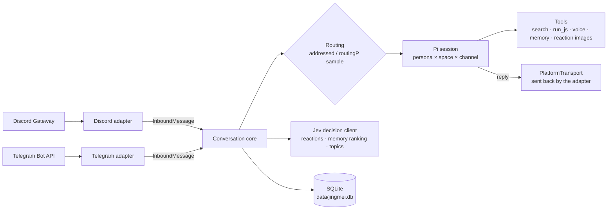

<div align="center">


# Jingmei (精魅)

**An AI group pet for Discord and Telegram groups · built on [Pi](https://www.npmjs.com/package/@earendil-works/pi-coding-agent)**

[](https://github.com/beiwater/jingmei/actions/workflows/ci.yml)
[](LICENSE)
[](https://bun.sh/)
[](tsconfig.json)
[](https://www.npmjs.com/package/@earendil-works/pi-coding-agent)
[](#discord-setup)

[中文](README.md) · **English**

[Quick start](#quick-start) · [Commands](#commands) · [Configuration](#configuration-reference) · [Architecture](docs/architecture.md) · [Deployment](docs/deploy.md) · [Contributing](CONTRIBUTING.md)

</div>

> The ancients believed that anything, given enough years, can become a spirit — hence *jing* (精); and because such spirits can bewitch the human heart — *mei* (魅).

Jingmei is an AI group pet that lives in Discord and Telegram groups. One configuration can keep several characters with different personalities: they chime in by probability, always answer when addressed, understand images and videos, send voice messages, look things up on the web, do math, and remember members' birthdays. Both platforms share one conversation core, and every character keeps a continuous Pi session in every channel.

## What it does

- **Chimes in by probability, always answers when addressed**: a message that @-mentions a character, replies to it, or contains its name or an alias always gets an answer from that character; other messages are sampled deterministically by `routingP` to decide whether anyone answers and who. Bot messages never trigger a character.
- **Jev quick reactions** (optional): a Jev decision API (or an in-process LLM wrapper) puts an emoji on messages. Addressed messages get the selected emoji unless the decision is `none`; ordinary messages only when strongly emotional or genuinely funny, rate-limited per channel. It does not use the main model and never delays the real reply. See [Jev](#jev).
- **Concurrent topics** (optional): `events` assigns channel messages to topics. `§E` IDs, titles, descriptions and leading participants tell the character which event it is answering, keeping simultaneous discussions separate and recalling older topics when they resume.
- **Images and video frames**: up to 4 images per message, scaled to fit 1024×1024 and 200 KB, reach the model; videos are sampled into 1–3 frames with ffmpeg. When the main model has no image input, Pi replaces each image with an omission note; alternatively set `visionModel` to describe images in a sentence or two first. Voice, files and stickers become text placeholders such as `[语音]`, `[文件]`, `[贴纸 😀]`.
- **Voice** (optional): with Fish Audio, characters can send MP3s with a transcript in Chinese, Japanese or English. When a member explicitly asks for a voice reply, the final answer is also turned into audio.
- **Web search**: with `DEEPSEEK_API_KEY` set, DeepSeek server-side web search is enabled. Messages that explicitly say “查一下” / “搜索” / “look up” are searched first and answered with source links; the model can also search on its own when a question depends on external facts.
- **Calculation**: `run_js` runs small pure-computation JavaScript in a node:vm realm inside a short-lived child process (no access to files, network or environment variables by default; this is not an OS-level sandbox, see the run_js threat model in [docs/architecture.md](docs/architecture.md)) for exact arithmetic, date math and unit conversions.
- **Member memory and soul**: per group, profiles hold names, birthdays, stable self-stated facts, and relationships formed by mentions and replies. The replying character automatically receives bounded private memory for the author, replied-to author, and mentioned humans (excluding bots and members who used `/forget`, with no extra decision call); it can recall other recently visible members by their chat display name. Characters save explicit self-stated interests, roles, projects, timezones, languages, goals, and preferences, never reciting full profiles or birthdays publicly. Each character keeps a private soul per channel; stable lessons about its own formatting, tone, or response length are staged and become formal only after successful compaction. Members can `/forget` at any time.
- **Holiday and birthday greetings** (optional): sent to a chosen channel after 09:00 local time, covering birthdays and Chinese/Australian holidays; deliveries are recorded in the database, so restarts never resend.
- **Reaction images**: characters can send one of 4 bundled PNGs (hello, laugh, think, hug); can be turned off per character.
- **No thinking by default, fewer tokens**: `reasoningEffort` defaults to `off`; even when enabled, thinking from completed turns is not sent back to the model. The system prompt and tool definitions stay stable for provider prefix caching.

## Architecture at a glance

One process, one conversation core, two thin platform adapters. Platform differences (formatting, length limits, emoji sets) stay in the adapters; the core only knows `InboundMessage` (in) and `PlatformTransport` (out).



| Principle | In practice |
|---|---|
| Pi-native first | Sessions, context compaction, model catalog and auth, image degradation all come from Pi |
| Deterministic before LLM | Routing is an HMAC sample, identical on replay; deduplication is a database primary key |
| Bounded cost | Stable system prompt and tool definitions hit prefix caches; dynamic content goes into messages only; reasoning off by default |
| Private by default | Secrets live only in `.env`; logs are redacted and never contain message text; members can `/forget` at any time |

Full data flow, schema and the run_js threat model: [docs/architecture.md](docs/architecture.md) (Chinese).

## Quick start

You need [Bun](https://bun.sh/) 1.3 or newer, at least one Discord or Telegram bot, and credentials for a model provider. Video frames additionally need `ffmpeg` (including `ffprobe`) on the host; without it everything else works and videos become a `[视频]` placeholder.

With `events` enabled, macOS development also needs `brew install sqlite` so Bun can load sqlite-vec. The first startup downloads the default Chinese embedding model (about 96 MB) into `data/models` (under your custom `dataDir` if set), requiring network access; later starts reuse that cache.

```bash
git clone https://github.com/beiwater/jingmei.git
cd jingmei
bun install
cp jingmei.config.example.json jingmei.config.json
cp .env.example .env
cp personas/template.en.md personas/luna.md
```

1. Edit `personas/luna.md`: the character's identity, voice and boundaries.
2. Edit `jingmei.config.json`: fill in server/channel or group IDs. If you use only one platform, delete the other platform's section and the matching account in each persona; delete `voice`, `jev`, `events` or `celebrations` if you don't want them. Fields are listed in [Configuration reference](#configuration-reference).
3. Edit `.env`: bot tokens, `ROUTING_SECRET` (any long random string) and API keys. The format is `key: value`, not `KEY=value`.
4. Provide model credentials, either way:
   - The example persona uses DeepSeek `deepseek-flash`; just set `DEEPSEEK_API_KEY` in `.env`. On startup a catalog entry for this model (without the key) is written to `data/pi-agent/models.json`.
   - Other providers: log in with the project's own Pi directory — run `PI_CODING_AGENT_DIR="$PWD/data/pi-agent" bunx pi`, then `/login`, and use `/model` to confirm the model name; or put that provider's API key variable (for example `OPENAI_API_KEY`) in the process environment. `.env` is read only by this project and, apart from `DEEPSEEK_API_KEY`, is not passed to Pi.
5. Start:

   ```bash
   bun run start
   ```

Startup validates the configuration, verifies every bot token, and checks that every persona's model exists and is authenticated. Configuration errors are listed all at once; an invalid token or unavailable model also stops startup. Then @-mention or reply to a character in the group.

## Discord setup

Each character is one Discord application.

1. In the [Discord Developer Portal](https://discord.com/developers/applications) create an application, copy the token on the **Bot** page and put it in `.env` (e.g. `DISCORD_LUNA_TOKEN: …`).
2. Under **Bot → Privileged Gateway Intents** enable **Message Content Intent**, otherwise the bot cannot read ordinary messages.
3. Under **OAuth2 → URL Generator** select `bot` and `applications.commands`, with the permissions View Channels, Send Messages, Read Message History, Send Messages in Threads, Attach Files, Add Reactions. Administrator is not needed.
4. Invite the bot with the generated link and put the server and channel IDs in `discord.guilds` (right-click → Copy ID in developer mode).

On startup each character registers its slash commands in its servers. Replies use Discord Markdown, are split above 2000 characters, and never trigger @ notifications.

## Telegram setup

1. Create one bot per character with `/newbot` at [@BotFather](https://t.me/BotFather) and put the token in `.env` (e.g. `TELEGRAM_LUNA_TOKEN: …`).
2. Use `/setprivacy` to set privacy mode to **Disable**, or make the bot a group admin; otherwise it only sees commands and messages addressed to it. After changing it, remove the bot from the group and add it again. The `privacy_mode_enabled` warning in the startup log points at this.
3. Add the bot to the group and put the group ID (supergroups look like `-100…`) in `telegram.chatIds`. If you don't know it, start with any placeholder, send a message in the group, and read `chat_id` from the `chat_ignored` log event.

Telegram limitation: **bots cannot see other bots' messages**. With several characters in one group they do not see each other's replies; each one knows only what members said and what it said itself. Discord has no such limit.

Telegram replies convert Markdown into message entities and are split above 4096 characters; reactions are limited to the emoji set allowed by the Bot API (which has no 😂).

## Commands

| Action | Discord (slash commands) | Telegram (text commands in the group) |
|---|---|---|
| List commands | `/help` | `/help` |
| Online characters | `/status` | `/status` |
| Ask directly | `/ask prompt:<question>` | `/ask <question>` |
| Show memory / re-enable | `/memory`, `/memory action:enable` | `/memory`, `/memory enable` |
| Birthday: show / set / clear | `/birthday`, `/birthday date:09-25`, `/birthday date:clear` | `/birthday`, `/birthday 09-25`, `/birthday clear` |
| Delete my memory here and stop collecting | `/forget` | `/forget` |
| Context usage (admin) | `/context` | `/context` |
| Compact context now (admin) | `/compact` | `/compact` |

- Discord command responses are visible only to the caller; the answer to `/ask` is posted in the channel as usual.
- Admin commands are open only to the character's `adminUserIds` and registered only for characters that have admins.
- Telegram commands can target a character with `@botusername`; without it the first character to receive the command handles it. With several characters in a group, `/context` and `/compact` must name one.
- Telegram has no caller-only replies, so command responses go to the group and `/memory` shows counts rather than the remembered details.
- `/forget` deletes only the structured member profile and relationships, not the platform's messages or existing session history.

## Configuration reference

There are exactly two sources: `jingmei.config.json` for settings and `.env` for secrets. The config file only names environment variables (`tokenEnv`, `apiKeyEnv`, `routingSecretEnv`), never the secrets themselves; process environment variables override `.env`. Write every ID as a JSON string.

### Top level

| Field | Meaning |
|---|---|
| `dataDir` | Data directory, default `data`; relative to the project root, `~/` allowed |
| `routingSecretEnv` | Env var holding the routing HMAC secret, default `ROUTING_SECRET`; must be set |
| `visionModel` | Optional `"provider/model"` (split at the first `/`). Describes images as text only for personas whose main model cannot see images; must accept image input |
| `discord.guilds[]` | `{ guildId, channelIds }`: server ID and allowed channel IDs (17–20 digits); threads under those channels work too |
| `telegram.chatIds` | Allowed group IDs, e.g. `"-1001234567890"` |
| `voice` | Optional Fish Audio: `apiKeyEnv`, `referenceId` (32-hex voice ID), `model` (`s2.1-pro-free` default, or `s2.1-pro`) |
| `jev` | Optional, see [Jev](#jev) |
| `localJev` | Optional in-process LLM→Jev wrapper: required `baseUrl` (http(s)) and `model`, optional `apiKeyEnv` (omit for unauthenticated local services). Requires an OpenAI-compatible endpoint with logprobs. If the section is absent and `DEEPSEEK_API_KEY` resolves, defaults to DeepSeek / `deepseek-flash` |
| `events` | Optional; presence enables topics. Required `summaryModel`: `"provider/model"` (first slash splits; model and authentication checked at startup). `embeddingModel` defaults to `fast-bge-small-zh-v1.5` (512 dimensions), and must be supported by fastembed. Requires a remote Jev or local LLM decision client |
| `celebrations[]` | Optional greeting targets, see below |
| `personas[]` | Characters, at least one |

Web search has no setting: it is on whenever `DEEPSEEK_API_KEY` is present.

### `personas[]`

| Field | Meaning |
|---|---|
| `id` | Unique, `a-z 0-9 _ -` only |
| `name` | Display name; a message containing it addresses the character |
| `personaPath` | Persona file, must be readable |
| `provider` / `model` | Pi provider and model ID |
| `reasoningEffort` | `off` (default), `minimal`, `low`, `medium`, `high`, `xhigh`, `max`; a level the model doesn't support fails at startup |
| `routingP` | 0–1, the chance this character answers an ordinary message; the sum over all characters that can speak in one group/server must not exceed 1. Use 0 to answer only when addressed |
| `aliases` | Optional extra names that address the character (≤ 64 characters each) |
| `spaces` | Optional restriction to some groups/servers, e.g. `["discord:<guildId>", "telegram:<chatId>"]`; omit for all |
| `sendReactionImages` | Whether the bundled reaction images may be sent, default `true` |
| `voiceEnabled` | Whether to use `voice` when configured, default `true` |
| `discord` / `telegram` | The character's account on that platform: `{ tokenEnv, adminUserIds? }`. At least one is required, and each platform used needs its top-level section. `adminUserIds` may use `/context` and `/compact` |

### `celebrations[]`

| Field | Meaning |
|---|---|
| `space` | `"discord:<guildId>"` or `"telegram:<chatId>"`, a configured space |
| `channelId` | Discord: one of that server's allowed channels; Telegram: optional, must equal the group ID if set |
| `personaId` | The character who sends greetings; must be able to speak in that space |
| `timeZone` | IANA time zone, e.g. `Australia/Sydney` |
| `calendar` | `china` (New Year's Day, Spring Festival, Labour Day, Dragon Boat, Mid-Autumn, National Day), `australia` (New Year's Day, Australia Day, Good Friday, Easter Sunday, ANZAC Day, Christmas, Boxing Day) or `both` |

Lunar holidays are calculated from the Gregorian date in the target time zone, independently of the operating system; leap months do not repeat greetings.

Birthdays are greeted only in groups/servers with a greeting target; February 29 birthdays are greeted on February 28 in common years.

## Jev

[Jev](https://docs.typesafe.ai/models) is TypeSafe's “System One” decision model: instead of text it returns calibrated probabilities for structured questions. Jingmei shares one decision client across reactions, memory ranking, and optional event assignment and participation scoring.

**Quick reactions** (`quickReactions`). Every human message with text gets one Jev request asking three things at once: pick an emoji from the table (or `none`), is the message strongly emotional, is it funny.

- Addressed messages (mention, reply, name): the addressed character adds the chosen emoji, nothing if Jev chose `none`.
- Ordinary messages: an emoji is added only if max(strong emotion, funny) ≥ `threshold` and the channel's previous such reaction was at least `minIntervalMs` ago, by the first character configured for that group. Messages inside the rate-limit window don't call Jev at all.
- Runs alongside the main reply; failures are only logged and never affect the reply. While enabled, the main model's `react_to_message` tool is not registered — reactions belong to Jev.

**Memory ranking** (`memoryScoring`). When a character explicitly calls `recall_member_memory`, candidate facts and relationships (per member: the 20 newest facts and 16 strongest relationships) are scored against the current message in a single Jev request, keeping the 5 most relevant facts and 4 relationships per member. If Jev is unavailable it falls back to recency and interaction count. Automatically injected member memory uses recency and interaction count directly without calling Jev.

**Local wrapper and fallback**. When `jev.apiKeyEnv` resolves, requests go to `jev.endpoint` first. If a local LLM is configured, any remote error retries once through the in-process `notjev` wrapper. Without a remote key, the wrapper is used directly; no extra HTTP server is started. “Local” describes the wrapper, not necessarily its LLM: absent `localJev` plus a resolved `DEEPSEEK_API_KEY` defaults to `https://api.deepseek.com` / `deepseek-flash`. An explicit `localJev` replaces that default completely; omitting its `apiKeyEnv` sends no authentication.

The wrapper has a 30-second default timeout and disables DeepSeek thinking (`thinking.type=disabled`). Its LLM must return logprobs; missing logprobs become an `invalid_response` call failure. When the model abstains, the wrapper takes the highest-probability option (argmax).

Quick reactions and memory ranking still require an explicit `jev` section; `events` alone or a DeepSeek key alone does not enable them. You may omit `jev.apiKeyEnv` to use only the wrapper. With neither a remote key nor a resolved local LLM, these features remain disabled. An explicitly named `apiKeyEnv` missing from `.env` / the process environment is still a configuration error, not a silent fallback. Wrapper calls are billed by the chosen LLM provider.

**Cost**. Remote Jev bills input tokens only; output is free (`jev-1.13` was $0.042 per million tokens at the time of writing — see the [official pricing](https://docs.typesafe.ai/models)). A reaction request carries just the message, up to 5 recent chat lines (each cut to 200 characters) and three questions — typically a few hundred tokens — and the remote request times out after 3 seconds. It uses none of the main model's tokens; the local wrapper consumes tokens from its configured LLM.

**Configuration**. Put `TYPESAFE_API_KEY: …` in `.env` and add to `jingmei.config.json`:

```json
"jev": {
	"endpoint": "https://api.typesafe.ai/v1/systemone",
	"apiKeyEnv": "TYPESAFE_API_KEY",
	"model": "jev-latest",
	"quickReactions": true,
	"memoryScoring": true,
	"threshold": 0.8,
	"minIntervalMs": 60000
}
```

| Field | Default | Meaning |
|---|---|---|
| `endpoint` | `https://api.typesafe.ai/v1/systemone` | Remote Jev http(s) URL |
| `apiKeyEnv` | none | Env var for the remote key; omit to use only the local wrapper |
| `model` | `jev-latest` | Can be pinned, e.g. `jev-1.13.0` |
| `quickReactions` | `true` | Quick reactions |
| `memoryScoring` | `true` | Memory ranking |
| `threshold` | `0.8` | In (0, 1]; minimum score for reacting to an ordinary message |
| `minIntervalMs` | `60000` | Minimum gap between two ordinary-message reactions in one channel |
| `emojis` | platform defaults | Per-platform override: `{ "discord": { "👍": "agree" }, "telegram": { … } }`; the key `none` is reserved |

Default tables (emoji → meaning given to Jev, in Chinese in the code):

| Meaning | Discord | Telegram |
|---|---|---|
| Agree, got it | 👍 | 👍 |
| Funny | 😂 | 🤣 |
| Sad, crushed | 😭 | 😭 |
| Heartwarming, thanks | ❤️ | ❤ |
| Puzzled, unsure | 🤔 | 🤔 |

Emojis in a custom Telegram table that the Bot API does not allow are dropped with a warning.

### Topic configuration

```json
"events": {
	"summaryModel": "deepseek/deepseek-flash",
	"embeddingModel": "fast-bge-small-zh-v1.5"
}
```

A reply to a message that already has an event inherits that event without a decision call (bot replies too; bot messages that reply to nothing have no event). A human message with fewer than 2 letters/digits after removing bare media placeholders such as `[贴纸 …]`, `[视频 N帧]` and `[文件]` joins the most recently active topic from the last 10 minutes. Other human messages go through the decision client whenever topic candidates exist: short replies, follow-ups and emotional reactions lean towards the ongoing topic, and a “new” decision whose probability is below 0.6 is reassigned to the most probable existing topic. Topics with a message in the last 2 hours are active. Candidates are up to 5 recent active topics, 2 older topics recalled by vector similarity within the same space/channel, and “new”. At 3, 6, 12, 24… messages, a background single-flight refresh generates the title/description, scores participation and updates the embedding without blocking channel processing. Summaries use the independent `summaryModel`; dynamic event details are appended only to the triggering input, never the system prompt.

## Deployment

The repository ships a systemd user unit, [`deploy/pi-discord-agent.service`](deploy/pi-discord-agent.service). It still runs `bun run src/discord/main.ts`, which now starts Jingmei, so existing deployments keep their unit file unchanged.

```bash
cp deploy/pi-discord-agent.service ~/.config/systemd/user/
systemctl --user daemon-reload
systemctl --user enable --now pi-discord-agent
journalctl --user -u pi-discord-agent -f
```

The unit assumes the code lives in `~/apps/pi-extension-discord` and Bun at `~/.local/share/pi-discord-bun/node_modules/.bin/bun`; adjust those two lines if yours differ. Data directory, logs and updates are covered in [docs/deploy.md](docs/deploy.md).

## Migrating from the old version

The old version was Discord-only, configured by `discord.config.json`, with its database at `data/discord-agent.db`.

```bash
bun scripts/migrate-config.ts
```

The script converts `discord.config.json` in the project root into `jingmei.config.json` (refusing to overwrite an existing one): `token_env` becomes `discord.tokenEnv`, `guildIds` becomes `spaces`, a celebration's `guildId` becomes `space`, and unknown fields are dropped. Afterwards check that persona `id`s use only `a-z 0-9 _ -`, then add `telegram` and `jev` sections as needed. Existing `.env` variable names keep working.

The database needs no manual step: on first start, if `data/jingmei.db` does not exist but `data/discord-agent.db` does, it is renamed together with its `-wal`/`-shm` files, the old `discord_*` tables are migrated to the new names, and server IDs are rewritten as `discord:<guildId>`. The migration runs in one transaction and is safe to repeat; existing Pi sessions continue.

## Development

```bash
bun test          # network allowed, Discord / Telegram forbidden
bun run check     # tsc --noEmit
bun run lint      # Biome
```

Start with [AGENTS.md](AGENTS.md); architecture is in [docs/architecture.md](docs/architecture.md) and the test inventory in [docs/testing.md](docs/testing.md). CI runs the same three steps on pushes to `main` and on every PR.

## Contributing

Issues and PRs are welcome. Read [CONTRIBUTING.md](CONTRIBUTING.md) first: one behavior change per commit, and user-visible changes update both READMEs.

## Security

Please do not report vulnerabilities in public issues; see [SECURITY.md](SECURITY.md).

## License

BSD 2-Clause, see [LICENSE](LICENSE). Jingmei derives from [mizorewww/pi-extension-telegram-agent](https://github.com/mizorewww/pi-extension-telegram-agent); thanks to its author.
