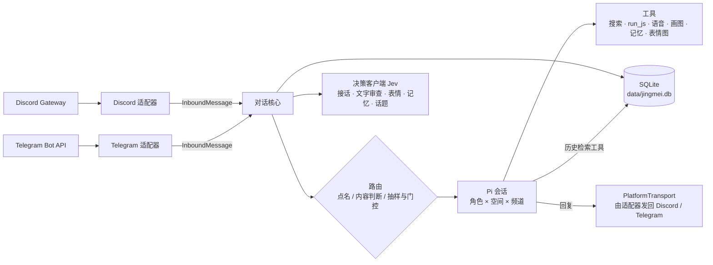

<div align="center">


# 精魅 Jingmei

**住在 Discord 与 Telegram 群里的 AI 群宠 · 基于 [Pi](https://www.npmjs.com/package/@earendil-works/pi-coding-agent) 构建**

[](https://github.com/beiwater/jingmei/actions/workflows/ci.yml)
[](LICENSE)
[](https://bun.sh/)
[](tsconfig.json)
[](https://www.npmjs.com/package/@earendil-works/pi-coding-agent)
[](#discord-设置)

**中文** · [English](README.en.md)

[快速开始](#快速开始) · [命令](#命令) · [运维命令](#运维命令) · [配置参考](#配置参考) · [架构](docs/architecture.md) · [部署](docs/deploy.md) · [参与贡献](CONTRIBUTING.md)

</div>

> 古人认为万物年深日久皆可成精，故称“精”；其能迷惑人心，故称“魅”。

精魅是住在 Discord 和 Telegram 群里的 AI 群宠。一份配置可以同时养几个性格不同的角色：平时按概率接话，被点名一定回应；看得懂图片和视频，会发语音、上网查资料、算数，记得群友的生日。两个平台共用同一个对话核心，每个角色在每个频道按“对话段”使用 Pi 会话：只有被触发的角色才写自己的会话，连续对话接续同一段，间隔久了或积累多了就开新段，更早的聊天靠检索。

## 能做什么

- **懂内容再接话，被点名必路由**：@ 提及、回复角色、叫名字/别名的路由优先级不变；普通人类消息在有决策客户端且开启接话判断时先识别是否在对某个角色说话，否则仅让 `routingP` 确定性抽样候选在冷却、发言占比与启用时的内容分数都合格后接话。bot 消息不触发角色；发送前还会检查最终文字，拦住内部标记或不自然的回复。
- **失败不堵群**：模型与工具轮次最多等 180 秒，超时中止并释放频道；失败只记日志，不在群里发送错误提示。Telegram 的成功文字/图片/语音回复也写入历史，回复 bot 时能继承原话题；Discord 仍通过平台回声记录。
- **崩溃恢复，过期不插话**：消息与待处理记录在同一事务入库，重启后补处理最近 3 分钟内的未完成消息；失败轮次不重试。收到或轮到处理时已超过 3 分钟的消息（包括长时间离线后补收的积压）只入库并写入向量索引：不回复（即使被 @、回复或叫名字）、不请求接话判断、不点秒回表情、不记入成员记忆和话题，Telegram 也不下载其中的图片和视频，只留 `[图片]`、`[视频]` 等占位。之后角色被触发时，它们仍作为积累的消息进入对话。恢复消息保留文字，图片以不可用说明代替。
- **持续显示“正在输入…”**：被路由的角色生成回复期间，Telegram 每 4 秒、Discord 每 8 秒刷新一次输入状态，回复发出、被扣留或失败时停止，最长显示 60 秒。
- **能查“为什么没回”**：每条人类消息记一行不含正文的 `route` 日志，写明最终路由、HMAC 候选、是否被冷却/占比挡住、接话判断结果与分数；暂停期间记 `paused`。字段见 [docs/architecture.md](docs/architecture.md#路由srccorerouterts)。
- **Jev 秒回表情**（可选）：用 Jev 决策接口（或进程内 LLM 包装器）给消息点一个表情。点名的消息只要选中表情就会点，普通消息只有情绪强烈或确实好笑时才会，并且每个频道限频。不占用主模型，也不拖慢正式回复。详见 [Jev](#jev)。
- **并行话题**（可选）：`events` 把同一频道的消息归入不同话题，用 `§E` 编号、标题、描述和主要参与者告诉角色当前在回应哪个事件，避免把同时发生的讨论混在一起；还能召回之前暂时结束的话题。
- **对话段，按需接续**：群消息一律入库并建索引，但只有被路由触发的角色才写自己的会话，没被触发的消息不会进入任何会话。角色被触发时，若距它上次成功回复不超过 5 分钟、之后积累的消息不超过 30 条、会话不超过 40,000 tokens，就接续原会话：把积累的消息作为一条上下文追加，再写触发消息；否则开新段，以触发前最近 30 条消息为种子。每行形如 `[时间] #消息号 ↪ 被回复号 §E话题 作者: 内容 （相关 N 条）`，N 是更早历史里的相关消息数（超过 20 显示 `20+`），写入时固化、之后不变，因此前缀稳定、缓存命中。轮次超时、发送失败或最终出错后下一次一定开新段，重启后同样成立。
- **历史检索**：角色看到“（相关 N 条）”时，可以调用 `related_messages` 按某条消息查更早的相关聊天，或用 `search_history` 按关键词与语义检索（可按 ISO 时间或 `YYYY-MM-DD` 日期限定范围）；每轮合计最多 3 次，每次最多 20 行，命中带前后各 2 行上下文，只查当前群/频道，已 `/forget` 的成员不会出现。关键词用 SQLite FTS5 trigram，语义用 sqlite-vec 向量（需要开启 `events`，复用其 embedding 模型）。升级前入库的旧消息要运行[回填脚本](#运维命令)才能被检索。
- **看图与视频抽帧**：每条消息最多 4 张图片，缩放到 1024×1024、200 KB 以内交给模型；视频用 ffmpeg 抽 1–3 帧。主模型不支持图片输入时，Pi 会把图片替换成一条省略说明；也可以配置 `visionModel`，先把图片描述成一两句文字。语音、文件、贴纸以 `[语音]`、`[文件]`、`[贴纸 😀]` 这样的文字占位。
- **语音**（可选）：接入 Fish Audio 后，角色可以用中文、日语或英语发送带文字稿的 MP3。群友明确要求“用语音回复”时，最终回答也会转成语音。
- **画图**（可选）：登录 Antigravity provider 后，角色可以在 `send_reply` 里放一个 `image` 部分，按群友的描述生成一张图发出（默认 Nano Banana 2 / `gemini-3.1-flash-image`，约十几秒）。登录方式见[画图](#画图)。**注意**：Google Antigravity 条款明确禁止用第三方工具调用 Antigravity OAuth，已有账号因此被封，建议使用小号。
- **长文转图**（可选）：开启 `textImage` 后，文字回复超过 300 字（可配置）就不会发出，角色会被告知改用 `send_reply` 的 `text_image` 部分，把完整内容写成 Markdown 渲染成一张图发出：支持标题、列表、表格、代码块、LaTeX 公式（`$…$`、`$$…$$`）、公网图片、函数图（函数、隐函数、参数方程、散点、3D 曲面），以及开启画图时由 AI 新画的插图。纯库实现，不需要浏览器。详见[长文转图](#长文转图)。
- **K 线图**（可选）：开启 `kline` 后，角色可以在 `send_reply` 里放一个 `kline_image` 部分，发出 Binance 现货交易对（如 BTCUSDT）的实时 K 线图（蜡烛图 + 成交量）。行情由 bot 从 Binance 公共接口取，模型只选交易对与周期，不写数字；纯库实现（手写 SVG + resvg），不需要浏览器。详见[K 线图](#k-线图)。
- **联网搜索**：配置 `DEEPSEEK_API_KEY` 后启用 DeepSeek 服务端联网搜索。消息里明确说“查一下”“搜索”时先搜再答，回答附来源链接；其他需要外部事实的问题，模型也可以自己调用搜索。
- **计算**：`run_js` 在短时子进程的 node:vm 隔离环境里运行小段纯计算 JavaScript，用于精确计算、日期运算和单位换算。必须在 Linux 上运行，并有可用的 bubblewrap（隔离文件系统、网络与 PID）；启动时试运行一次，不可用就直接报错退出，没有回退。无新增配置；Ubuntu 启用见 [docs/deploy.md](docs/deploy.md#run_js-操作系统沙箱)，残余风险见 [docs/architecture.md](docs/architecture.md)。
- **成员记忆与 soul**：按群记录名字、生日、本人明确说过的稳定信息，以及提及/回复形成的关系。成员记忆不会自动附在输入里，接话角色需要时调用 `recall_member_memory` 按聊天显示名回想（排除 bot 和已 `/forget` 的成员），这样历史更短、缓存更稳。角色会保存作者本人明确陈述的兴趣、角色、项目、时区、语言、目标与偏好，不会在群里复述完整档案或生日。每个角色在每个频道还有私人 soul，学到自身格式、语气、长度等稳定教训后先暂存，开新对话段或压缩成功后才转为正式内容。成员可随时 `/forget`。
  何时保存、何时回想写在 system prompt 里：作者自述长期信息时先保存再回复（玩笑、一时状态、他人信息、敏感信息不存）；被问到成员情况时先回想；查不到就说不记得，不编造。
- **节日与生日祝福**（可选）：在指定频道、当地时间 09:00 之后发送生日祝福和中国/澳洲节日祝福；发送记录存在数据库里，重启不会重发。
- **表情图**：角色可以从内置的 4 张 PNG（hello、laugh、think、hug）或自己的本地 PNG/JPEG 图库里挑一张发出去（`send_reply` 的 `reaction_image` 部分），默认使用图库说明作配文；可按角色关闭。
- **一次发几条**：角色调用 `send_reply` 可以在一轮里按顺序发最多 4 条消息：文字、语音、新画的图、表情图、长文图（后四种每种最多 1 条），比如先发一张图再用文字或语音解释，或把回答分成几段。只有当前角色能用的种类才会出现在工具里。画图、渲染、合成语音等慢的部分并行准备，全部准备好才严格按顺序发出，只有第一条回复原消息；任一部分准备失败就一条都不发，角色改用文字；发到一半失败时已发出的留着、不重发，后面的不再发。文字与语音稿和普通文字回复一样经过内部标记检查、自然度审查和长度闸门。一句话说得完时角色仍直接写文字回复。
- **默认不思考，省 token**：`reasoningEffort` 默认 `off`；即使打开，已完成轮次的 thinking 也不会再发给模型。system prompt 和工具定义保持稳定，便于 provider 前缀缓存。
- **固定身份与摘要边界**：角色明确知道自己的名字、别名和已验证平台账号，接受路由交给它的回复轮次；媒体说明区分直接图片输入、可选辅助描述和占位，不编造处理流程。历史压缩摘要要求保留固定身份、只记确认事实并归因成员说法，不把助手猜测或过去拒绝固化为规则；风格教训仅在成员明确要求时保留。

## 架构一览

一个进程、一个对话核心、两个薄平台适配器。平台差异（格式、长度上限、表情集合）全部留在适配器里，核心只认 `InboundMessage`（进）和 `PlatformTransport`（出）。



| 设计原则 | 体现 |
|---|---|
| Pi 原生优先 | 会话、窗口上限兜底压缩、模型目录与认证、图片降级都直接用 Pi |
| 确定性优先于 LLM | 概率候选用可重放的 HMAC 抽样，冷却与占比用历史计算；内容判断只用有界决策请求，去重靠数据库主键 |
| 成本有界 | system prompt 与工具定义稳定以命中前缀缓存；动态内容只进消息；对话段按上限换新，种子只取最近 30 条，更早的靠检索；reasoning 默认关闭 |
| 隐私默认 | 密钥只在 `.env`；日志自动脱敏，不记正文；成员可随时 `/forget` |

完整数据流、表结构与 run_js 威胁模型见 [docs/architecture.md](docs/architecture.md)。

## 快速开始

需要 Linux、[Bun](https://bun.sh/) 1.3 以上、可用的 bubblewrap（`run_js` 沙箱，缺少则启动报错，见 [docs/deploy.md](docs/deploy.md#run_js-操作系统沙箱)）、至少一个 Discord bot 或 Telegram bot，以及一个模型 provider 的凭据。视频抽帧另需系统安装 `ffmpeg`（含 `ffprobe`）；没有也能运行，视频只剩 `[视频]` 占位。

macOS 开发机还需 `brew install sqlite`，供 Bun 加载 sqlite-vec 扩展。首次启动会下载约 96 MB 的默认中文 embedding 模型到 `data/models`（自定义 `dataDir` 时随之变化），需要网络；之后复用本地缓存。消息检索的向量部分（相关条数、语义检索）总是使用这个模型；开启 `events` 时话题也共用它。

```bash
git clone https://github.com/beiwater/jingmei.git
cd jingmei
bun install
cp jingmei.config.example.json jingmei.config.json
cp .env.example .env
cp personas/template.zh.md personas/luna.md
```

1. 编辑 `personas/luna.md`，写下角色的身份、说话方式和边界。
2. 编辑 `jingmei.config.json`：填入服务器/频道或群 ID，只用一个平台就删掉另一个平台的段落和角色里对应的账号；不用语音、Jev、话题或节日祝福就删掉 `voice`、`jev`、`events`、`celebrations`。字段见[配置参考](#配置参考)。
3. 编辑 `.env`，填 bot token、`ROUTING_SECRET`（任意随机长字符串）和各项 API key。注意格式是 `key: value`，不是 `KEY=value`。
4. 准备模型凭据，二选一：
   - 示例角色使用 DeepSeek 的 `deepseek-flash`，只需在 `.env` 填 `DEEPSEEK_API_KEY`。启动时会在 `data/pi-agent/models.json` 写入这个模型的目录条目（不含密钥）。
   - 其他 provider：订阅账号（Claude Pro/Max、ChatGPT Plus/Pro、GitHub Copilot 等）用 `bun run jingmei login` 选 provider 走 OAuth 登录，凭据写进 `<dataDir>/pi-agent/auth.json`，bot 启动后直接使用并自动刷新 token；`bun run jingmei logout` 删除。服务器上没有浏览器时，在本机浏览器打开打印出的链接，再把最终跳转 URL 或授权码粘贴回终端。`bun run jingmei model` 列出所有已有凭据的模型。也可以把该 provider 的 API key 环境变量（如 `OPENAI_API_KEY`）放进进程环境。`.env` 只由本项目读取，除 `DEEPSEEK_API_KEY` 外不会转交给 Pi。
5. 启动：

   ```bash
   bun run start
   ```

启动时会校验配置、验证每个 bot token、确认每个角色的模型存在且已认证。配置错误会一次列全；token 或模型不可用也会报错退出。之后去群里 @ 角色或回复它试试。

在终端前台启动时，准备期间会播放 [fox-girl-loader](https://github.com/beiwater/fox-girl-loader) 加载动画，就绪后显示 **✓ Ready**，期间的启动日志在动画结束后补显示；systemd 等非终端环境不绘制动画，日志照常输出。

<div align="center">

</div>

## Discord 设置

每个角色对应一个 Discord application。

1. 在 [Discord Developer Portal](https://discord.com/developers/applications) 创建 application，在 **Bot** 页面复制 token，写进 `.env`（如 `DISCORD_LUNA_TOKEN: …`）。
2. 在 **Bot → Privileged Gateway Intents** 打开 **Message Content Intent**，否则 bot 读不到普通消息。
3. 在 **OAuth2 → URL Generator** 勾选 `bot` 和 `applications.commands`，权限选 View Channels、Send Messages、Read Message History、Send Messages in Threads、Attach Files、Add Reactions。不需要 Administrator。
4. 用生成的链接把 bot 邀请进服务器，把服务器 ID 和频道 ID 填进 `discord.guilds`（开发者模式下右键复制 ID）。

启动时每个角色会在其服务器注册斜杠命令。回复是 Discord Markdown，单条超过 2000 字符会分段发送，并且不会产生 @ 通知。

## Telegram 设置

1. 在 [@BotFather](https://t.me/BotFather) 用 `/newbot` 为每个角色创建 bot，token 写进 `.env`（如 `TELEGRAM_LUNA_TOKEN: …`）。
2. 用 `/setprivacy` 把 privacy mode 设为 **Disable**，或把 bot 设为群管理员，否则它只能看到命令和 @ 它的消息。改完后把 bot 移出群再重新拉入才会生效。启动日志里的 `privacy_mode_enabled` 警告就是在提示这件事。
3. 把 bot 拉进群，在 `telegram.chatIds` 填入群 ID（超级群形如 `-100…`）。不知道 ID 时，先随便填一个再启动，在群里发条消息，日志里的 `chat_ignored` 事件会带出 `chat_id`。

Telegram 的限制：**bot 看不到其他 bot 的消息**。同一个群里放多个角色时，它们互相看不到对方的回复，每个角色只知道群友说了什么和自己说了什么。Discord 没有这个限制。

Telegram 回复把 Markdown 转成消息实体，超过 4096 字符分条发送；大段解释、长清单这类细节由角色放进 ```` ```fold ```` 代码块，显示成默认收起、点开才展开的引用（块内只保留粗体/斜体/删除线，代码以纯文字显示，链接写成“文字 (网址)”）。表情回应只能用 Bot API 允许的表情集合（其中没有 😂）。

## 命令

| 功能 | Discord（斜杠命令） | Telegram（群内文字命令） |
|---|---|---|
| 查看命令 | `/help` | `/help` |
| 在线角色 | `/status` | `/status` |
| 直接提问 | `/ask prompt:<问题>` | `/ask <问题>` |
| 查看记忆 / 重新启用 | `/memory`、`/memory action:enable` | `/memory`、`/memory enable` |
| 生日：查看 / 设置 / 清除 | `/birthday`、`/birthday date:09-25`、`/birthday date:clear` | `/birthday`、`/birthday 09-25`、`/birthday clear` |
| 删除本群记忆并停止记录 | `/forget` | `/forget` |
| 上下文用量与对话段上限（管理员） | `/context` | `/context` |
| 手动压缩上下文（管理员） | `/compact` | `/compact` |

- Discord 命令的回执只有调用者自己看得见；`/ask` 的答案照常发在频道里。
- 管理员命令只对该角色 `adminUserIds` 里的用户开放，也只注册给配置了管理员的角色。
- Telegram 命令可加 `@bot用户名` 指定角色；不加时由第一个收到的角色处理。群里有多个角色时，`/context`、`/compact` 必须指定角色。
- Telegram 没有“仅自己可见”，命令回执直接发在群里，所以 `/memory` 只显示条数，不列出具体内容。
- `/forget` 只删除结构化的成员档案和关系，以及该成员的消息检索索引（之后不再索引其消息），不删除平台上的原消息或已有的会话历史。

## 运维命令

在项目目录、以运行 bot 的同一个用户执行。只读 `jingmei.config.json` 的 `dataDir` 和角色的 `provider`/`model`，不需要 bot token；`bun run jingmei --help` 列出全部命令。

| 命令 | 作用 |
|---|---|
| `bun run jingmei` | 交互菜单：状态、切换模型、暂停 / 恢复、登录、登出；每项做完回到菜单，选 Exit 退出 |
| `bun run jingmei start` | 前台启动 bot，等同 `bun run start` |
| `bun run jingmei login [provider]` / `logout [provider]` | OAuth 登录 / 删除已保存的凭据；登录后刷新该 provider 的模型列表 |
| `bun run jingmei model [provider/model\|default] [--persona <id>]` | 查看并切换角色的聊天模型；不带模型时刷新模型列表后弹出选择 |
| `bun run jingmei pause` / `resume` | 暂停 / 恢复 |
| `bun run jingmei stats` | 运行状态与本次运行时长、累计运行时长与启动次数、回复数、消息 / 群 / 成员 / 话题 / 祝福总数 |
| `nice -n 10 bun scripts/backfill-message-index.ts [delayMs]` | 给升级前入库的旧消息补建检索索引（关键词 + 向量），最新优先，默认每条间隔 100ms，可中断后重跑、已索引的跳过；部署新版本后运行一次，新消息自动索引。详见 [docs/deploy.md](docs/deploy.md#升级后回填历史消息索引) |

- **暂停**：bot 保持在线并照常把消息存进数据库，但不回复、不点表情、不更新成员记忆和话题、不发祝福，也不调用回复模型；管理员手动压缩仍可调用模型。对正在运行的 bot 立即生效，不用重启；重启后仍保持暂停，直到 `resume`。暂停期间的消息只入库、不写入任何会话（恢复后角色被触发时，它们与其他未触发的消息一样，可能随最近窗口进入新会话）；当天到期的祝福在恢复后补发。要真正停掉进程，用 `systemctl --user stop pi-discord-agent` 或 Ctrl+C。
- **运行状态**：bot 每分钟写一次心跳，超过两分钟没有心跳即视为已停止（包括崩溃）。回复数从引入这个命令的版本开始统计；消息等数据统计全部历史。
- **切换模型**：只能在服务器上用 CLI 切换，群里没有对应命令。选择存在数据库里，运行中的 bot 在每个频道下一次回复前换过去，不用重启，重启后保留；`default` 恢复 `jingmei.config.json` 里的 `provider`/`model`。`reasoningEffort` 不变，新模型不支持时由 Pi 自动降级。要用其他 provider 先 `login`，或把 API key 放进服务进程环境。选中的模型 bot 找不到时（例如 provider 被删除），它会记 `model_override_unavailable` 警告并继续用配置模型。切换会让 provider 前缀缓存失效一次。
- **上下文与对话段**：每个频道、每个角色的会话使用模型自己的 `contextWindow`（例如 Gemini 的 1M），不再统一截断。常规情况下对话段在 5 分钟无回复、积累超过 30 条消息或会话超过 40,000 tokens 时就在下一次触发时换新，所以回复输入量保持在较小范围，不再依赖压缩。接近真实窗口上限（窗口减 16,384 tokens）仍由 Pi 自动压缩兜底，provider 溢出恢复也保留；管理员仍可 `/compact` 手动压缩；`/context` 显示当前用量、窗口条数与对话段上限。压缩后保留最近约 1.5–2 万真实 token（Pi 对中文按字符估算低估约 5 倍，因此保留量仍设为 3000 估算 token）；对话段内历史只在末尾追加，有利于前缀缓存。

## 配置参考

配置只有两处：`jingmei.config.json` 放业务配置，`.env` 放密钥。配置文件里只写环境变量的名字（`tokenEnv`、`apiKeyEnv`、`routingSecretEnv`），不写密钥本身；进程环境变量优先于 `.env`。所有 ID 都写成 JSON 字符串。

### 顶层

| 字段 | 说明 |
|---|---|
| `dataDir` | 数据目录，默认 `data`；相对路径以项目根为准，支持 `~/` |
| `routingSecretEnv` | 路由 HMAC 密钥的环境变量名，默认 `ROUTING_SECRET`；必须有值 |
| `visionModel` | 可选，`"provider/model"`（按第一个 `/` 拆分）。只在有角色的主模型不能看图时，为图片生成文字描述；该模型必须支持图片输入 |
| `discord.guilds[]` | `{ guildId, channelIds }`：服务器 ID 与允许的频道 ID（17–20 位数字）；这些频道下的 thread 也可用 |
| `telegram.chatIds` | 允许的群 ID，如 `"-1001234567890"` |
| `voice` | 可选，Fish Audio：`apiKeyEnv`、`referenceId`（32 位十六进制音色 ID）、`model`（`s2.1-pro-free` 默认，或 `s2.1-pro`） |
| `imageGeneration` | 可选，`{ model }`：画图用的 Antigravity 模型 ID，默认 `gemini-3.1-flash-image`。只有登录了 `antigravity` provider 时画图工具才会启用，见[画图](#画图) |
| `kline` | 可选，`{ enabled }`：`enabled` 默认 `false`，见[K 线图](#k-线图) |
| `textImage` | 可选，`{ enabled, thresholdChars }`：`enabled` 默认 `false`；`thresholdChars` 是文字回复的字数上限（50–8000 的整数，默认 `300`），见[长文转图](#长文转图) |
| `jev` | 可选，见 [Jev](#jev) |
| `localJev` | 可选，进程内 LLM→Jev 包装器：`baseUrl`（http(s)）、`model`（必填）、`apiKeyEnv`（可省略，供无鉴权本地服务）。接口需兼容 OpenAI 且支持 logprobs；省略整个段落且有 `DEEPSEEK_API_KEY` 时默认 DeepSeek / `deepseek-flash` |
| `events` | 可选，存在即启用话题：`summaryModel` 必填，`"provider/model"`（第一个 `/` 拆分，启动时校验模型与认证）；`embeddingModel` 默认 `fast-bge-small-zh-v1.5`（512 维），须是 fastembed 支持的模型，同时用于消息检索向量（不开话题时消息检索用默认模型）。必须能解析出远程 Jev 或本地 LLM 决策客户端 |
| `celebrations[]` | 可选，节日与生日祝福目标，见下 |
| `personas[]` | 角色列表，至少一个 |

联网搜索没有配置项：环境里有 `DEEPSEEK_API_KEY` 就启用。

### `personas[]`

| 字段 | 说明 |
|---|---|
| `id` | 唯一，只能用 `a-z 0-9 _ -` |
| `name` | 显示名；消息里出现这个名字即视为点名 |
| `personaPath` | 人设文件路径，必须可读 |
| `reactionImages` | 可选，本地图库目录（含 `catalog.json`）；路径与 `personaPath` 一样按项目根目录解析，也支持绝对路径和 `~/` |
| `provider` / `model` | Pi 的 provider 与模型 ID |
| `reasoningEffort` | `off`（默认）、`minimal`、`low`、`medium`、`high`、`xhigh`、`max`；模型不支持的档位会在启动时报错 |
| `routingP` | 0–1。普通消息的确定性抽样候选概率，仍须通过门控与启用时的内容判断；同一群/服务器内能发言角色之和不得超过 1。设为 0 不参与随机接话，但仍可被明确或内容识别为对它说话 |
| `aliases` | 可选，额外的点名词（每个不超过 64 字符） |
| `spaces` | 可选，把角色限定在部分群/服务器，如 `["discord:<guildId>", "telegram:<chatId>"]`；省略即全部 |
| `sendReactionImages` | 是否能发内置及本地图库表情图，默认 `true` |
| `voiceEnabled` | 配置了 `voice` 时是否使用语音，默认 `true` |
| `imageGenerationEnabled` | 登录了 Antigravity 时是否使用画图，默认 `true` |
| `discord` / `telegram` | 该角色在对应平台的账号：`{ tokenEnv, adminUserIds? }`。至少要有一个；用到哪个平台，顶层就必须有哪个平台的段落。`adminUserIds` 是可以用 `/context`、`/compact` 的用户 ID |

本地图库不入库：把整个目录放到 `personas/feiba/`，在对应角色对象中加 `"reactionImages": "personas/feiba"`，保留 `"sendReactionImages": true`。目录示例：

```text
personas/
  idk.local.md
  feiba/
    catalog.json
    001_innocent.png
    ...
```

`catalog.json` 是 id 到元数据的对象，例如 `{"innocent":{"file":"feiba/001_innocent.png","name":"无辜","caption":"我什么都不知道"}}`。`file` 默认相对于图库目录；若首段恰好是目录名（这里是 `feiba/`），先去掉这一段。因此旧 `assets/reactions/feiba/` 整个目录可直接复制到 `personas/feiba/`，无需修改旧 catalog 中的 120 条路径；目录名须保持 `feiba`。

启动时统一校验：id 只能用 `a-z 0-9 _`，不能与 hello/laugh/think/hug 重名；`name`、`caption` 必须是字符串；文件必须可读，扩展名只允许 `.png`、`.jpg`、`.jpeg`（不区分大小写），禁止绝对路径、`..`、反斜杠和逃出图库目录的符号链接；额外元数据忽略。可用 id 按稳定顺序进入该角色的工具 schema，人设文件可说明选图场景，不在 system prompt 里重复列出全图库。修改目录或 catalog 后重启以重新加载。

### `celebrations[]`

| 字段 | 说明 |
|---|---|
| `space` | `"discord:<guildId>"` 或 `"telegram:<chatId>"`，必须是已配置的空间 |
| `channelId` | Discord：该服务器允许的频道之一；Telegram：可省略，填写时必须等于群 ID |
| `personaId` | 发祝福的角色，必须能在该空间发言 |
| `timeZone` | IANA 时区，如 `Australia/Sydney` |
| `calendar` | `china`（元旦、春节、劳动节、端午、中秋、国庆）、`australia`（元旦、Australia Day、Good Friday、Easter Sunday、ANZAC Day、圣诞、Boxing Day）或 `both` |

农历节日按目标时区的公历日期换算，不依赖操作系统的农历实现；闰月不重复祝福。

生日只在配置了祝福目标的群/服务器里发送；2 月 29 日的生日在平年于 2 月 28 日祝福。

## 画图

画图复用 Pi 扩展 [`pi-provider-antigravity`](https://github.com/iamxeph/pi-provider-antigravity) 的 Antigravity 登录，精魅自己不保存另一套凭据：

1. 在 `<dataDir>/pi-agent/settings.json` 写入 `{ "packages": ["npm:pi-provider-antigravity@0.13.0"] }`，下次运行 `bun run jingmei` 时 Pi 会自动安装这个扩展。
2. `bun run jingmei login antigravity` 完成 Google 登录。
3. 重启 bot。启动日志 `ready` 里出现 `image_generation_enabled: true` 即为生效；角色可以用 `imageGenerationEnabled: false` 单独关闭。

每次画图发一次请求（`gemini-3.1-flash-image` 大约 15 秒），失败（限流、被安全策略拦截、超时）时这次 `send_reply` 一条都不发，角色改用文字说明，日志里记 `reply_part_failed`（`part_type: image`）和错误分类。一轮最多画一张图。**Google Antigravity 条款明确禁止第三方工具使用 Antigravity OAuth，已有账号被封，风险自负，建议使用小号。**

## K 线图

在配置里写 `"kline": { "enabled": true }` 即可开启，不需要浏览器，也不需要 API key。角色的 `send_reply` 因此多出一种 `kline_image` 部分：`symbol`（如 `BTCUSDT`，`BTC/USDT` 也认）、`interval`（`15m`、`1h`、`4h`、`1d`、`1w`）和可选的 `limit`（K 线根数，10–120，默认 60）。

- **数据**：bot 向 Binance 的公开行情镜像 `data-api.binance.vision` 取 K 线，不经过模型，价格不会被编造；只支持 Binance 现货交易对，不认的交易对或网络失败时这次 `send_reply` 一条都不发，角色改用文字说明，日志里记 `reply_part_failed`（`part_type: kline_image`）和错误分类。
- **渲染**：代码直接手写 SVG（蜡烛、成交量柱、坐标轴），再由 `@resvg/resvg-js` 转成 1600×1000 的 PNG。图为蜡烛图加成交量柱，红涨绿跌，时间为 UTC。图中文字用系统字体，Debian/Ubuntu 请确认装有 DejaVu Sans（`fonts-dejavu-core`，通常已随系统安装）。启动时用两根合成 K 线试渲染一次，失败只记 `kline_unavailable` 并关闭该功能；启动日志 `ready` 里 `kline_enabled: true` 即为生效。
- **入库内容**：消息配文由数据生成，如 `📈 BTCUSDT 日线 · 最新 67123.45 · 近 60 根 +5.20%`；它是之后每一轮上下文里这条消息的内容，角色需要点评时在后面加一个 `text` 部分。

## 长文转图

在配置里写 `"textImage": { "enabled": true }` 即可开启，不需要浏览器：渲染用 Typst 编译器（`@myriaddreamin/typst-ts-node-compiler`）排版成 SVG，再由 `@resvg/resvg-js` 转 PNG。服务器需要系统中文字体（Debian/Ubuntu：`sudo apt install fonts-noto-cjk`），首次渲染会从 Typst 官方仓库下载并缓存固定版本的包（cmarker、mitex；用到函数图时还有 cetz、cetz-plot、plotsy-3d）。启动时先试渲染一次，失败只记 `text_image_unavailable` 并关闭该功能。

- **长度闸门**：角色的最终文字超过 `thresholdChars`（默认 300 字）时不发送。同一轮里系统会告诉它“回复超过上限，没有发出”，让它用 `send_reply` 的 `text_image` 部分重发；多花一次模型调用，只重试一次。重试后仍输出超长文字（或渲染失败），这段文字按原样分条发送，不会丢。
- **`text_image` 部分**：`send_reply` 的一种部分，参数是 Markdown（≤ 8000 字）和可选的短配文，可以和文字、语音、图片一起按顺序发出。角色也可以不等闸门，在内容含公式、表格、插图时主动使用。`send_reply` 的每个 `text` 部分同样不得超过 `thresholdChars`，超过时整条回复被拒绝、一条不发，角色改放进 `text_image`。system prompt 会写明字数上限，让模型尽量一次到位。
- **支持**：标题、加粗、列表、引用、表格、代码块；LaTeX 公式 `$…$`（行内）与 `$$…$$`（独立成行）；`` 公网图片（PNG/JPEG/GIF/WebP，每张 ≤ 4 MiB，最多 4 张）。
- **函数图**：Markdown 里写一个语言为 `plot` 的代码块，内容是 JSON。2D 如 `{"x":[-3,3],"y":[-2,2],"plots":[{"y":"sin(x)","label":"sin x"},{"implicit":"x^2+y^2=1"},{"x":"cos(t)","y":"sin(2t)","t":[0,6.28]},{"points":[[1,2],[2,3]]}]}`：每项是关于 x 的函数、x/y 的隐函数方程、关于 t 的参数方程或散点；范围可省略（自动选取，隐函数会自动找曲线位置，没有关于 x 的函数时两轴等比例），`tan`、`1/x` 这类间断点自动断开。3D 曲面如 `{"z":"sin(x)*cos(y)","x":[-3,3],"y":[-3,3]}`，范围须为整数。表达式只认数字、x/y/t、`+ - * / ^`、`2x` 式省略乘号、`pi`、`e` 和常用函数（sin cos tan asin acos atan sinh cosh tanh exp ln log sqrt cbrt abs floor ceil）。取样在 JS 里完成，交给 Typst 的只有数字和转义后的图例文字，模型写的表达式从不作为代码执行。作图用 Typst 包 cetz-plot（2D）与 plotsy-3d（3D），首次用到时下载。每张最多 3 个图，写错的图在原位显示原因，不影响其余内容。
- **AI 插图**：角色开启了画图（见[画图](#画图)）时，语言为 `image` 的代码块写英文画面描述，渲染时会调用同一个画图模型新画一张嵌进图里（每张最多 2 张，每张约十几秒）；失败或未开启画图时原位显示“图片无法生成”。
- **限制**：图片只下载公网 http(s) 地址，不跟随重定向，私网、本机地址和本地路径一律不显示（原位显示“图片无法显示”）；Markdown 里的原始 Typst、`<svg>`、`<a>` 等不会被执行。图片宽度固定（720 px，过高时自动降为 360 px 的 1 倍清晰度），高度超过 8000 px 或文件超过 9 MB 时渲染失败，该轮回退为文字。
- **入库内容**：Discord 与 Telegram 里这条消息存的是配文（没写配文时取 Markdown 的第一行标题），不是全文，避免长文占满之后每一轮的上下文；角色自己的会话里仍保留调用时的完整 Markdown。

## Jev

[Jev](https://docs.typesafe.ai/models) 是 TypeSafe 的“System One”决策模型：不生成文字，只对结构化问题返回校准过的概率。精魅用同一个决策客户端做接话判断、最终文字审查、表情、记忆排序，以及可选的话题归属与参与度判断。

**接话判断**（`replyDecision`，默认 `true`）。明确 @、回复、名字/别名命中时直接路由，不请求接话判断。其他人类消息在启用且有客户端时各发一次请求：带上发言者，从当前空间的全部角色与 `none` 中判断是否在对某个角色说话。没有点名时只有明显在回应角色刚说的话才算（角色刚发过言不算），拿不准选 `none`；选中角色的概率 ≥ 0.5 时直接路由，不受抽样与门控限制，秒回表情也视它为被点名。

- 普通接话候选仍按累积 `routingP` 的 HMAC 抽样产生。角色当前平台账号最近 30 秒发过任何消息则冷却；最近 10 分钟最多 30 条消息中，该账号至少 3 条、其他不同作者多于 1 人且该账号占比 ≥ 25% 时也不主动接话。
- 只有抽样且未被门控的候选才在同一次请求中附带 `chat_in` 的 noul 评分问题，评分 ≥ `replyThreshold`（默认 `0.7`）才接话。即使没有候选或被门控，仍判断内容指向；调用失败记 `participation_failed` 和错误类别，不让任何角色接话。关闭或没有客户端时，只用 HMAC 抽样与门控。

**最终文字审查**。发送最终文字（或把它转换成明确要求的语音）前，先检查 `§E` 后跟数字、`[当前事件` 等内部标记，命中直接扣留，不请求审查。有客户端时再用 noul 评分自然度：分数 < 0.5 扣留；审查失败时，内容指向和概率接话扣留，明确 @、回复、名字路由则放行。没有客户端时只做标记检查。扣留不发错误提示、不写平台消息或增加回复数，只记不含正文的 `reply_withheld`，并持久保存隐藏的 `jingmei_withheld_v1` 标记；下轮 provider 投影排除该标记和被扣留轮次的 assistant 消息，避免把未发送内容当历史。`send_reply` 在准备任何部分前做同样的审查：所有文字部分与语音稿合在一起审查自然度，配文与长文图 Markdown 也做内部标记检查；被扣留时整条回复一条不发、本轮结束（同样记 `reply_withheld`，工具结果留在会话里告诉角色没发出）。只有图片、表情图的纯媒体回复不请求自然度审查。

**秒回表情**（`quickReactions`）。每条有文字的人类消息发一次 Jev 请求，同时问三件事：从表情表里选一个（或 `none`）、这条消息情绪是否强烈、是否好笑。

- 点名的消息（@、回复、叫名字或内容判断选中 directed 角色）：由对应角色点上选中的表情，Jev 选 `none` 时不点。
- 普通消息：只有 max(情绪强烈, 好笑) ≥ `threshold`，并且该频道距上一次这样的表情已超过 `minIntervalMs` 才点；由该群配置顺序里第一个角色来点。处于限频期的消息连 Jev 都不调用。
- 与主回复并行，失败只记日志，不影响回复。开启后，主模型不再注册 `react_to_message` 工具，表情完全交给 Jev。

**记忆排序**（`memoryScoring`）。角色按需调用 `recall_member_memory` 时，把候选事实和关系（每人最近 20 条事实、最强 16 条关系）一次性交给 Jev 与当前消息比对相关度，每人保留最相关的 5 条事实和 4 条关系。Jev 不可用时退回按时间和互动次数排序。

**本地包装与回退**。`jev.apiKeyEnv` 有值时先调用 `jev.endpoint`；配置了本地 LLM 时，远程调用任何失败都会回退一次到进程内 `notjev` 包装器。没有远程 key 时直接用包装器，不另起 HTTP 服务。“本地”指包装器在进程内运行，其 LLM 可以是远程 DeepSeek。省略 `localJev` 且有 `DEEPSEEK_API_KEY` 时，默认连接 `https://api.deepseek.com` 的 `deepseek-flash`；显式 `localJev` 完全覆盖这个默认，省略其 `apiKeyEnv` 即不带鉴权。

包装器默认超时 30 秒，关闭 DeepSeek thinking（`thinking.type=disabled`）；LLM 必须返回 logprobs，缺失会作为 `invalid_response` 调用失败处理。模型弃答时取概率最大的选项（argmax）。

秒回表情和记忆排序仍须显式配置 `jev` 段落；仅配置 `events` 或仅有 DeepSeek key 不会开启它们。接话判断默认开启，有共享决策客户端即可运行；最终文字审查也在有客户端时运行，不受 `replyDecision` 开关控制。`jev` 可省略 `apiKeyEnv`，这时使用本地包装器，但必须有可用的本地 LLM（`localJev` 段落或 `DEEPSEEK_API_KEY`），否则是配置错误。完全不写 `jev` 段落时退回确定性路由与标记检查。显式填写的 `apiKeyEnv` 若在 `.env` / 进程环境中缺失，仍是配置错误，不会悄悄回退。包装器调用按所选 LLM 的费用计费。

**成本**。远程 Jev 只按输入 token 计费，输出免费（撰写时 `jev-1.13` 为每百万 token $0.042，以[官方价格](https://docs.typesafe.ai/models)为准）。一次表情请求只包含当前消息、最多 5 行近期聊天（每行截断到 200 字符）和三个问题，通常只有几百 token；远程请求超时 3 秒。它不消耗主模型的 token；本地包装器则消耗其配置的 LLM token。

接话判断启用且客户端可用时，每条未明确点名的人类消息额外 **+1 次**决策请求（内容指向与可选接话分数合并），每条最终文字回复额外 **+1 次**自然度审查；明确点名省掉接话请求，内部标记命中省掉审查请求。这些调用不使用主回复模型，但本地包装器按其 LLM 计费；远程失败回退可能额外调用一次本地 LLM。

**配置**。在 `.env` 写 `TYPESAFE_API_KEY: …`，在 `jingmei.config.json` 加：

```json
"jev": {
	"endpoint": "https://api.typesafe.ai/v1/systemone",
	"apiKeyEnv": "TYPESAFE_API_KEY",
	"model": "jev-latest",
	"quickReactions": true,
	"memoryScoring": true,
	"replyDecision": true,
	"replyThreshold": 0.7,
	"threshold": 0.8,
	"minIntervalMs": 60000
}
```

| 字段 | 默认 | 说明 |
|---|---|---|
| `endpoint` | `https://api.typesafe.ai/v1/systemone` | 远程 Jev 的 http(s) URL |
| `apiKeyEnv` | 无 | 远程 key 的环境变量名；省略则仅使用本地包装器 |
| `model` | `jev-latest` | 也可固定版本，如 `jev-1.13.0` |
| `quickReactions` | `true` | 秒回表情 |
| `memoryScoring` | `true` | 记忆排序 |
| `replyDecision` | `true` | 内容感知接话判断；关闭仍保留确定性抽样门控与最终文字审查 |
| `replyThreshold` | `0.7` | 取值 (0, 1]，普通抽样候选接话所需的最低分 |
| `threshold` | `0.8` | 取值 (0, 1]，普通消息点表情所需的最低分 |
| `minIntervalMs` | `60000` | 同一频道两次“普通消息表情”之间的最短间隔 |
| `emojis` | 平台默认表 | 按平台覆盖表情表：`{ "discord": { "👍": "赞同" }, "telegram": { … } }`；不能使用保留键 `none` |

默认表情表（表情 → 交给 Jev 的含义）：

| 含义 | Discord | Telegram |
|---|---|---|
| 赞同、收到 | 👍 | 👍 |
| 好笑 | 😂 | 🤣 |
| 难过、破防 | 😭 | 😭 |
| 暖心、感谢 | ❤️ | ❤ |
| 疑问、不确定 | 🤔 | 🤔 |

Telegram 自定义表情表中不在 Bot API 允许集合里的表情会被丢弃并记一条警告。

### 话题配置

```json
"events": {
	"summaryModel": "deepseek/deepseek-flash",
	"embeddingModel": "fast-bge-small-zh-v1.5"
}
```

回复某条已有话题的消息时，直接沿用该话题，不调用决策模型（bot 消息同理，未回复的 bot 消息无话题）。去掉 `[贴纸 …]`、`[视频 N帧]`、`[文件]` 等裸媒体占位后不足 2 个字母/数字的人类消息，并入 10 分钟内最近活跃的话题。其余人类消息在有候选话题时由决策客户端选择归属：短回复、追问和情绪反应倾向延续正在进行的话题；决策选“新话题”但其概率低于 0.6 时，改归概率最高的现有话题。最近 2 小时有消息的话题视为活跃，每次最多提供 5 个活跃话题、2 个同频道向量召回的旧话题，以及“新话题”选项。累计消息数达到 3、6、12、24……时，后台生成/刷新标题描述、参与度与向量；同一事件只同时刷新一次，不阻塞频道处理。摘要使用独立的 `summaryModel`；话题说明只在触发回复的那一轮附在消息后面，下一轮起不再留在历史里，也不写入 system prompt。

话题摘要要求中性地描述正在讨论或玩的内容：接梗仍是接梗，不评价成员行为，不给角色安排管理任务，也不保留与话题无关的成员隐私。

## 部署

仓库自带 systemd 用户服务 [`deploy/pi-discord-agent.service`](deploy/pi-discord-agent.service)，它运行的仍是 `bun run src/discord/main.ts`，这个入口现在直接启动精魅，已有部署不用改服务文件。

```bash
cp deploy/pi-discord-agent.service ~/.config/systemd/user/
systemctl --user daemon-reload
systemctl --user enable --now pi-discord-agent
journalctl --user -u pi-discord-agent -f
```

服务文件假定代码在 `~/apps/pi-extension-discord`、Bun 在 `~/.local/share/pi-discord-bun/node_modules/.bin/bun`，不同的话改这两行即可。数据目录、日志和更新流程见 [docs/deploy.md](docs/deploy.md)。

## 开发

```bash
bun test          # 测试可联网，但禁止访问 Discord / Telegram
bun run check     # tsc --noEmit
bun run lint      # Biome
```

从 [AGENTS.md](AGENTS.md) 开始；架构见 [docs/architecture.md](docs/architecture.md)，测试清单见 [docs/testing.md](docs/testing.md)。CI 在 push 到 `main` 和每个 PR 上跑同样三步。

## 参与贡献

欢迎 issue 和 PR。提交前请阅读 [CONTRIBUTING.md](CONTRIBUTING.md)：一个行为变化一个 commit，用户可见的变化同步更新中英文 README。

## 安全

请不要在公开 issue 里报告漏洞，流程见 [SECURITY.md](SECURITY.md)。

## 许可证

BSD 2-Clause，见 [LICENSE](LICENSE)。精魅源自 [mizorewww/pi-extension-telegram-agent](https://github.com/mizorewww/pi-extension-telegram-agent)，感谢原作者。
