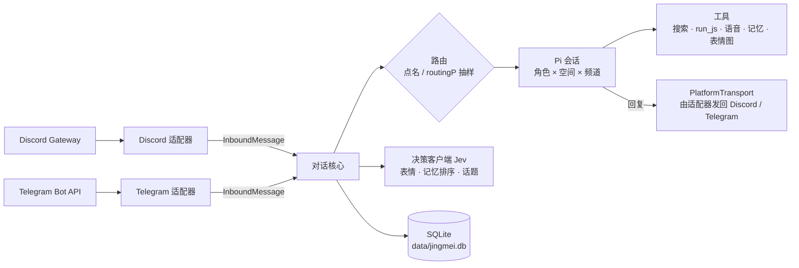

<div align="center">


# 精魅 Jingmei

**住在 Discord 与 Telegram 群里的 AI 群宠 · 基于 [Pi](https://www.npmjs.com/package/@earendil-works/pi-coding-agent) 构建**

[](https://github.com/beiwater/jingmei/actions/workflows/ci.yml)
[](LICENSE)
[](https://bun.sh/)
[](tsconfig.json)
[](https://www.npmjs.com/package/@earendil-works/pi-coding-agent)
[](#discord-设置)

**中文** · [English](README.en.md)

[快速开始](#快速开始) · [命令](#命令) · [配置参考](#配置参考) · [架构](docs/architecture.md) · [部署](docs/deploy.md) · [参与贡献](CONTRIBUTING.md)

</div>

> 古人认为万物年深日久皆可成精，故称“精”；其能迷惑人心，故称“魅”。

精魅是住在 Discord 和 Telegram 群里的 AI 群宠。一份配置可以同时养几个性格不同的角色：平时按概率接话，被点名一定回应；看得懂图片和视频，会发语音、上网查资料、算数，记得群友的生日。两个平台共用同一个对话核心，每个角色在每个频道都有一段持续的 Pi 会话。

## 能做什么

- **按概率接话，被点名必回**：@ 提及、回复角色的消息、或在消息里叫出角色的名字/别名时，对应角色一定回应；其他消息按 `routingP` 做确定性抽样决定由谁接话、是否接话。bot 发的消息不会触发任何角色。
- **Jev 秒回表情**（可选）：用 Jev 决策接口（或进程内 LLM 包装器）给消息点一个表情。点名的消息只要选中表情就会点，普通消息只有情绪强烈或确实好笑时才会，并且每个频道限频。不占用主模型，也不拖慢正式回复。详见 [Jev](#jev)。
- **并行话题**（可选）：`events` 把同一频道的消息归入不同话题，用 `§E` 编号、标题、描述和主要参与者告诉角色当前在回应哪个事件，避免把同时发生的讨论混在一起；还能召回之前暂时结束的话题。
- **看图与视频抽帧**：每条消息最多 4 张图片，缩放到 1024×1024、200 KB 以内交给模型；视频用 ffmpeg 抽 1–3 帧。主模型不支持图片输入时，Pi 会把图片替换成一条省略说明；也可以配置 `visionModel`，先把图片描述成一两句文字。语音、文件、贴纸以 `[语音]`、`[文件]`、`[贴纸 😀]` 这样的文字占位。
- **语音**（可选）：接入 Fish Audio 后，角色可以用中文、日语或英语发送带文字稿的 MP3。群友明确要求“用语音回复”时，最终回答也会转成语音。
- **联网搜索**：配置 `DEEPSEEK_API_KEY` 后启用 DeepSeek 服务端联网搜索。消息里明确说“查一下”“搜索”时先搜再答，回答附来源链接；其他需要外部事实的问题，模型也可以自己调用搜索。
- **计算**：`run_js` 在短时子进程的 node:vm 隔离环境里运行小段纯计算 JavaScript（默认拿不到文件、网络和环境变量；这不是操作系统级沙箱，见 [docs/architecture.md](docs/architecture.md) 的 run_js 威胁模型），用于精确计算、日期运算和单位换算。
- **成员记忆与 soul**：按群记录成员档案：名字、生日、本人明确说过的偏好，以及提及/回复形成的关系。角色需要时才回想，不会在群里复述完整档案。每个角色在每个频道还有一份私人 soul 备忘，写入后先暂存，上下文压缩成功后才转为正式内容。成员可随时 `/forget`。
- **节日与生日祝福**（可选）：在指定频道、当地时间 09:00 之后发送生日祝福和中国/澳洲节日祝福；发送记录存在数据库里，重启不会重发。
- **表情图**：角色可以从内置的 4 张 PNG（hello、laugh、think、hug）里挑一张发出去，可按角色关闭。
- **默认不思考，省 token**：`reasoningEffort` 默认 `off`；即使打开，已完成轮次的 thinking 也不会再发给模型。system prompt 和工具定义保持稳定，便于 provider 前缀缓存。

## 架构一览

一个进程、一个对话核心、两个薄平台适配器。平台差异（格式、长度上限、表情集合）全部留在适配器里，核心只认 `InboundMessage`（进）和 `PlatformTransport`（出）。



| 设计原则 | 体现 |
|---|---|
| Pi 原生优先 | 会话、上下文压缩、模型目录与认证、图片降级都直接用 Pi |
| 确定性优先于 LLM | 路由用 HMAC 抽样，重放结果一致；去重靠数据库主键 |
| 成本有界 | system prompt 与工具定义稳定以命中前缀缓存；动态内容只进消息；reasoning 默认关闭 |
| 隐私默认 | 密钥只在 `.env`；日志自动脱敏，不记正文；成员可随时 `/forget` |

完整数据流、表结构与 run_js 威胁模型见 [docs/architecture.md](docs/architecture.md)。

## 快速开始

需要 [Bun](https://bun.sh/) 1.3 以上、至少一个 Discord bot 或 Telegram bot，以及一个模型 provider 的凭据。视频抽帧另需系统安装 `ffmpeg`（含 `ffprobe`）；没有也能运行，视频只剩 `[视频]` 占位。

开启 `events` 时，macOS 开发机还需 `brew install sqlite`，供 Bun 加载 sqlite-vec 扩展。首次启动会下载约 96 MB 的默认中文 embedding 模型到 `data/models`（自定义 `dataDir` 时随之变化），需要网络；之后复用本地缓存。

```bash
git clone https://github.com/beiwater/jingmei.git
cd jingmei
bun install
cp jingmei.config.example.json jingmei.config.json
cp .env.example .env
cp personas/template.zh.md personas/luna.md
```

1. 编辑 `personas/luna.md`，写下角色的身份、说话方式和边界。
2. 编辑 `jingmei.config.json`：填入服务器/频道或群 ID，只用一个平台就删掉另一个平台的段落和角色里对应的账号；不用语音、Jev、话题或节日祝福就删掉 `voice`、`jev`、`events`、`celebrations`。字段见[配置参考](#配置参考)。
3. 编辑 `.env`，填 bot token、`ROUTING_SECRET`（任意随机长字符串）和各项 API key。注意格式是 `key: value`，不是 `KEY=value`。
4. 准备模型凭据，二选一：
   - 示例角色使用 DeepSeek 的 `deepseek-flash`，只需在 `.env` 填 `DEEPSEEK_API_KEY`。启动时会在 `data/pi-agent/models.json` 写入这个模型的目录条目（不含密钥）。
   - 其他 provider：用项目自己的 Pi 目录登录，`PI_CODING_AGENT_DIR="$PWD/data/pi-agent" bunx pi` 打开 Pi 后执行 `/login`，用 `/model` 确认模型名；或者把该 provider 的 API key 环境变量（如 `OPENAI_API_KEY`）放进进程环境。`.env` 只由本项目读取，除 `DEEPSEEK_API_KEY` 外不会转交给 Pi。
5. 启动：

   ```bash
   bun run start
   ```

启动时会校验配置、验证每个 bot token、确认每个角色的模型存在且已认证。配置错误会一次列全；token 或模型不可用也会报错退出。之后去群里 @ 角色或回复它试试。

## Discord 设置

每个角色对应一个 Discord application。

1. 在 [Discord Developer Portal](https://discord.com/developers/applications) 创建 application，在 **Bot** 页面复制 token，写进 `.env`（如 `DISCORD_LUNA_TOKEN: …`）。
2. 在 **Bot → Privileged Gateway Intents** 打开 **Message Content Intent**，否则 bot 读不到普通消息。
3. 在 **OAuth2 → URL Generator** 勾选 `bot` 和 `applications.commands`，权限选 View Channels、Send Messages、Read Message History、Send Messages in Threads、Attach Files、Add Reactions。不需要 Administrator。
4. 用生成的链接把 bot 邀请进服务器，把服务器 ID 和频道 ID 填进 `discord.guilds`（开发者模式下右键复制 ID）。

启动时每个角色会在其服务器注册斜杠命令。回复是 Discord Markdown，单条超过 2000 字符会分段发送，并且不会产生 @ 通知。

## Telegram 设置

1. 在 [@BotFather](https://t.me/BotFather) 用 `/newbot` 为每个角色创建 bot，token 写进 `.env`（如 `TELEGRAM_LUNA_TOKEN: …`）。
2. 用 `/setprivacy` 把 privacy mode 设为 **Disable**，或把 bot 设为群管理员，否则它只能看到命令和 @ 它的消息。改完后把 bot 移出群再重新拉入才会生效。启动日志里的 `privacy_mode_enabled` 警告就是在提示这件事。
3. 把 bot 拉进群，在 `telegram.chatIds` 填入群 ID（超级群形如 `-100…`）。不知道 ID 时，先随便填一个再启动，在群里发条消息，日志里的 `chat_ignored` 事件会带出 `chat_id`。

Telegram 的限制：**bot 看不到其他 bot 的消息**。同一个群里放多个角色时，它们互相看不到对方的回复，每个角色只知道群友说了什么和自己说了什么。Discord 没有这个限制。

Telegram 回复把 Markdown 转成消息实体，超过 4096 字符分条发送；表情回应只能用 Bot API 允许的表情集合（其中没有 😂）。

## 命令

| 功能 | Discord（斜杠命令） | Telegram（群内文字命令） |
|---|---|---|
| 查看命令 | `/help` | `/help` |
| 在线角色 | `/status` | `/status` |
| 直接提问 | `/ask prompt:<问题>` | `/ask <问题>` |
| 查看记忆 / 重新启用 | `/memory`、`/memory action:enable` | `/memory`、`/memory enable` |
| 生日：查看 / 设置 / 清除 | `/birthday`、`/birthday date:09-25`、`/birthday date:clear` | `/birthday`、`/birthday 09-25`、`/birthday clear` |
| 删除本群记忆并停止记录 | `/forget` | `/forget` |
| 上下文用量（管理员） | `/context` | `/context` |
| 手动压缩上下文（管理员） | `/compact` | `/compact` |

- Discord 命令的回执只有调用者自己看得见；`/ask` 的答案照常发在频道里。
- 管理员命令只对该角色 `adminUserIds` 里的用户开放，也只注册给配置了管理员的角色。
- Telegram 命令可加 `@bot用户名` 指定角色；不加时由第一个收到的角色处理。群里有多个角色时，`/context`、`/compact` 必须指定角色。
- Telegram 没有“仅自己可见”，命令回执直接发在群里，所以 `/memory` 只显示条数，不列出具体内容。
- `/forget` 只删除结构化的成员档案和关系，不删除平台上的原消息或已有的会话历史。

## 配置参考

配置只有两处：`jingmei.config.json` 放业务配置，`.env` 放密钥。配置文件里只写环境变量的名字（`tokenEnv`、`apiKeyEnv`、`routingSecretEnv`），不写密钥本身；进程环境变量优先于 `.env`。所有 ID 都写成 JSON 字符串。

### 顶层

| 字段 | 说明 |
|---|---|
| `dataDir` | 数据目录，默认 `data`；相对路径以项目根为准，支持 `~/` |
| `routingSecretEnv` | 路由 HMAC 密钥的环境变量名，默认 `ROUTING_SECRET`；必须有值 |
| `visionModel` | 可选，`"provider/model"`（按第一个 `/` 拆分）。只在有角色的主模型不能看图时，为图片生成文字描述；该模型必须支持图片输入 |
| `discord.guilds[]` | `{ guildId, channelIds }`：服务器 ID 与允许的频道 ID（17–20 位数字）；这些频道下的 thread 也可用 |
| `telegram.chatIds` | 允许的群 ID，如 `"-1001234567890"` |
| `voice` | 可选，Fish Audio：`apiKeyEnv`、`referenceId`（32 位十六进制音色 ID）、`model`（`s2.1-pro-free` 默认，或 `s2.1-pro`） |
| `jev` | 可选，见 [Jev](#jev) |
| `localJev` | 可选，进程内 LLM→Jev 包装器：`baseUrl`（http(s)）、`model`（必填）、`apiKeyEnv`（可省略，供无鉴权本地服务）。接口需兼容 OpenAI 且支持 logprobs；省略整个段落且有 `DEEPSEEK_API_KEY` 时默认 DeepSeek / `deepseek-flash` |
| `events` | 可选，存在即启用话题：`summaryModel` 必填，`"provider/model"`（第一个 `/` 拆分，启动时校验模型与认证）；`embeddingModel` 默认 `fast-bge-small-zh-v1.5`（512 维），须是 fastembed 支持的模型。必须能解析出远程 Jev 或本地 LLM 决策客户端 |
| `celebrations[]` | 可选，节日与生日祝福目标，见下 |
| `personas[]` | 角色列表，至少一个 |

联网搜索没有配置项：环境里有 `DEEPSEEK_API_KEY` 就启用。

### `personas[]`

| 字段 | 说明 |
|---|---|
| `id` | 唯一，只能用 `a-z 0-9 _ -` |
| `name` | 显示名；消息里出现这个名字即视为点名 |
| `personaPath` | 人设文件路径，必须可读 |
| `provider` / `model` | Pi 的 provider 与模型 ID |
| `reasoningEffort` | `off`（默认）、`minimal`、`low`、`medium`、`high`、`xhigh`、`max`；模型不支持的档位会在启动时报错 |
| `routingP` | 0–1。普通消息由该角色接话的概率；同一个群/服务器内所有能发言角色之和不得超过 1。设为 0 则只在被点名时回应 |
| `aliases` | 可选，额外的点名词（每个不超过 64 字符） |
| `spaces` | 可选，把角色限定在部分群/服务器，如 `["discord:<guildId>", "telegram:<chatId>"]`；省略即全部 |
| `sendReactionImages` | 是否能发内置表情图，默认 `true` |
| `voiceEnabled` | 配置了 `voice` 时是否使用语音，默认 `true` |
| `discord` / `telegram` | 该角色在对应平台的账号：`{ tokenEnv, adminUserIds? }`。至少要有一个；用到哪个平台，顶层就必须有哪个平台的段落。`adminUserIds` 是可以用 `/context`、`/compact` 的用户 ID |

### `celebrations[]`

| 字段 | 说明 |
|---|---|
| `space` | `"discord:<guildId>"` 或 `"telegram:<chatId>"`，必须是已配置的空间 |
| `channelId` | Discord：该服务器允许的频道之一；Telegram：可省略，填写时必须等于群 ID |
| `personaId` | 发祝福的角色，必须能在该空间发言 |
| `timeZone` | IANA 时区，如 `Australia/Sydney` |
| `calendar` | `china`（元旦、春节、劳动节、端午、中秋、国庆）、`australia`（元旦、Australia Day、Good Friday、Easter Sunday、ANZAC Day、圣诞、Boxing Day）或 `both` |

农历节日按目标时区的公历日期换算，不依赖操作系统的农历实现；闰月不重复祝福。

生日只在配置了祝福目标的群/服务器里发送；2 月 29 日的生日在平年于 2 月 28 日祝福。

## Jev

[Jev](https://docs.typesafe.ai/models) 是 TypeSafe 的“System One”决策模型：不生成文字，只对结构化问题返回校准过的概率。精魅用同一个决策客户端做表情、记忆排序，以及可选的话题归属与参与度判断。

**秒回表情**（`quickReactions`）。每条有文字的人类消息发一次 Jev 请求，同时问三件事：从表情表里选一个（或 `none`）、这条消息情绪是否强烈、是否好笑。

- 点名的消息（@、回复、叫名字）：由被点名的角色点上选中的表情，Jev 选 `none` 时不点。
- 普通消息：只有 max(情绪强烈, 好笑) ≥ `threshold`，并且该频道距上一次这样的表情已超过 `minIntervalMs` 才点；由该群配置顺序里第一个角色来点。处于限频期的消息连 Jev 都不调用。
- 与主回复并行，失败只记日志，不影响回复。开启后，主模型不再注册 `react_to_message` 工具，表情完全交给 Jev。

**记忆排序**（`memoryScoring`）。角色回想成员档案时，把候选事实和关系（每人最近 20 条事实、最强 16 条关系）一次性交给 Jev 与当前消息比对相关度，每人保留最相关的 5 条事实和 4 条关系。Jev 不可用时退回按时间和互动次数排序。

**本地包装与回退**。`jev.apiKeyEnv` 有值时先调用 `jev.endpoint`；配置了本地 LLM 时，远程调用任何失败都会回退一次到进程内 `notjev` 包装器。没有远程 key 时直接用包装器，不另起 HTTP 服务。“本地”指包装器在进程内运行，其 LLM 可以是远程 DeepSeek。省略 `localJev` 且有 `DEEPSEEK_API_KEY` 时，默认连接 `https://api.deepseek.com` 的 `deepseek-flash`；显式 `localJev` 完全覆盖这个默认，省略其 `apiKeyEnv` 即不带鉴权。

包装器默认超时 30 秒，关闭 DeepSeek thinking（`thinking.type=disabled`）；LLM 必须返回 logprobs，缺失会作为 `invalid_response` 调用失败处理。模型弃答时取概率最大的选项（argmax）。

秒回表情和记忆排序仍须显式配置 `jev` 段落；仅配置 `events` 或仅有 DeepSeek key 不会开启它们。`jev` 可省略 `apiKeyEnv`，这时使用本地包装器；没有远程 key 且没有可用本地 LLM 时这两项关闭。显式填写的 `apiKeyEnv` 若在 `.env` / 进程环境中缺失，仍是配置错误，不会悄悄回退。包装器调用按所选 LLM 的费用计费。

**成本**。远程 Jev 只按输入 token 计费，输出免费（撰写时 `jev-1.13` 为每百万 token $0.042，以[官方价格](https://docs.typesafe.ai/models)为准）。一次表情请求只包含当前消息、最多 5 行近期聊天（每行截断到 200 字符）和三个问题，通常只有几百 token；远程请求超时 3 秒。它不消耗主模型的 token；本地包装器则消耗其配置的 LLM token。

**配置**。在 `.env` 写 `TYPESAFE_API_KEY: …`，在 `jingmei.config.json` 加：

```json
"jev": {
	"endpoint": "https://api.typesafe.ai/v1/systemone",
	"apiKeyEnv": "TYPESAFE_API_KEY",
	"model": "jev-latest",
	"quickReactions": true,
	"memoryScoring": true,
	"threshold": 0.8,
	"minIntervalMs": 60000
}
```

| 字段 | 默认 | 说明 |
|---|---|---|
| `endpoint` | `https://api.typesafe.ai/v1/systemone` | 远程 Jev 的 http(s) URL |
| `apiKeyEnv` | 无 | 远程 key 的环境变量名；省略则仅使用本地包装器 |
| `model` | `jev-latest` | 也可固定版本，如 `jev-1.13.0` |
| `quickReactions` | `true` | 秒回表情 |
| `memoryScoring` | `true` | 记忆排序 |
| `threshold` | `0.8` | 取值 (0, 1]，普通消息点表情所需的最低分 |
| `minIntervalMs` | `60000` | 同一频道两次“普通消息表情”之间的最短间隔 |
| `emojis` | 平台默认表 | 按平台覆盖表情表：`{ "discord": { "👍": "赞同" }, "telegram": { … } }`；不能使用保留键 `none` |

默认表情表（表情 → 交给 Jev 的含义）：

| 含义 | Discord | Telegram |
|---|---|---|
| 赞同、收到 | 👍 | 👍 |
| 好笑 | 😂 | 🤣 |
| 难过、破防 | 😭 | 😭 |
| 暖心、感谢 | ❤️ | ❤ |
| 疑问、不确定 | 🤔 | 🤔 |

Telegram 自定义表情表中不在 Bot API 允许集合里的表情会被丢弃并记一条警告。

### 话题配置

```json
"events": {
	"summaryModel": "deepseek/deepseek-flash",
	"embeddingModel": "fast-bge-small-zh-v1.5"
}
```

人类消息在有候选话题时由决策客户端选择归属；bot 消息不调用决策模型，只继承被回复消息的话题（否则无话题）。最近 2 小时有消息的话题视为活跃，每次最多提供 5 个活跃话题、2 个同频道向量召回的旧话题，以及“新话题”选项。累计消息数达到 3、6、12、24……时，后台生成/刷新标题描述、参与度与向量；同一事件只同时刷新一次，不阻塞频道处理。摘要使用独立的 `summaryModel`，动态话题内容只追加到触发回复的消息，不写入 system prompt。

## 部署

仓库自带 systemd 用户服务 [`deploy/pi-discord-agent.service`](deploy/pi-discord-agent.service)，它运行的仍是 `bun run src/discord/main.ts`，这个入口现在直接启动精魅，已有部署不用改服务文件。

```bash
cp deploy/pi-discord-agent.service ~/.config/systemd/user/
systemctl --user daemon-reload
systemctl --user enable --now pi-discord-agent
journalctl --user -u pi-discord-agent -f
```

服务文件假定代码在 `~/apps/pi-extension-discord`、Bun 在 `~/.local/share/pi-discord-bun/node_modules/.bin/bun`，不同的话改这两行即可。数据目录、日志和更新流程见 [docs/deploy.md](docs/deploy.md)。

## 从旧版迁移

旧版只有 Discord，配置叫 `discord.config.json`，数据库叫 `data/discord-agent.db`。

```bash
bun scripts/migrate-config.ts
```

脚本把项目根的 `discord.config.json` 转成 `jingmei.config.json`（已存在则拒绝覆盖）：`token_env` 变成 `discord.tokenEnv`，`guildIds` 变成 `spaces`，节日目标的 `guildId` 变成 `space`，其余未知字段丢弃。转完后检查角色 `id` 只含 `a-z 0-9 _ -`，再按需加上 `telegram` 和 `jev` 段落。`.env` 里原有的变量名保持不变即可。

数据库无需手动处理：首次启动时，若没有 `data/jingmei.db` 而有 `data/discord-agent.db`，会连同 `-wal`/`-shm` 一起改名，并把旧的 `discord_*` 表迁移成新表名、把服务器 ID 改写为 `discord:<guildId>`。迁移在一个事务里完成，可重复执行；已有的 Pi 会话照常续用。

## 开发

```bash
bun test          # 测试可联网，但禁止访问 Discord / Telegram
bun run check     # tsc --noEmit
bun run lint      # Biome
```

从 [AGENTS.md](AGENTS.md) 开始；架构见 [docs/architecture.md](docs/architecture.md)，测试清单见 [docs/testing.md](docs/testing.md)。CI 在 push 到 `main` 和每个 PR 上跑同样三步。

## 参与贡献

欢迎 issue 和 PR。提交前请阅读 [CONTRIBUTING.md](CONTRIBUTING.md)：一个行为变化一个 commit，用户可见的变化同步更新中英文 README。

## 安全

请不要在公开 issue 里报告漏洞，流程见 [SECURITY.md](SECURITY.md)。

## 许可证

BSD 2-Clause，见 [LICENSE](LICENSE)。精魅源自 [mizorewww/pi-extension-telegram-agent](https://github.com/mizorewww/pi-extension-telegram-agent)，感谢原作者。
