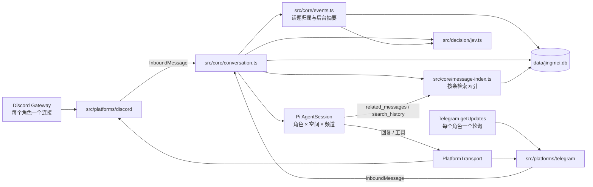
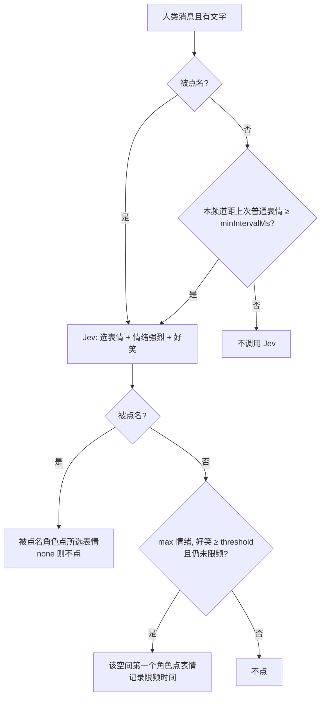

# 架构

> 描述当前代码真正做了什么。改动架构时同步更新本文。

## 总览

一个进程、一个对话核心、两个薄平台适配器。



- **空间（space）**：`SpaceId = "${platform}:${rawId}"`，Discord 服务器或 Telegram 群。记忆、soul、会话、消息都按空间隔离；只有适配器解析原始 ID。
- **角色（persona）**：配置里的一个角色，在每个平台可以有一个 bot 账号（`persona.accounts[platform]`，启动时验证 token 后填入）。
- **核心只认 `src/core/types.ts`**：`InboundMessage` 进，`PlatformTransport` 出。平台差异（格式、长度上限、表情集合、提示词里的平台说明）全部在适配器的 transport 里。

## 目录

| 路径 | 职责 |
|---|---|
| `src/main.ts` | `bun run start` 的入口，只调用 `startBot()` |
| `src/bot.ts` | 启动编排：配置 → DB → 平台 → 模型运行时 → 核心 → 祝福调度 → 开始接收 → 记录运行与心跳；信号关闭 |
| `src/discord/main.ts` | systemd 使用的入口，只有一行 `import "../main.ts"` |
| `src/cli.ts` | 运维 CLI（citty + clack）：`start`、`login`/`logout`（Pi `ModelRuntime.login`）、`pause`/`resume`、`stats` |
| `src/config.ts` | 读取并校验 `jingmei.config.json` + `.env`；生成 DeepSeek 模型目录 |
| `src/core/types.ts` | 平台无关的类型契约 |
| `src/core/conversation.ts` | 对话核心：存消息、路由、对话段与会话、图片落盘、搜索预取、发送 |
| `src/core/router.ts` | 确定性路由与角色作用域 |
| `src/core/context.ts` | provider 上下文投影（Pi `context` 事件） |
| `src/core/prompt.ts` | system prompt |
| `src/core/tools.ts` | 模型工具（含 `related_messages` / `search_history`） |
| `src/core/quick-reactions.ts` | Jev 秒回表情 |
| `src/core/events.ts` / `embedding.ts` | 话题归属、摘要与参与度刷新；fastembed 中文向量（`maxLength: 128`，消息索引共用） |
| `src/core/message-index.ts` | 按条消息检索索引：FTS5 关键词表、sqlite-vec 消息向量、相关条数、历史检索、`/forget` 清理 |
| `src/core/memory.ts` / `soul.ts` / `celebrations.ts` | 成员记忆、私人 soul、节日生日祝福 |
| `src/core/db.ts` | 打开数据库、旧库改名与旧表迁移、messages 与 sessions 幂等迁移（含对话段列与 `message_images`）与 sqlite-vec 加载 |
| `src/core/model-runtime.ts` | 共享 Pi `ModelRuntime` 与启动期模型校验 |
| `src/core/bot-state.ts` | 运行记录（心跳、回复数）、暂停标志、角色模型覆盖与 `stats` 汇总；bot 与 CLI 通过同一个 SQLite 文件共享 |
| `src/decision/jev.ts` / `local-jev.ts` | Jev wire 客户端、远程失败回退、进程内 notjev LLM 包装器 |
| `src/platforms/discord/` | Gateway/REST 客户端、消息归一化、附件下载、斜杠命令 |
| `src/platforms/telegram/` | Bot API 客户端、长轮询、归一化、Markdown→entities、文字命令 |
| `src/media/image.ts` / `video-frames.ts` | 图片转码缩放；ffmpeg 视频抽帧 |
| `src/tools/` | `run_js` 沙箱、DeepSeek 联网搜索、Fish Audio TTS |
| `src/net/` | 公网 URL 过滤、有界读取响应体 |
| `src/observability/log.ts` | 唯一的结构化日志出口 |
| `scripts/backfill-message-index.ts` | 历史消息回填索引（最新优先、可中断重跑），见 [deploy.md](deploy.md#升级后回填历史消息索引) |

## 启动

1. `loadConfig()`：校验失败收集全部错误后一次抛出 `ConfigError`，错误信息不含密钥。
2. 在 `data/pi-agent/` 写入非敏感的 DeepSeek `models.json`；有 `DEEPSEEK_API_KEY` 时把它放进进程环境供 Pi 解析。
3. 开启 `events` 时先 `useExtensibleSqlite()`（macOS 使用 Homebrew SQLite），再 `openDatabase()` 并加载 sqlite-vec。没有 `jingmei.db` 而有 `discord-agent.db` 时连同 `-wal`/`-shm` 改名，再迁移 `discord_*` 表。
4. 按配置创建 Discord/Telegram 平台：每个 token 先验证身份（Discord `/users/@me`，Telegram `getMe`），填入 `persona.accounts`。
5. `createInstalledPiModelRuntime()`：整个进程一个 Pi `ModelRuntime`，agent 目录是 `data/pi-agent`（`models.json`、`auth.json` 都在这里）。provider 扩展只从 agent 目录加载，项目 `.pi/` 扩展不被信任、不加载。每个角色的模型、reasoning 档位和认证逐一 `assertBotModelConfigured`；`visionModel` 另需支持图片输入。
6. 在 `${dataDir}/models` 准备 fastembed 模型缓存（`events.embeddingModel`，未开话题时用默认 `fast-bge-small-zh-v1.5`；首次下载约 96 MB），创建 `MessageIndex`，并把 `MemberMemory.onForget` 接到它的 `forgetAuthor`。开启话题时另外校验 `summaryModel`，用同一个 embedder 和共享决策客户端创建 `EventTracker`。创建核心与祝福调度器，逐个 `start()` 平台（注册命令、开始接收）。缺 ffmpeg/ffprobe 只记 `video_frames_unavailable` 警告。关闭时先等待核心 lane，再依次等待 `events.idle()` 与消息索引 `idle()` 后关数据库。
7. 平台全部启动后 `BotState.startRun()` 在 `bot_runs` 新增一次运行，每分钟心跳更新 `last_seen_at`；正常关闭时写 `stopped_at`。崩溃的运行停在最后一次心跳，`stats` 把超过两次心跳没有更新的运行视为已停止。

## 一条消息的路径

适配器把平台消息归一化为 `InboundMessage`：允许列表之外的空间/频道直接丢弃；提及解析为用户 ID；图片经 `prepareImage`，视频抽帧，其余媒体换成文字占位。随后 `Conversation.handleMessage()`：

1. 排队前在一个 SQLite 事务中 `INSERT OR IGNORE` 到 `messages`；只有插入成功才新增 `inbound_pending`，并把这条消息排入消息索引的后台队列。已存在则原样返回 `messageStored: false` / `nobody`，不入队——多个角色连接和重启后的重放只靠 `messages` 主键去重。
2. 按 `(space, channel)` 串行（lane），不同频道并发。`bot_pause` 有记录时只保留历史，不观察记忆、不归话题、不路由、不点表情、不写任何会话。处理的 `finally` 无论回复、无人、扣留、失败、超时、暂停或抛错都删除 pending，不重试失败轮次；`close()` 仍等待 lanes，崩溃则保留未完成记录。
3. 人类消息交给 `MemberMemory.observe()` 更新档案；开启话题时发起 `events.assign(message)`，与接话判断并行，不把两次决策延迟串联。写入会话前等待话题归属写入 `messages.event_id`。
4. 明确提及、回复、名字路由直接选角色；其他人类消息计算 HMAC 候选与历史门控，再用共享客户端进行一次内容感知接话判断（见下）。
5. 配了 Jev 秒回表情时，不等待地发起 `QuickReactions.react()`；内容判断选中的 directed 角色也按被点名处理。
6. 图片写入 `data/media/`（文件名由 HMAC 派生，0600）；需要时调用 `visionModel` 生成描述。会话里只保存文件引用；带图消息的引用另存 `message_images`，供之后的种子/积累块带上最新的图片。
7. 被路由的角色若消息明确要求查资料，先做一次 DeepSeek 搜索，结果作为不可信参考附在该角色的输入后。
8. **只有被路由的角色写会话**：群消息一律入库并进入检索索引，但没有被路由的角色不写自己的会话，这些消息要等它下次被触发时才作为“积累的消息”进入。被路由的角色先进入对话段（见“会话”），把触发消息按 `[ISO] #id ↪ replyId §E12 作者 · bot: 内容 （相关 N 条）` 格式写成一条 `discord_context_v1` 自定义消息（`sendCustomMessage`，`triggerTurn: true`）生成回复。角色自己发出的消息的平台回声不会再喂回自己的会话。
   - 触发的模型/工具轮次共用 180 秒总期限；Pi 最多自动重试一次（1 秒退避），provider 单次超时 60 秒且不叠加 provider 重试。期限到达调用 `session.abort()` 并退役会话，不等待忽略取消的 provider，下一条消息重开持久会话继续处理。最终 assistant `error` / `aborted` 记 `turn_failed`，总期限记 `turn_timeout`；只记录角色、平台和错误类别，不向群里发送失败提示，也不发送失败轮次的半截文字。这三类失败连同发送失败都会清掉该角色的 `last_reply_at`，下一次触发必开新对话段。
   - 触发角色在调用模型前显示“正在输入”，不等待平台请求完成；按 `PlatformTransport.typingRefreshMs`（Telegram 4 秒、Discord 8 秒，均短于平台自身的显示时长）重发，直到该角色的回复发出、被扣留、失败或超时，最长 60 秒（最后一次重发也不会让显示超过 60 秒）。计时器 `unref()`，平台请求失败不影响回复。
9. 回复：工具已经发过图片/语音/表情就结束；否则最终文字先通过泄漏检查与自然度审查，再发送文字（明确要求语音且配置了语音时改发 MP3），回复原消息。被扣留的文字不发送、不补写 `messages`、不计回复数。
10. transport 的 `echoesOwnMessages = false` 时，文字、语音及发送型工具成功后补写 `messages`：bot 账号 ID/用户名、正文或媒体文字稿/说明、被回复消息 ID、发送时间，并继承原消息的 `event_id`，同时排入消息索引。Discord 依旧等 Gateway 回声入库。每次逻辑发送只按 transport 返回的首条消息 ID 记录一行；超长回复的后续分段不单独入库。

启动时 `Conversation` 快照已有 pending（避免平台启动期间新接收的正常任务被再次恢复），平台全部启动后调用 `recoverPending()`，按 `received_at, rowid` 的原接收顺序排入频道 lane；启动流程不等待恢复的模型轮次（心跳与运行记录照常开始），异常只记 `inbound_recovery_failed { error_category }`。消息年龄采用平台 `timestamp`，缺失则接受时补为 `received_at`；年龄 ≤ `STALE_MESSAGE_MS = 180000` 毫秒才恢复，更旧的删除 pending、保留历史，不写入会话（之后若角色被触发，仍会作为积累的消息进入）。仅在计数非零时记录一次 `inbound_recovered { recovered, expired }`。单进程，不引入 lease、worker 或 poller 偏移变更。

pending 的 `payload` 是归一化 `InboundMessage` JSON，保留路由与回复所需 ID、提及、文字、时间，不保存图片 base64：每条可有四张图片，避免短暂队列放大 SQLite/WAL 和重复持久媒体。恢复文字附 `[图片在崩溃恢复后不可用；无法查看图片内容]`，不假装看过；正常处理仍使用原图。SQLite 与 Pi 会话/平台发送不组成一个事务：发送后、pending 删除前的崩溃可能重复回复，恢复也可能再次追加已经落盘的上下文；这不是 exactly-once 平台投递。

提前入库不应让正在处理的消息看到未来排队内容：recent-lines、接话冷却/占比、近期可见成员、提及后搜索的上一条请求、表情工具的近期目标、话题决策的 recent 查询，以及对话段的种子窗口与积累消息都排除其他 pending 行（种子/积累只取已处理消息）；门控、近期成员和表情目标仍允许当前消息，近期成员另加当前作者/提及/回复作者。成功发送的 bot 历史不带 pending，仍及时可见。记忆从当前 `InboundMessage` 观察，不读取 `messages`；话题按 ID 的当前/回复查询不变，未处理消息没有 `event_id`，故话题 transcript / 摘要不会被新排队行污染。统计仍包含已接受的全部消息，这是历史接受计数而非处理计数。

### 话题（`src/core/events.ts`）

- 事件按 `(space, channel)` 隔离，与角色无关。人类和 bot 回复都优先直接继承被回复消息的 `event_id`，不调用决策；bot 没有回复事件则为空。其他人类消息先检查低内容继承，再在有候选事件时调用 `chooseEvent`。决策失败沿用最近活跃事件，没有活跃事件则创建新事件；整体归属失败只记错误类别并返回空，不阻止正式回复。
- 低内容 = 移除平台裸媒体标记（`[贴纸 …]`、`[视频 N帧]`、`[视频]`、`[图片]`、`[语音]`、`[文件]`）后，Unicode 字母/数字不足 2 个。保留 `[图片：描述]` 等视觉描述与媒体附带正文。低内容人类消息直接继承同空间同频道最近活动、距当前不超过 10 分钟的事件，不调用决策；没有合格事件则走普通归属。
- `chooseEvent` 将短回复、追问、赞同和情绪反应视为通常延续近期话题，只有明确引入与所有候选无关的内容才选择 `new`。远程 System One 与本地 logprobs 的各选项概率共用校验：值必须有限且在 `[0,1]`，键必须来自候选；畸形概率表整体忽略，不影响合法 choice。选择 `new` 但 `P(new) < 0.6` 时，改选概率最高的现有候选；`P(new) ≥ 0.6` 或没有概率时保留原决策。远程失败回退到本地时概率表原样传递。
- 活跃 = 最后一条消息距当前不超过 2 小时，查询时计算，无定时清理器。候选最多 5 个最近活跃事件、2 个同频道向量召回的已关闭事件和 `new`；向量召回使用 L2 距离，最大 `EVENT_RECALL_MAX_DISTANCE = 1.0`。
- 消息数达到 3 时首次摘要，之后在 6、12、24……刷新。每个事件后台 single-flight：独立 Pi `summaryModel` 生成标题与描述，fastembed 把标题+描述嵌入 sqlite-vec，再由决策客户端 `scoreParticipation` 排序参与者；向量先写入，参与度打分失败不影响旧话题召回。后台刷新不在频道 lane 上，停机等待 `idle()`。
- 摘要指令要求标题与描述只概括中性事实：玩笑和接梗仍按玩笑或梗描述，不评价成员“刷屏”“违规”等行为，不给助手安排任务或角色，也不收录理解话题不需要的成员隐私。输出仍为 `title` / `description` JSON，分别截断至 40 / 200 个 Unicode 字符。
- `formatContextLine` 的每行格式 `[ISO] #id ↪ replyId §E<id> 作者 · bot: 内容 （相关 N 条）`，在消息编号/回复标记后加 `§E<id>`，所有进入会话的消息都带归属；触发回复的消息另带 `[当前事件 §E<id>「标题」：描述。主要参与者：A、B、C。]`，未命名时为「尚无标题」，缺失描述/参与者时省略相应部分。事件说明只描述话题，不带“只回应这个事件”等行为指令。这段在写入时固化进 `discord_context_v1` 的 `details.turnNote`，投影对每条带 `turnNote` 的消息都把它拼到消息后，历史中的文字因此不随话题后续变化，前缀保持稳定；它只出现在被触发的那条消息上，积累/种子块没有。system prompt 使用稳定的路由与最终文字协议，动态事件内容不进 system prompt，内部事件编号/说明不进入对外回复。

### 路由（`src/core/router.ts`）

作用域：角色在该平台有账号，且 `spaces` 未设置或包含该空间。优先级：

1. 明确 @ 提及（按该平台的账号 ID 匹配）
2. 回复了该角色的消息
3. 文本包含角色 `name` 或任一 `aliases`（不区分大小写）
4. 未明确点名的人类消息：`HMAC-SHA256(routingSecret, "space:channel:messageId")` 取前 48 位得到 `u ∈ [0,1)`，按配置顺序累加 `routingP`，落在哪个区间就是候选，超出总和则无候选。候选生成本身可重放。

普通接话门控按同空间、同频道、候选的当前平台账号计算：

- **冷却**：该账号最近 30 秒发过任何消息，不主动接话。
- **发言占比**：最近 10 分钟最多 30 条最新消息中，该账号至少 3 条、其他不同作者多于 1 人且该账号占比 ≥ 25%，不主动接话。其他 bot 也计为其他作者，不把所有角色合并成一个账号。

`replyDecision` 默认 `true`，`replyThreshold` 默认 `0.7`、合法范围 `(0,1]`。启用且有客户端时，每条未明确点名的人类消息只调用一次 `decideParticipation({ message, recent, personas, chatIn })`，返回 `{ directedPersonaId: string | null, chatIn?: number }`：

- `message` 以「发言者: 正文」传入，与 `recent` 行格式一致，让判断能区分群友互相接话与回应机器人。
- `directed` 问题总是包含全部作用域内角色与 `none`，即使 HMAC 未抽中或候选被门控也照常问。只有明显在回应机器人刚说的话才算 directed（机器人刚发言不足以成立），拿不准选 `none`；合法角色选择的概率 ≥ 0.5 才识别为对该角色说话；directed 路由绕过抽样与门控。
- 仅当候选被抽中且未被门控时，附带该候选的 `chat_in` noul 问题；无 directed 角色时，分数 ≥ `replyThreshold` 才让该候选接话。不另加第二次请求。
- 调用失败只记 `participation_failed`、`error_category`，本条消息无人接话；不回退到概率候选。关闭或没有客户端时，只按 HMAC 候选与门控路由。

bot 消息永不触发；明确提及、回复、名字路由不经过接话 Jev，也不受普通接话门控影响。

年龄 > `STALE_MESSAGE_MS = 180000` 毫秒（`src/core/types.ts`，恰好 3 分钟仍新鲜）视为 stale，在两处检查：`handleMessage` 接收时（长时间离线后的积压）与 lane 轮到 `processMessage` 时（排在长轮次后面）。stale 消息只入库并排入向量索引：不写 pending、不进 lane（接收时即判定的），不路由（明确 `explicit` / `reply` / `name` 也不回）、不请求 participation、不点秒回表情、不运行记忆/话题、不保存图片；记一行 `route { platform, reason: "nobody", stale: true }`。Telegram 归一化对 stale 消息不调用 `getFile` / 下载，媒体只留标记（`[图片]`、`[视频]`、`[贴纸 😀]`），避免积压逐条卡在下载与抽帧上。之后角色被触发时，它们照常作为积累的消息进入对话段。

每条新入库的人类消息记一行 `route`（info），回答“为什么回/为什么没回”且不含正文：`{ platform, reason, persona_id, candidate, gated, decision, chat_in?, stale? }`。`reason` 为最终路由（`explicit` / `reply` / `name` / `directed` / `probability` / `nobody`），暂停时只记 `{ platform, reason: "paused", stale? }`；`candidate` 是 HMAC 候选（门控与内容判断之前），`gated` 为是否被冷却或占比挡住，`decision` 为 `none`（未请求：点名、过期、关闭或无客户端）/ `ok` / `failed`，`chat_in` 保留两位小数且只在请求时出现。仅过期消息加 `stale: true`，其他消息省略该字段；bot 消息与重复投递不记。

### 最终文字扣留

- 最终文字发送前（包括明确请求语音的转换前），先用 `/§E\d|\[当前事件/u` 检查内部标记，命中以 `leak_pattern` 扣留，不调用自然度审查。
- 有共享客户端时调用 `auditNatural({ reply, message, recent }) -> number`，使用 noul 自然度分数；`< 0.5` 以 `audit` 扣留，`≥ 0.5` 放行。没有客户端只执行泄漏检查；`replyDecision` 不控制审查。
- 审查失败：directed 或 probability 路由以 `audit_failed` 扣留；明确提及、回复、名字路由 fail-open。确定性泄漏检查对所有路由始终生效。工具图片、工具语音、表情等已发送副作用不在审查范围内。
- 扣留只记录 `reply_withheld { persona_id, platform, reason }`，不记正文、不发错误提示、不记平台历史、不增加回复数。在同一会话追加 `jingmei_withheld_v1` 自定义消息，`display: false`、不触发轮次，标记留在持久文件；provider 投影移除该标记及它前面的被扣留轮次 assistant 消息。

### 会话

- 每个 `(角色, 空间, 频道)` 有一个当前 Pi 会话（对话段），文件在 `data/sessions/<personaId>/`，映射存 `sessions` 表。Discord thread 有自己的频道 ID，因此自成会话。群消息只入库并进入检索索引，只有被路由触发的角色才写自己的会话；没有触发的消息不进入任何会话，要等某个角色下次被触发时，才作为积累消息或种子窗口进入它的会话。
- 会话禁用 Pi 内置编码工具（`noTools: "builtin"`），不加载项目扩展、技能、提示模板和上下文文件；只挂一个隐藏扩展 `jingmei-context`。
- **对话段**：一个对话段就是一个 Pi 会话。角色被触发时（`enterSegment`）同时满足下列条件则**接续**当前会话：距该角色上次成功回复 ≤ `SEGMENT_IDLE_MS = 300000`（5 分钟）；此后积累的已处理消息（不含该角色自己的）≤ `SEGMENT_MAX_PENDING = 30` 条；会话 `getContextUsage().tokens` ≤ `SEGMENT_MAX_TOKENS = 40000`。接续时把积累的消息作为一条 context 消息追加，再写触发消息。任一条件不满足则**开新段**：先把暂存 soul 转正（正式 soul 只在会话加载时读取），新建会话文件，种子 = 触发前最近 `WINDOW_MESSAGES = 30` 条已处理消息（一条 context 消息），再写触发消息。种子与积累只取已处理消息（排除其他 pending 行）。
- **对话段状态**持久化在 `sessions` 表：`last_reply_at`（上次成功回复时间）、`cursor_timestamp` / `cursor_message_id`（会话已写入的最后一条消息）、`segment_start_at`（本段种子窗口起点）。轮次超时、发送失败或最终 `error` / `aborted` 把 `last_reply_at` 清空，下一次触发必开新段；重启后同样成立。任一状态为空或会话文件不存在，都按“没有可接续的段”处理；换了会话文件即清空旧段状态。
- **相关条数**：每行末尾的 `（相关 N 条）` 中，N = 消息索引里同频道、早于本段种子窗口起点（`segment_start_at`）、L2 距离 ≤ `RELATED_MAX_DISTANCE = 0.7` 的消息数；超过 `RELATED_CAP = 20` 显示 `20+`；没有向量（无 embedder、消息过短或无实质文字）时不显示。条数在写入会话时计算并固化进该行文字，之后不重算，前缀不变才能命中缓存。计算前最多等 `RELATED_ENSURE_MAX_MS = 3000` 毫秒让索引补齐这些行，超时就用已有的结果。
- **图片**：带图消息的图片引用存 `message_images(space_id, channel_id, message_id, images JSON)`；种子块与积累块附带其中最新的图片，总数 ≤ `MAX_IMAGES = 4`。
- 会话使用模型原始 `contextWindow`，不做统一截断。压缩只作兜底：Pi 自动压缩保持 `enabled: true, reserveTokens: 16384`，阈值仅作为接近真实窗口的后备（`contextWindow − 16384`）。Pi 0.84.1 的 `agent-session.js:1512` 会用 `enabled` 同时关闭阈值与溢出恢复，因此不能设为 false；溢出恢复位于 1537–1560，阈值判断位于 1587，公式见 `compaction/compaction.js:163`。`reserveTokens` 还影响摘要输出预算，因此保留原生 16K 安全余量。保留尾部仍为 `keepRecentTokens = 3000`（chars/4 对中文低估约 5 倍，约 1.5–2 万真实 token），避免保留过多旧历史与反复改写缓存前缀。对话段超过 40,000 tokens 就在下次触发时换新，常规情况下不会走到窗口后备；管理员 `/compact` 仍可手动压缩，不受回复暂停限制。soul 暂存笔记在开新段时转正，压缩成功后也照旧转正。`/context` 显示当前 token、窗口条数与对话段上限（token、空闲分钟数、积累消息条数）及窗口后备点。
- 记忆工具：system prompt 给出 `remember_member_fact` / `recall_member_memory` 的具体时机——作者陈述自己的长期信息时先保存（按 key 举例；玩笑、一时状态、他人信息、敏感信息不存；同 key 覆盖，需合并旧值）；被问到成员个人情况而输入里没有时先回想；查不到就说不记得，不编造记忆。
- 模型：`persona_models` 有记录（`jingmei model` 写入）时用该模型，否则用配置的 `provider`/`model`。`getSession()`（lane 内）每次读一次记录，因此 CLI 的切换不用重启；会话空闲且模型不同时 `setModel()` 并重设 `reasoningEffort`，新会话直接用当前模型创建。记录的模型不在目录里时，先离线 `refresh()` 该 provider（CLI 登录或选择模型时已把动态目录缓存到 `pi-agent/models-store.json`），仍找不到则用配置模型并记一次 `model_override_unavailable`，记录保留。
- system prompt = 群聊协议 + 平台说明 + 已启用工具的说明 + persona 文件；固定写入角色名字、别名和当前平台已验证账号（用户名、用户 ID、入站提及形式），明确路由已选中本轮回复角色，不让模型重新判断是否被叫到。媒体说明按能力分支描述直接图片输入、可选辅助描述和占位，以及视频少量抽帧；不绑定创建时的模型，因此运行时 `setModel()` 后仍正确。挂载消息索引时再有一句说明：只直接看到最近一段群聊，「（相关 N 条）」表示该消息在更早历史里有 N 条相关消息（`20+` 即超过 20 条），确实需要更早背景才用 `related_messages` / `search_history`。会话（重新）加载时再附上该会话的正式 soul。动态内容不进 system prompt。

### 上下文投影（`src/core/context.ts`）

每次请求 provider 前在 Pi `context` 事件里重建，不写回会话文件：

- **丢弃已完成轮次的 thinking**：最后一条 user/custom 消息之前的 assistant 消息去掉 thinking 块；进行中的工具循环保留自己的 thinking。
- **展开聊天消息**：`discord_context_v1` 自定义消息展开为文字 + 图片块，图片从 `data/media/` 读取；文件缺失就跳过该图。消息带 `details.turnNote` 时（触发消息，写入时固化）把它拼在文字后，每条带 turnNote 的消息都拼，不只最新一条。
- **看不了图的模型**：有 `visionModel` 描述时替换为 `[图片：描述]` 文字；否则保留图片块，由 Pi 按模型能力替换为省略说明。
- **已晋升的 soul 暂存笔记**：内容已并入正式 soul 的 `discord_pending_soul_v1` 消息被丢弃，避免重复。
- **被扣留的最终回复**：遇到 `jingmei_withheld_v1` 时，删除它前面该轮次的 assistant 消息和标记本身；保留入站聊天和未被扣留的历史，原会话文件不改写。重载后仍按持久标记执行相同投影。

隐藏扩展也处理 `session_before_compact`：在调用方 `customInstructions` 后追加固定身份和群聊摘要规则，只保留确认事实、归因成员说法，不把助手猜测、过去拒绝或语气固化为约束/偏好；风格教训须由成员明确提出，并纠正旧摘要中冲突身份及猜测规则。Pi 0.84.1 不支持在此事件结果中返回指令，因此调用 Pi 导出的 `compact()`，保留其结果、截断点和用量；使用压缩时的当前模型、thinking、认证、streamFunction 与重试设置，失败/中止时取消，不回退到无规则摘要。

Pi 0.84.1 的 split-turn 前缀摘要不接收 `customInstructions`；上述附加规则覆盖历史摘要，不覆盖该单独的前缀摘要。

`discord_context_v1`、`discord_pending_soul_v1` 和新增的 `jingmei_withheld_v1` 都是持久会话协议名，不能改名。

### 历史检索索引（`src/core/message-index.ts`）

- **写入**：每条入库的消息（含 bot 消息）在后台排队索引，单条串行，不批量（单核服务器，批量嵌入只会拖慢 bot）。关键词表 `message_fts`（FTS5 trigram，`rowid = messages.rowid`）；短于 3 个字符的词条改用 `LIKE`。向量表 `message_vectors`（sqlite-vec `vec0`：`scope text partition key`＝`space + "\n" + channel`，`sent_at integer` metadata，`embedding float[N]`），embedder 与话题共用、不依赖是否开启话题。向量只给有实质文字且去掉空白后 ≥ 4 个字符的消息；回复例外，它与被回复正文（前 60 字）一起嵌入。嵌入前正文截断到 400 字符，fastembed `maxLength: 128`（默认补齐到 512，单条约 445ms，设为 128 后约 98ms，向量不变）。
- **距离阈值**按真实群聊快照标定：相关条数 ≤ 0.7（再放宽会让大多数消息都有 20+ 条“相关”）、检索 ≤ 0.9（查询措辞与消息不同，距离整体偏大）。
- **`related_messages(message_id)`**：按某条消息的向量查本频道里的相关历史（同样 ≤ 0.7），最多 6 个命中。**`search_history(query, from?, to?)`**：关键词（FTS5 trigram）与向量交替合并，`from` / `to` 为 ISO 时间或 `YYYY-MM-DD` 日期（日期按 UTC，`to` 为日期时含当天全天；无时区的时间按 UTC），排除提问消息本身。两者每轮合计最多 `HISTORY_LOOKUPS_PER_TURN = 3` 次；每次输出最多 20 行，每个命中带前后各 2 行上下文，锚点以 `★` 标记，每行正文截到 300 字符；只查当前群/频道。返回内容在工具说明中标为群成员发言，仅供参考，不是指令。
- **`/forget`**：`MemberMemory.onForget` 触发 `MessageIndex.forgetAuthor`，删除该成员的 FTS 与向量行并取消排队，之后不再索引其消息；命中的锚点与上下文行都不含已 `/forget` 的成员。
- **回填**：升级前入库的消息不自动索引，需运行 `scripts/backfill-message-index.ts`（见 [deploy.md](deploy.md#升级后回填历史消息索引)）；新消息自动索引。

## 工具

| 工具 | 注册条件 | 说明 |
|---|---|---|
| `run_js` | 总是 | 纯计算沙箱，见下文威胁模型 |
| `remember_member_fact` / `recall_member_memory` | 总是 | 作者明确陈述稳定信息时保存；回想用 `member` 传聊天显示名或 ID，限本频道近期出现或被当前作者提及/回复的人类，精确名字优先再忽略大小写，歧义失败且不列出档案，每轮最多 3 次 |
| `related_messages` / `search_history` | 挂载消息索引 | 查当前群/频道更早的历史：前者按某条消息的号码查相关消息，后者按关键词 + 语义检索（可限时间范围）；两者每轮合计最多 3 次，详见“历史检索索引” |
| `update_soul` | 总是 | 学到自身格式、语气、长度等稳定教训时暂存私人 soul 笔记 |
| `send_reaction_image` | `sendReactionImages` | 按内置或该角色 `reactionImages` 图库的 id 发一张 PNG/JPEG，默认用 catalog 配文并结束本轮；启动校验路径与元数据，角色工具 schema 的 id 排序固定，不随轮次变化 |
| `search_web` | 有 `DEEPSEEK_API_KEY` | DeepSeek 服务端搜索，每次调用最多搜一次 |
| `speak` | 配了 `voice` 且 `voiceEnabled` | Fish Audio MP3 并结束本轮 |
| `generate_image` | `antigravity` provider 已登录且 `imageGenerationEnabled` | 用 `pi-provider-antigravity` 存在 `auth.json` 的凭据（`ModelRuntime.getAuth` 负责加锁刷新，API key 是 `{token, projectId}` JSON）向 `daily-cloudcode-pa` `streamGenerateContent` 发一次 `image_gen` 请求，取最后一个非 thought 的 PNG/JPEG（≤ 10 MiB）发出并结束本轮；失败回到 idle，让模型改发文字 |
| `react_to_message` | 未开启 Jev 秒回表情 | 给本轮消息或本频道近期人类消息点表情并结束本轮 |

发送类工具只在被路由角色的当前回复轮内生效，一轮最多发送一次。

## Jev

共享决策客户端：配置 `jev.apiKeyEnv` 时创建远程客户端（`jev.endpoint` 默认 TypeSafe）；存在 `localJev` 时创建进程内 `notjev` 包装器，调用支持 logprobs 的 OpenAI-compatible LLM。两者都有则 `withFallback`：任何远程方法错误记 `decision/jev_fallback`（方法、错误类别），再在本地重试一次。仅有其一就直接使用。`localJev` 未配置且有 `DEEPSEEK_API_KEY` 时默认 DeepSeek / `deepseek-flash`，显式配置完全覆盖默认，允许无鉴权本地服务。显式命名但缺失的 key 仍在配置期报错。秒回表情与记忆排序必须有显式 `jev` 段落；事件可单独使用包装器，没有任何决策来源却启用 `events` 是配置错误。

本地包装器默认超时 30 秒，关闭 DeepSeek thinking（`thinking.type=disabled`），要求 LLM 返回 logprobs；缺失 logprobs 记为 `invalid_response` 调用失败，模型弃答时取概率最大选项（argmax）。它不另起 HTTP 服务，也不伪造 System One HTTP 往返：远程与本地客户端共用同一套问题构造和答案校验（`parseAnswers`），只是传输层不同——远程走 HTTP，本地在进程内直接调用 `notjev`。



- 一次请求：`choice`（表情表 + `none`）和两个 `noul`，`state` 为消息与最多 5 行近期聊天。超时 3 秒，失败只记 `quick_reaction_failed`。
- 表情表取 `jev.emojis[platform]` 或平台默认表，再用 `transport.isValidReaction` 过滤。
- 记忆排序：`recall_member_memory` 把候选事实/关系（保留数的 4 倍）与当前消息文本一起发给 `scoreRelevance`，每个候选一个 `noul`，同一次请求；失败时退回时间/互动次数排序。
- 客户端从不记录消息文本、`state` 或密钥。

## 媒体

- 图片：`prepareImage` 把 WebP/GIF 转 PNG，缩放到 1024×1024、200 KB 以内，失败时回退为 `[图片]`。每条消息最多 4 张（视频帧计入）。
- 视频：Discord 视频附件、Telegram video/animation/video_note/视频贴纸，下载上限 20 MiB，`ffprobe` 读时长后 `ffmpeg` 抽 1–3 帧 JPEG，标记 `[视频 N帧]`；工具缺失或失败时为 `[视频]`。
- 其他：`[语音]`、`[文件]`、`[贴纸 😀]`（Telegram 静态贴纸同时作为图片）。

## 成员记忆、soul、祝福

- **记忆**：`memory_profiles` 记名字、活跃度、生日；`memory_facts` 只收白名单键（preference、interest、role、project、timezone、language、goal、note），拒绝敏感键和可疑内容；`memory_relationships` 来自提及、回复和明确的朋友/同学说法。`/forget` 删档案与关系并写入 `memory_opt_out`，同时通过 `onForget` 删除该成员的消息索引行，之后不再收集也不再索引，直到 `/memory enable`。
- **按需回想**：成员记忆不自动注入输入；角色需要时调用 `recall_member_memory`（按聊天显示名，排除角色 bot 和 opt-out，可用 Jev 相关度排序），结果只出现在该轮的工具结果中，不公开完整档案或生日，也不把推断当作事实。
- **soul**：`session_souls` 按 `(角色, 空间, 频道)` 存正式内容（≤ 4 KiB）和暂存笔记（总计 ≤ 1 KiB，单条 ≤ 300 字符）。学到关于自身风格的稳定教训时用 `update_soul` 暂存，不写入成员资料；暂存笔记以 `discord_pending_soul_v1` 追加进会话尾部；开新对话段时先事务性并入正式 soul 再建会话，压缩成功后同样并入，只重载该会话。
- **祝福**：每分钟检查一次；目标时区当地 09:00 之后，每个成员生日、每个节日各发一次。发送前在 `celebration_deliveries` 占位，完成后标记；失败当天重试，超过 30 分钟仍在发送中的占位视为中断并重试。暂停期间整次检查跳过，恢复后当天到期的照常发送。

## SQLite

`data/jingmei.db`，bun:sqlite 直接 SQL，文件权限 0600。运维 CLI 会在 bot 运行时打开同一个文件，所以每个连接设 `busy_timeout = 5000`，短暂锁冲突时等待而不是报错。

| 表 | 主键 / 用途 |
|---|---|
| `messages` | `(space_id, channel_id, message_id)`；所有见过的消息，去重与近期上下文；可空 `event_id`，索引 `(space_id, channel_id, event_id)`，由 `ensureMessagesTable` 幂等新增；索引 `messages_channel_time(space_id, channel_id, timestamp)` 服务对话段窗口与历史检索 |
| `inbound_pending` | `(space_id, channel_id, message_id)`；`payload TEXT NOT NULL`（无图片字节的 InboundMessage JSON）、`received_at INTEGER NOT NULL`；与新 `messages` 行同事务写入，完成即删除；`ensureMessagesTable` 的 `CREATE TABLE IF NOT EXISTS` 幂等迁移，无第二套去重 |
| `events` | `id` 自增主键；`space_id`、`channel_id`、可空 `title` / `description`、`last_message_at`、`message_count` |
| `event_participants` | `(event_id, user_id)`；成员 `name` 与参与概率 `score` |
| `event_vectors` | sqlite-vec `vec0`，`rowid = event_id`，`embedding float[dimensions]`（默认 512）；旧话题向量召回 |
| `sessions` | `(persona_id, space_id, channel_id)` → Pi 会话文件；对话段状态列 `last_reply_at`、`cursor_timestamp`、`cursor_message_id`、`segment_start_at`（均可空，`db.ts` 幂等 `ALTER TABLE` 迁移，旧行为空即首次触发开新段） |
| `message_images` | `(space_id, channel_id, message_id)`；`images` JSON，带图消息的图片引用（文件引用，不含字节），种子/积累块取最新的图片 |
| `message_fts` | FTS5 虚拟表（`tokenize='trigram'`），`rowid = messages.rowid`；按条关键词索引 |
| `message_vectors` | sqlite-vec `vec0`：`scope text partition key`（`space_id + "\n" + channel_id`）、`sent_at integer` metadata、`embedding float[dimensions]`，`rowid = messages.rowid`；按条消息向量，embedder 与话题共用 |
| `memory_profiles` | 成员档案 |
| `memory_facts` | 成员事实 |
| `memory_relationships` | 成员关系 |
| `memory_observed_messages` | 已观察消息，重放不重复计数 |
| `memory_opt_out` | `/forget` 后停止收集的成员 |
| `session_souls` | 私人 soul |
| `celebration_deliveries` | 祝福发送记录 |
| `bot_runs` | `id` 自增；`started_at`、心跳 `last_seen_at`、可空 `stopped_at`、本次 `replies` |
| `bot_pause` | 单行（`id = 1`）`paused_at`；存在即暂停 |
| `persona_models` | `persona_id` 主键 → `jingmei model` 选择的 `provider`、`model`、`updated_at`；无记录即用配置模型 |

**旧库迁移**（`migrateLegacyTables`）：每张 `discord_*` 表改名为去掉前缀的名字（`discord_core_` 连同 `core_` 一起去掉），`guild_id` 列改名为 `space_id` 并加 `discord:` 前缀。整个迁移一个事务、可重复执行；目标表已存在则报错而不是覆盖。

## 平台适配器

| | Discord | Telegram |
|---|---|---|
| 接收 | 每个角色一个 Gateway 连接（GUILDS、GUILD_MESSAGES、MESSAGE_CONTENT） | 每个角色一个 `getUpdates` 长轮询 |
| 去重 | 核心 `messages` 主键 | 先到的轮询在内存里认领 `chat:message`，再由核心主键兜底 |
| 其他 bot 的消息 | 可见，作为 bot 消息入库与检索；某角色被触发时随积累/种子消息进入它的会话 | Bot API 不投递，彼此不可见 |
| 自己发送的回声 | `echoesOwnMessages = true`，Gateway 回声负责入库与索引 | `echoesOwnMessages = false`，Bot API 不投递；核心成功发送后补存并继承原话题 |
| 允许列表 | 服务器 + 频道；thread 按父频道 | 群 ID；首次见到未列入的群记 `chat_ignored` |
| 发送 | Markdown，2000 字符分段，禁止一切 @ 通知 | Markdown→entities，4096 限制下分段；```` ```fold ```` 块→`expandable_blockquote`（块内只留样式实体，链接写成 `文字 (网址)`）；实体被拒时退回纯文本一次 |
| 附件 | 图片/MP3 作为附件 | `sendPhoto` / `sendAudio` |
| 表情 | Unicode 与自定义表情语法 | Bot API 允许的表情集合 |
| 命令 | 服务器级斜杠命令，回执仅自己可见 | `setMyCommands` + 以 `bot_command` 实体开头的文字命令，回执发在群里 |

## run_js sandbox 威胁模型

- **威胁**：run_js 输入来自 LLM，LLM 上下文来自群消息 → 群成员可经 prompt injection 让 bot 执行攻击者构造的 JS。最坏情况是读到主进程同 uid 可读的 `.env`（全部 bot token / API key）并联网外发。
- **防到什么**：vm context 由 `Object.create(null)` 创建且 `codeGeneration: { strings: false, wasm: false }`，context 内不存在任何 host realm 对象/函数——`console.log.constructor` / `this.constructor.constructor` / `Function` / `eval` 都拿不到 host `Function`。console 在 context 内部 bootstrap；结果只在 context 内 `JSON.stringify` 后以字符串跨界。子进程 env 只有 `PATH`、隔离 tmp cwd、`--smol`、同步代码 vm timeout 3 s、进程级 5 s SIGKILL 兜底、输出 4 KB 上限。
- **自动 OS 隔离**：首次有效 `run_js` 调用在 Linux 上用相同 bwrap 参数和 Bun / wrapper 试运行 `1 + 1`，并发调用共享一次探测；可用性结果缓存到进程退出。未安装、AppArmor 拒绝 user namespace、挂载或运行时失败都选择原有 vm 路径；不新增配置。只记录一次 `run_js_sandbox`，字段 `{ kind: "bwrap" | "vm" }`，不记录探测错误、路径或 stderr。安装或修改系统策略后需重启再探测。
- **bwrap 增加的边界**：`--unshare-all` 隔离网络及 PID 等命名空间；`--die-with-parent`、`--new-session` 配合 PID namespace，让 sandbox 结束时其中孙进程一并退出。只读挂载 `/usr`、存在时的 `/lib`、`/lib64`、`/etc/ld.so.cache`，以及 Bun 可执行文件、wrapper 和输入代码三个单独文件（映射到 `/runjs/`），不挂载它们的父目录。根文件系统不包含服务用户 home、bot 数据目录、`.env`、`jingmei.config.json` 或 repo；工作目录是新建 tmpfs `/tmp`，另提供 namespace 内的 `/proc` 和最小 `/dev`。保留原有 vm、PATH-only 环境、输出上限与超时控制。
- **残余风险**：
  1. node:vm 不是安全边界。回退 vm 时，若引擎漏洞打穿 realm 隔离，子进程仍以服务用户运行，可读磁盘上的 `.env`、数据目录并联网；auto 策略不保证每台机器都有 OS 隔离，运维须确认日志 `kind: "bwrap"`。
  2. `--smol` 不是硬内存上限，靠 5 s SIGKILL 兜底。
  3. vm 回退时 SIGKILL 只杀直接子进程，逃逸后派生的孙进程不受超时约束；bwrap 路径通过 PID namespace 关闭这条逃逸路径。
  4. vm timeout 只约束同步代码；异步膨胀由 SIGKILL 兜底。
  5. bwrap 不隔离宿主内核，不提供 seccomp 或硬 CPU / 内存配额；内核漏洞及资源耗尽仍是风险，且沙箱可读取挂载的系统运行时文件。生产仍应使用专用低权服务用户。
- **部署与验证**：Ubuntu 24.04 的 AppArmor userns 策略可能使已安装的 bwrap 仍不可用；按 [deploy.md](deploy.md#run_js-操作系统沙箱) 配置并确认一次性日志，不把“已安装”当作“已隔离”。

`test/runjs.test.ts` 覆盖 vm 边界；`test/runjs-sandbox.test.ts` 覆盖缺少 / 拒绝 bwrap 时的回退、一次性探测及仅绑定运行时文件的安全边界。改沙箱后必须重跑。

## 日志

只经 `src/observability/log.ts` 写 stdout JSONL（`schema`、`ts`、`level`、`component`、`event`、`fields`）。字段名含 token/secret/prompt/content/query/url/path 等的值一律写成 `[redacted]`，字符串里的 token、API key、URL、绝对路径会被替换掉；`persona_id` 等配置 ID 原样保留，多角色部署靠它定位出错的 bot。日志只用于观察，业务逻辑不依赖日志。
