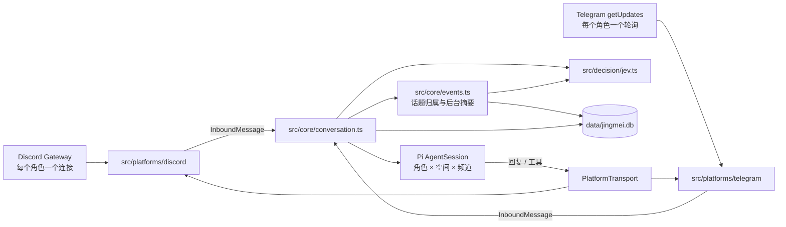
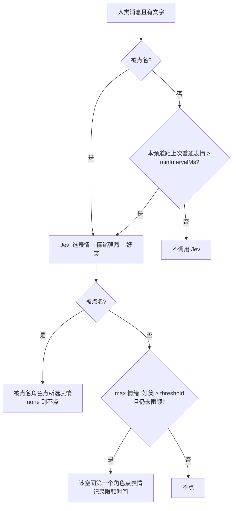

# 架构

> 描述当前代码真正做了什么。改动架构时同步更新本文。

## 总览

一个进程、一个对话核心、两个薄平台适配器。

- **空间（space）**：`SpaceId = "${platform}:${rawId}"`，Discord 服务器或 Telegram 群。记忆、soul、会话、消息都按空间隔离；只有适配器解析原始 ID。
- **角色（persona）**：配置里的一个角色，在每个平台可以有一个 bot 账号（`persona.accounts[platform]`，启动时验证 token 后填入）。
- **核心只认 `src/core/types.ts`**：`InboundMessage` 进，`PlatformTransport` 出。平台差异（格式、长度上限、表情集合、提示词里的平台说明）全部在适配器的 transport 里。

## 目录

| 路径 | 职责 |
|---|---|
| `src/main.ts` | 启动编排：配置 → DB → 平台 → 模型运行时 → 核心 → 祝福调度 → 开始接收；信号关闭 |
| `src/discord/main.ts` | systemd 使用的入口，只有一行 `import "../main.ts"` |
| `src/config.ts` | 读取并校验 `jingmei.config.json` + `.env`；生成 DeepSeek 模型目录 |
| `src/core/types.ts` | 平台无关的类型契约 |
| `src/core/conversation.ts` | 对话核心：存消息、路由、会话、图片落盘、搜索预取、发送 |
| `src/core/router.ts` | 确定性路由与角色作用域 |
| `src/core/context.ts` | provider 上下文投影（Pi `context` 事件） |
| `src/core/prompt.ts` | system prompt |
| `src/core/tools.ts` | 模型工具 |
| `src/core/quick-reactions.ts` | Jev 秒回表情 |
| `src/core/events.ts` / `embedding.ts` | 话题归属、摘要与参与度刷新；fastembed 中文向量 |
| `src/core/memory.ts` / `soul.ts` / `celebrations.ts` | 成员记忆、私人 soul、节日生日祝福 |
| `src/core/db.ts` | 打开数据库、旧库改名与旧表迁移、messages 幂等迁移与 sqlite-vec 加载 |
| `src/core/model-runtime.ts` | 共享 Pi `ModelRuntime` 与启动期模型校验 |
| `src/decision/jev.ts` / `local-jev.ts` | Jev wire 客户端、远程失败回退、进程内 notjev LLM 包装器 |
| `src/platforms/discord/` | Gateway/REST 客户端、消息归一化、附件下载、斜杠命令 |
| `src/platforms/telegram/` | Bot API 客户端、长轮询、归一化、Markdown→entities、文字命令 |
| `src/media/image.ts` / `video-frames.ts` | 图片转码缩放；ffmpeg 视频抽帧 |
| `src/tools/` | `run_js` 沙箱、DeepSeek 联网搜索、Fish Audio TTS |
| `src/net/` | 公网 URL 过滤、有界读取响应体 |
| `src/observability/log.ts` | 唯一的结构化日志出口 |

## 启动

1. `loadConfig()`：校验失败收集全部错误后一次抛出 `ConfigError`，错误信息不含密钥。
2. 在 `data/pi-agent/` 写入非敏感的 DeepSeek `models.json`；有 `DEEPSEEK_API_KEY` 时把它放进进程环境供 Pi 解析。
3. 开启 `events` 时先 `useExtensibleSqlite()`（macOS 使用 Homebrew SQLite），再 `openDatabase()` 并加载 sqlite-vec。没有 `jingmei.db` 而有 `discord-agent.db` 时连同 `-wal`/`-shm` 改名，再迁移 `discord_*` 表。
4. 按配置创建 Discord/Telegram 平台：每个 token 先验证身份（Discord `/users/@me`，Telegram `getMe`），填入 `persona.accounts`。
5. `createInstalledPiModelRuntime()`：整个进程一个 Pi `ModelRuntime`，agent 目录是 `data/pi-agent`（`models.json`、`auth.json` 都在这里）。provider 扩展只从 agent 目录加载，项目 `.pi/` 扩展不被信任、不加载。每个角色的模型、reasoning 档位和认证逐一 `assertBotModelConfigured`；`visionModel` 另需支持图片输入。
6. 开启话题时校验 `summaryModel`，在 `${dataDir}/models` 准备 fastembed 模型缓存（默认首次下载约 96 MB），创建共享决策客户端与 `EventTracker`。创建核心与祝福调度器，逐个 `start()` 平台（注册命令、开始接收）。缺 ffmpeg/ffprobe 只记 `video_frames_unavailable` 警告。关闭时先等待核心 lane，再等待 `events.idle()` 后关数据库。

## 一条消息的路径

适配器把平台消息归一化为 `InboundMessage`：允许列表之外的空间/频道直接丢弃；提及解析为用户 ID；图片经 `prepareImage`，视频抽帧，其余媒体换成文字占位。随后 `Conversation.handleMessage()`：

1. 按 `(space, channel)` 串行（lane）。同一空间同一频道的消息严格按顺序处理；不同频道并发。
2. `INSERT OR IGNORE` 到 `messages`。已存在则直接返回——多个角色的连接收到同一条消息、重启后重放，都在这里去重。
3. 人类消息交给 `MemberMemory.observe()` 更新档案；开启话题时再 `await events.assign(message)` 写入 `messages.event_id`，然后路由。
4. `routeMessage()` 选出接话角色（或无人）。
5. 配了 Jev 秒回表情时，不等待地发起 `QuickReactions.react()`。
6. 图片写入 `data/media/`（文件名由 HMAC 派生，0600）；需要时调用 `visionModel` 生成描述。会话里只保存文件引用。
7. 被路由的角色若消息明确要求查资料，先做一次 DeepSeek 搜索，结果作为不可信参考附在该角色的输入后。
8. **每个在作用域内的角色都把这条消息追加进自己的会话**（`sendCustomMessage`，类型 `discord_context_v1`）；只有被路由的角色 `triggerTurn: true` 生成回复。角色自己发出的消息的平台回声不会再喂回自己的会话。
9. 回复：工具已经发过图片/语音/表情就结束；否则发送最终文字（明确要求语音且配置了语音时改发 MP3），回复原消息。

### 话题（`src/core/events.ts`）

- 事件按 `(space, channel)` 隔离，与角色无关。人类和 bot 回复都优先直接继承被回复消息的 `event_id`，不调用决策；bot 没有回复事件则为空。其他人类消息先检查低内容继承，再在有候选事件时调用 `chooseEvent`。决策失败沿用最近活跃事件，没有活跃事件则创建新事件；整体归属失败只记错误类别并返回空，不阻止正式回复。
- 低内容 = 移除平台裸媒体标记（`[贴纸 …]`、`[视频 N帧]`、`[视频]`、`[图片]`、`[语音]`、`[文件]`）后，Unicode 字母/数字不足 2 个。保留 `[图片：描述]` 等视觉描述与媒体附带正文。低内容人类消息直接继承同空间同频道最近活动、距当前不超过 10 分钟的事件，不调用决策；没有合格事件则走普通归属。
- `chooseEvent` 将短回复、追问、赞同和情绪反应视为通常延续近期话题，只有明确引入与所有候选无关的内容才选择 `new`。远程 System One 与本地 logprobs 的各选项概率共用校验：值必须有限且在 `[0,1]`，键必须来自候选；畸形概率表整体忽略，不影响合法 choice。选择 `new` 但 `P(new) < 0.6` 时，改选概率最高的现有候选；`P(new) ≥ 0.6` 或没有概率时保留原决策。远程失败回退到本地时概率表原样传递。
- 活跃 = 最后一条消息距当前不超过 2 小时，查询时计算，无定时清理器。候选最多 5 个最近活跃事件、2 个同频道向量召回的已关闭事件和 `new`；向量召回使用 L2 距离，最大 `EVENT_RECALL_MAX_DISTANCE = 1.0`。
- 消息数达到 3 时首次摘要，之后在 6、12、24……刷新。每个事件后台 single-flight：独立 Pi `summaryModel` 生成标题与描述，fastembed 把标题+描述嵌入 sqlite-vec，再由决策客户端 `scoreParticipation` 排序参与者；向量先写入，参与度打分失败不影响旧话题召回。后台刷新不在频道 lane 上，停机等待 `idle()`。
- `formatInboundMessage` 在消息编号/回复标记后加 `§E<id>`，所有观察会话都看到归属；仅触发回复的输入追加 `[当前事件 §E<id>「标题」：描述。主要参与者：A、B、C。只回应这个事件，不要混入其他事件的内容。]`，未命名时为「尚无标题」，缺失描述/参与者时省略相应部分。system prompt 只有稳定的 §E 协议行，动态事件信息不进入缓存前缀。

### 路由（`src/core/router.ts`）

作用域：角色在该平台有账号，且 `spaces` 未设置或包含该空间。优先级：

1. 明确 @ 提及（按该平台的账号 ID 匹配）
2. 回复了该角色的消息
3. 文本包含角色 `name` 或任一 `aliases`（不区分大小写）
4. 概率：`HMAC-SHA256(routingSecret, "space:channel:messageId")` 取前 48 位得到 `u ∈ [0,1)`，按配置顺序累加 `routingP`，落在哪个区间就是谁，超出总和则无人

bot 消息永不触发。同一条消息在重放时路由结果相同。

### 会话

- 每个 `(角色, 空间, 频道)` 一个持久 Pi 会话，文件在 `data/sessions/<personaId>/`，映射存 `sessions` 表。Discord thread 有自己的频道 ID，因此自成会话。
- 会话禁用 Pi 内置编码工具（`noTools: "builtin"`），不加载项目扩展、技能、提示模板和上下文文件；只挂一个隐藏扩展 `jingmei-context`。
- Pi 自动压缩开启。管理员 `/compact` 手动压缩；`/context` 显示用量，自动压缩点按 `contextWindow − 16384` 报告。
- system prompt = 群聊协议 + 平台说明 + 已启用工具的说明 + persona 文件；会话（重新）加载时再附上该会话的正式 soul。动态内容不进 system prompt。

### 上下文投影（`src/core/context.ts`）

每次请求 provider 前在 Pi `context` 事件里重建，不写回会话文件：

- **丢弃已完成轮次的 thinking**：最后一条 user/custom 消息之前的 assistant 消息去掉 thinking 块；进行中的工具循环保留自己的 thinking。
- **展开聊天消息**：`discord_context_v1` 自定义消息展开为文字 + 图片块，图片从 `data/media/` 读取；文件缺失就跳过该图。
- **看不了图的模型**：有 `visionModel` 描述时替换为 `[图片：描述]` 文字；否则保留图片块，由 Pi 按模型能力替换为省略说明。
- **已晋升的 soul 暂存笔记**：内容已并入正式 soul 的 `discord_pending_soul_v1` 消息被丢弃，避免重复。

`discord_context_v1`、`discord_pending_soul_v1` 这两个类型名已写进现有会话文件，不能改名。

## 工具

| 工具 | 注册条件 | 说明 |
|---|---|---|
| `run_js` | 总是 | 纯计算沙箱，见下文威胁模型 |
| `remember_member_fact` / `recall_member_memory` | 总是 | 只记当前消息作者本人明确说的安全事实；回想限本频道近期出现或被当前作者提及/回复的成员，每轮最多 3 次 |
| `update_soul` | 总是 | 暂存私人 soul 笔记 |
| `send_reaction_image` | `sendReactionImages` | 发一张内置 PNG 并结束本轮 |
| `search_web` | 有 `DEEPSEEK_API_KEY` | DeepSeek 服务端搜索，每次调用最多搜一次 |
| `speak` | 配了 `voice` 且 `voiceEnabled` | Fish Audio MP3 并结束本轮 |
| `react_to_message` | 未开启 Jev 秒回表情 | 给本轮消息或本频道近期人类消息点表情并结束本轮 |

发送类工具只在被路由角色的当前回复轮内生效，一轮最多发送一次。

## Jev

共享决策客户端：配置 `jev.apiKeyEnv` 时创建远程客户端（`jev.endpoint` 默认 TypeSafe）；存在 `localJev` 时创建进程内 `notjev` 包装器，调用支持 logprobs 的 OpenAI-compatible LLM。两者都有则 `withFallback`：任何远程方法错误记 `decision/jev_fallback`（方法、错误类别），再在本地重试一次。仅有其一就直接使用。`localJev` 未配置且有 `DEEPSEEK_API_KEY` 时默认 DeepSeek / `deepseek-flash`，显式配置完全覆盖默认，允许无鉴权本地服务。显式命名但缺失的 key 仍在配置期报错。秒回表情与记忆排序必须有显式 `jev` 段落；事件可单独使用包装器，没有任何决策来源却启用 `events` 是配置错误。

本地包装器默认超时 30 秒，关闭 DeepSeek thinking（`thinking.type=disabled`），要求 LLM 返回 logprobs；缺失 logprobs 记为 `invalid_response` 调用失败，模型弃答时取概率最大选项（argmax）。它不另起 HTTP 服务，也不伪造 System One HTTP 往返：远程与本地客户端共用同一套问题构造和答案校验（`parseAnswers`），只是传输层不同——远程走 HTTP，本地在进程内直接调用 `notjev`。

- 一次请求：`choice`（表情表 + `none`）和两个 `noul`，`state` 为消息与最多 5 行近期聊天。超时 3 秒，失败只记 `quick_reaction_failed`。
- 表情表取 `jev.emojis[platform]` 或平台默认表，再用 `transport.isValidReaction` 过滤。
- 记忆排序：`recall_member_memory` 把候选事实/关系（保留数的 4 倍）与当前消息文本一起发给 `scoreRelevance`，每个候选一个 `noul`，同一次请求；失败时退回时间/互动次数排序。
- 客户端从不记录消息文本、`state` 或密钥。

## 媒体

- 图片：`prepareImage` 把 WebP/GIF 转 PNG，缩放到 1024×1024、200 KB 以内，失败时回退为 `[图片]`。每条消息最多 4 张（视频帧计入）。
- 视频：Discord 视频附件、Telegram video/animation/video_note/视频贴纸，下载上限 20 MiB，`ffprobe` 读时长后 `ffmpeg` 抽 1–3 帧 JPEG，标记 `[视频 N帧]`；工具缺失或失败时为 `[视频]`。
- 其他：`[语音]`、`[文件]`、`[贴纸 😀]`（Telegram 静态贴纸同时作为图片）。

## 成员记忆、soul、祝福

- **记忆**：`memory_profiles` 记名字、活跃度、生日；`memory_facts` 只收白名单键（preference、interest、role、project、timezone、language、goal、note），拒绝敏感键和可疑内容；`memory_relationships` 来自提及、回复和明确的朋友/同学说法。`/forget` 删档案与关系并写入 `memory_opt_out`，之后不再收集，直到 `/memory enable`。
- **soul**：`session_souls` 按 `(角色, 空间, 频道)` 存正式内容（≤ 4 KiB）和暂存笔记（总计 ≤ 1 KiB，单条 ≤ 300 字符）。暂存笔记以 `discord_pending_soul_v1` 追加进会话尾部；压缩成功后事务性并入正式 soul，只重载该会话。
- **祝福**：每分钟检查一次；目标时区当地 09:00 之后，每个成员生日、每个节日各发一次。发送前在 `celebration_deliveries` 占位，完成后标记；失败当天重试，超过 30 分钟仍在发送中的占位视为中断并重试。

## SQLite

`data/jingmei.db`，bun:sqlite 直接 SQL，文件权限 0600。

| 表 | 主键 / 用途 |
|---|---|
| `messages` | `(space_id, channel_id, message_id)`；所有见过的消息，去重与近期上下文；可空 `event_id`，索引 `(space_id, channel_id, event_id)`，由 `ensureMessagesTable` 幂等新增 |
| `events` | `id` 自增主键；`space_id`、`channel_id`、可空 `title` / `description`、`last_message_at`、`message_count` |
| `event_participants` | `(event_id, user_id)`；成员 `name` 与参与概率 `score` |
| `event_vectors` | sqlite-vec `vec0`，`rowid = event_id`，`embedding float[dimensions]`（默认 512）；旧话题向量召回 |
| `sessions` | `(persona_id, space_id, channel_id)` → Pi 会话文件 |
| `memory_profiles` | 成员档案 |
| `memory_facts` | 成员事实 |
| `memory_relationships` | 成员关系 |
| `memory_observed_messages` | 已观察消息，重放不重复计数 |
| `memory_opt_out` | `/forget` 后停止收集的成员 |
| `session_souls` | 私人 soul |
| `celebration_deliveries` | 祝福发送记录 |

**旧库迁移**（`migrateLegacyTables`）：每张 `discord_*` 表改名为去掉前缀的名字（`discord_core_` 连同 `core_` 一起去掉），`guild_id` 列改名为 `space_id` 并加 `discord:` 前缀。整个迁移一个事务、可重复执行；目标表已存在则报错而不是覆盖。

## 平台适配器

| | Discord | Telegram |
|---|---|---|
| 接收 | 每个角色一个 Gateway 连接（GUILDS、GUILD_MESSAGES、MESSAGE_CONTENT） | 每个角色一个 `getUpdates` 长轮询 |
| 去重 | 核心 `messages` 主键 | 先到的轮询在内存里认领 `chat:message`，再由核心主键兜底 |
| 其他 bot 的消息 | 可见，作为 bot 消息进入各角色会话 | Bot API 不投递，彼此不可见 |
| 允许列表 | 服务器 + 频道；thread 按父频道 | 群 ID；首次见到未列入的群记 `chat_ignored` |
| 发送 | Markdown，2000 字符分段，禁止一切 @ 通知 | Markdown→entities，4096 限制下分段；实体被拒时退回纯文本一次 |
| 附件 | 图片/MP3 作为附件 | `sendPhoto` / `sendAudio` |
| 表情 | Unicode 与自定义表情语法 | Bot API 允许的表情集合 |
| 命令 | 服务器级斜杠命令，回执仅自己可见 | `setMyCommands` + 以 `bot_command` 实体开头的文字命令，回执发在群里 |

## run_js sandbox 威胁模型

- **威胁**：run_js 输入来自 LLM，LLM 上下文来自群消息 → 群成员可经 prompt injection 让 bot 执行攻击者构造的 JS。最坏情况是读到主进程同 uid 可读的 `.env`（全部 bot token / API key）并联网外发。
- **防到什么**：vm context 由 `Object.create(null)` 创建且 `codeGeneration: { strings: false, wasm: false }`，context 内不存在任何 host realm 对象/函数——`console.log.constructor` / `this.constructor.constructor` / `Function` / `eval` 都拿不到 host `Function`。console 在 context 内部 bootstrap；结果只在 context 内 `JSON.stringify` 后以字符串跨界。子进程 env 只有 `PATH`、隔离 tmp cwd、`--smol`、同步代码 vm timeout 3 s、进程级 5 s SIGKILL 兜底、输出 4 KB 上限。
- **残余风险**：
  1. node:vm 不是安全边界；若引擎漏洞打穿 realm 隔离，子进程仍以服务用户运行，可读磁盘上的 `.env`、可联网。
  2. `--smol` 不是硬内存上限，靠 5 s SIGKILL 兜底。
  3. SIGKILL 只杀直接子进程；逃逸后派生的孙进程不受超时约束。
  4. vm timeout 只约束同步代码；异步膨胀由 SIGKILL 兜底。
- **为什么可接受**：realm 隔离 + 禁用代码生成 + 清空环境 + 资源限制 + 超时，使攻击需要未知引擎漏洞；威胁源限于群成员 prompt injection。OS 级隔离（低权用户、seccomp）是后续增强，不是当前必需。

`test/runjs.test.ts` 覆盖这些边界；改沙箱后必须重跑。

## 日志

只经 `src/observability/log.ts` 写 stdout JSONL（`schema`、`ts`、`level`、`component`、`event`、`fields`）。字段名含 token/secret/prompt/content/query/url/path 等的值一律写成 `[redacted]`，字符串里的 token、API key、URL、绝对路径会被替换掉；`persona_id` 等配置 ID 原样保留，多角色部署靠它定位出错的 bot。日志只用于观察，业务逻辑不依赖日志。
